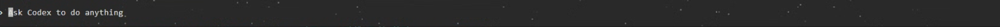

**言語:** [English](README.md) | [한국어](README-ko.md) | 日本語 | [简体中文](README-zh-CN.md)

# Skill Olympus

### コーディングエージェントに、動き続けるプロダクトチームを。

設計、実装、監査、テスト、文書化、そして次のセッションへの引き継ぎまで。
CLIが備えるネイティブエージェントは、そのまま活用します。

[](https://github.com/Dannykkh/skill-olympus/stargazers)
[](https://github.com/Dannykkh/skill-olympus/network/members)
[](https://github.com/Dannykkh/skill-olympus/releases/latest)
[](LICENSE)
[](https://dannykkh.github.io/skill-olympus/ja/)


Skill Olympusは、**Claude Code**、**Codex CLI**、**Antigravity CLI**、**Grok Build**を使う
個人開発者向けの実践的なハーネスです。複数のCLIに同じワークフローを導入し、必要な
専門機能だけを呼び出すことも、Zeusに開発全体を任せることもできます。

```text
/zeus "React、Spring Boot、PostgreSQLで小規模な在庫管理SaaSを作って"
```

一つの依頼から、保存可能な設計資料、実装、監査、実行テスト、根拠付きレポートまでを
つなげます。ターンを使い切っただけでは、完了と判定しません。

[クイックスタート](#クイックスタート) · [ワークフローを選ぶ](#ワークフローを選ぶ) · [CLI対応](#cli対応) · [Englishの詳細版](README.md)

> Olympusは、大量のプロンプトを常時読み込む仕組みではありません。普段は18個の
> 入口だけを公開し、下位モジュール76個は必要になった時点でカタログから読み込みます。

---

## Olympusを使う理由

| やりたいこと | Olympusが加えるもの |
|---|---|
| **一文からプロダクトを作る** | `/zeus`が設計、実装、監査、実行環境、テスト、最終レポートを一つにつなぐ |
| **途中で止まらない修正ループ** | `/chronos`が FIND → FIX → VERIFY を繰り返し、失敗やブロッカーも正直に記録する |
| **仕様どおりに作れたか確かめる** | `/argos`が仕様、コード、API、QAシナリオ、図、セキュリティ境界を照合する |
| **ブラウザテストを実際に動かす** | `/minos`がPlaywrightシナリオを生成・実行し、上限付きのループで失敗を直す |
| **セッションをまたいで記憶する** | `mnemo`が索引、意味記憶、検索可能な会話、再開用ハンドオフを残す |
| **開始時のコンテキストを軽くする** | 少数の入口から、必要なsource-onlyモジュールだけを読む |

公開スキルソースは100個です。標準のallowlistは24個の和集合で、統合CLIでは20個または
21個、skills-onlyホストでは18個が有効になります。残り76個はsource-onlyです。

---

## インストール前に変わるものを確認する

統合インストーラーはグローバル環境を更新するため、ルールは他のプロジェクトにも適用されます。スキルだけでなく、カタログ、フック、MCP設定も対象です。OpenClawとHermes Agentはskills-onlyです。

| CLI | 更新するグローバルルール |
|---|---|
| Claude Code | `~/.claude/CLAUDE.md` の `MNEMO` ブロック |
| Codex | `${CODEX_HOME:-~/.codex}/AGENTS.md` の `CODEX-MNEMO` ブロック |
| Antigravity CLI | `~/.gemini/GEMINI.md` の `ANTIGRAVITY-MNEMO` ブロック |
| Grok Build | `~/.grok/rules/grok-mnemo.md` とClaudeの共有ルール |

v6.1.2では、依頼と同じ言語での応答、`codemap/index.md`を先に確認するコード探索、記憶→会話リンク・タグ→本文→範囲を絞った元セッションの確認を共通化しました。読み取り専用の依頼ではファイルを書きません。カタログ、文書、引き継ぎ、検証は各CLIの仕組みに合わせます。

**再インストール時は管理ブロック内の編集も置き換わります。** Claude・Codex・Antigravityではマーカー外の個人ルールを残し、Grokの管理ファイルは全体を置き換えます。統合インストーラーは変更前に対象ルールとCodex設定・通知wrapperを`~/.olympus/install-backups/`へ保存します。個別アダプターのインストールには、このバックアップ処理は適用されません。

インストールの最後にルール・登録・インストール済みフックを検証し、結果を`verification.json`へ保存します。未実行の検査は`NOT RUN`と表示します。`node scripts/install-state.js restore "<manifest.json>"`で復元対象を確認し、`--apply`で適用します。Codex設定全体を含むファイル単位の復元で、インストール後の編集があれば停止します。[バックアップ範囲と検証の限界](docs/global-agent-rules.md)を確認してください。

- 個人設定はマーカー外、Grokでは別の個人ルールファイルに書きます。次回のインストールにも変更を反映したい場合は、管理しているチェックアウトの[正本テンプレート](docs/global-agent-rules.md)を編集します。
- Mnemoはプロジェクトの`conversations/`に会話のコピーを保存します。CLI起動時の環境変数`MNEMO_DISABLE=1`で保存フックを停止できますが、明示的なファイル作成やCLI本来のセッション保存は別です。
- ルールだけを外す場合は管理ブロック、またはGrokの管理ファイルを削除します。フックは残り、次回インストールでルールは復元されます。アダプター全体の[削除手順](docs/global-agent-rules.md#customize-disable-remove)では既存の会話・記憶・引き継ぎ文書を残します。
- Codexの既存インストーラーは`config.toml`の`notify`を設定し、`tui.notifications=false`, `tui.animations=false`, `tui.whimsy=false`にします。通知チェーンの保持条件と削除後の復旧は[詳細ガイド](docs/global-agent-rules.md)で確認してください。

### Codex Astraの星のエフェクトを切り替える

Codex CLIでAstraモデルを使うと、入力欄の背景に星がきらめくことがあります。以下は有効な状態のスクリーンショットです（静止画）。



`install.bat`または`install.sh`のCodexインストール処理は、**この装飾と通常のアニメーションを全プロジェクトで無効にします**。設定先はWindowsでは`%USERPROFILE%\.codex\config.toml`、macOS/Linuxでは`~/.codex/config.toml`です。`CODEX_HOME`を指定した場合は、そのフォルダーの`config.toml`を編集します。

```toml
# 最初の [テーブル] より前にある既存の値を編集
tui.animations = false
tui.whimsy = false
```

`animations`は通常のアニメーション、`whimsy`はAstraの星などの装飾を制御します。すでに`[tui]`があれば、その中の`animations`と`whimsy`を編集し、上のキーを重複して追加しないでください。

**星を再び表示するには両方を`true`にしてCodexを再起動します。** 通常のアニメーションだけ有効にするなら`animations=true`、`whimsy=false`にします。再インストールすると両方とも`false`に戻り、Olympusを削除しても設定は残ります。[公式設定スキーマ](https://developers.openai.com/codex/config-schema.json) · [設定の詳細](docs/global-agent-rules.md)

このルール変更のためにモデル・推論強度・権限の値を追加する必要はありません。更新後は新しいセッションを開始してください。詳しい設定条件と復旧ツールの制限は[グローバルルールガイド（韓国語）](docs/global-agent-rules.md)にあります。

---

## クイックスタート

GitとNode.js LTSが必要です。対象のAI CLIはOlympusの前後どちらでインストールしても
かまいません。CLIを後から入れた場合は、同じインストーラーをもう一度実行してください。

### 四つの統合ランタイムをインストール

```bash
git clone https://github.com/Dannykkh/skill-olympus.git
cd skill-olympus

# Windows
.\install.bat

# macOS/Linux
chmod +x install.sh && ./install.sh
```

引数なしが標準のフルインストールです。Claude、Codex、Antigravity、Grokの四つを対象に
します。CLIの実行ファイルが`PATH`になくてもファイルは配置され、MCP登録など実行
ファイルを必要とする処理だけがスキップされます。

### 最初に試すワークフロー

```text
/zeus "React、Spring Boot、PostgreSQLで小規模な在庫管理SaaSを作って"
/chronos "決済フローのテストが通るまで直して"
/aphrodite "運用担当者の一日の仕事を軸に、このダッシュボードを設計し直して"
/argos docs/plan/checkout
/mnemo "認証方式について何を決めた？"
```

説明に合う自然言語の依頼からも起動できます。slash名を使うと、意図したワークフローを
明確に指定できます。

### OpenClawとHermes Agentはskills-only

専用インストーラーは、共通のユーザー向けスキル18個とsource-onlyモジュール76個を
導入します。プラグイン、フック、Mnemo、MCP、カスタムエージェント、四つの統合CLI専用
アダプターは導入しません。

```powershell
# Windows
.\install-openclaw.bat
.\install-hermes.bat

# TermSnap向けインストーラーから明示的に選ぶ場合
.\install.bat --llm openclaw,hermes
```

```bash
# macOS/Linux
bash ./install-openclaw.sh
bash ./install-hermes.sh
```

ホスト別インストーラーに`--uninstall`を付けると、そのホストでOlympusが管理するスキル
だけを削除します。通常の更新では、先にアンインストールする必要はありません。

<details>
<summary><strong>更新とsource-onlyモジュール</strong></summary>

```powershell
git pull
.\install.bat
```

インストーラーを再実行すると、Olympusが管理する名前だけを現在のポリシーに合わせて
更新します。名前の異なる外部スキルは残ります。同名の変更済みスキルは削除せず、
`_olympus-preserved`へ移します。

source-onlyとは、現在の`SKILL.md`と関連ファイルを保持したまま、CLIの自動検出
ディレクトリには登録しない状態です。全モジュールをslashメニューと自動マッチングへ
戻す場合は、次のオプションを使います。

```powershell
.\install.bat --include-source-only-skills
```

詳しくは[スキルレジストリ移行ガイド](docs/skill-registry-migration.md)を参照してください。

</details>

---

## 仕組み

Zeusは、依頼を設計へ分解し、実装、監査、実行環境の準備、テスト、根拠レポートまで
進めるハーネス層です。Chronosで継続状態を持ち、Zephermineで設計し、現在のCLIが
備えるネイティブワーカーで実装します。Argos、Docker、Minosの証拠がそろうまで、
SUCCESSを返しません。

<p align="center">
  
</p>

```text
依頼
  → Chronos: 継続状態と完了条件
  → Zephermine: 調査と設計資料
  → Native workers: 実装と局所テスト
  → Argos: 仕様との照合
  → Docker: 再現可能な実行環境
  → Minos: Playwrightによる実行検証
  → 根拠付き最終レポート
```

---

## ワークフローを選ぶ

| 状況 | 呼び出し | 主な成果物 |
|---|---|---|
| 一文から最後まで作る | `/zeus` | 設計、実装、監査、実行環境、テスト、レポート |
| 実装前に要件を固める | `/zephermine` | 要求仕様、API、QAシナリオ、フロー図 |
| 複数ワーカーで実装する | `/agent-team` | 所有権を分けた並列実装と統合結果 |
| 設計なしで実装を進める | `workpm` / `/daedalus` | 調査、タスク分割、実装、検証 |
| UIを再設計する | `/aphrodite` | Experience Contract、デザイン方針、実装、視覚検証 |
| 実装を仕様と照合する | `/argos` | 根拠付きの適合・不適合判定 |
| QAが通るまで直す | `/minos` | Playwrightテストと修正ログ |
| 一件ずつ修正を続ける | `/chronos` | 監査ログ、検証結果、再開可能な状態 |
| 過去の決定を探す | `/mnemo` | 会話検索、意味記憶、ハンドオフ |

全スキル、エージェント参考資料、フックの一覧は[英語版README](README.md#whats-inside)に
まとめています。

---

## CLI対応

| ホスト | 対応レベル | 主な統合 |
|---|---|---|
| Claude Code | 統合 | skills、hooks、Mnemo、MCP、ネイティブサブエージェント |
| Codex CLI | 統合 | skills、notifyベースMnemo、MCP、ネイティブサブエージェント |
| Antigravity CLI | 統合 | skills、native hooks、Mnemo、MCP、ネイティブワークフロー |
| Grok Build | 統合 | Claude共有skill表面、hooks、Mnemo、ネイティブワーカー |
| OpenClaw | skills-only | 移植可能なスキルとsource-onlyカタログ |
| Hermes Agent | skills-only | 移植可能なスキルとsource-onlyカタログ |

OpenClawとHermesでskills-onlyとしているのは、未対応という意味ではありません。共通の
`SKILL.md`ワークフローは利用できますが、ホスト固有のフック、メモリ、MCP、エージェント
登録まではOlympusが所有しない、という境界を示しています。

---

## ドキュメント

- [詳細な英語版README](README.md)
- [セットアップとインストーラーのオプション](SETUP.md)
- [ワークフローガイド](docs/workflow-guide.md)
- [スキルレジストリと競合の復旧](docs/skill-registry-migration.md)
- [変更履歴](CHANGELOG.md)

## コントリビューション

IssueとPull Requestを歓迎します。PRを送る前に[AGENTS.md](AGENTS.md)を読み、次のテストを
実行してください。

```powershell
$tests = (Get-ChildItem scripts/tests -Filter '*.test.js').FullName
node --test $tests
```

```bash
node --test scripts/tests/*.test.js
```

Olympusが設計のやり直し、途切れた引き継ぎ、デバッグループのどれか一つでも減らせたら、
GitHubでStarを付けてもらえると、ほかの個人開発者にも見つけてもらいやすくなります。

---

## ライセンス

[MIT](LICENSE)

---

**最終更新:** 2026-09-01
