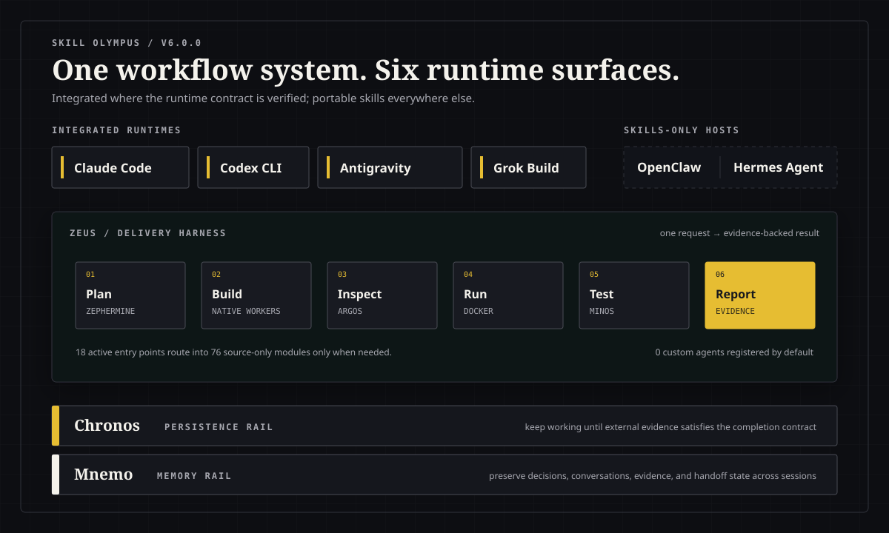

**Language:** English | [한국어](README-ko.md) | [日本語](README-ja.md) | [简体中文](README-zh-CN.md)

# Skill Olympus

### A persistent product team for your coding agent.

Plan, build, inspect, test, document, and remember across sessions — without replacing the native
workers already built into your CLI.

[](https://github.com/Dannykkh/skill-olympus/stargazers)
[](https://github.com/Dannykkh/skill-olympus/network/members)
[](https://github.com/Dannykkh/skill-olympus/releases/latest)
[](LICENSE)
[](https://dannykkh.github.io/skill-olympus/en/)


Skill Olympus is a production-oriented harness for solo builders using **Claude Code**, **Codex CLI**,
**Antigravity CLI**, or **Grok Build**. Install the same workflow surface across your CLIs, call one
specialist for a focused job, or let Zeus drive the full delivery loop.

```bash
/zeus "Build a shopping mall. React + Spring Boot + PostgreSQL"
```

One request becomes persisted planning artifacts, implementation, inspection, executable tests, and an
evidence report. Olympus treats running out of turns as incomplete, not success.

[Quick start](#quick-start) · [Choose a workflow](#choose-a-workflow) · [CLI support](#cross-cli-support) · [Browse all skills](#whats-inside)

> Olympus is not a prompt dump. Eighteen focused entry points stay discoverable by default; lower-level
> modules remain available through a source catalog, while each integrated CLI keeps its native agents,
> review engine, and task primitives.

---

## Why Olympus

| What you need | What Olympus adds |
|---|---|
| **A product from one sentence** | `/zeus` connects planning, implementation, inspection, runtime setup, tests, and an evidence-backed final report |
| **A loop that does not bluff** | `/chronos` runs FIND → FIX → VERIFY, records state, and reports exhaustion or blockers honestly |
| **Proof that code matches intent** | `/argos` compares the specification, code, APIs, scenarios, diagrams, and security boundaries |
| **Browser tests that actually run** | `/minos` writes Playwright scenarios, executes them, and repairs failures within a bounded loop |
| **Memory across sessions** | `mnemo` keeps an index, semantic memory, searchable conversations, and resumable handoffs |
| **Less prompt noise** | A small active registry routes into 76 source-only modules only when the work needs them |

**100 public skill sources (default allowlist union: 24 = 18 user entry points + 6 runtime adapters; 20 or 21 active per integrated surface, 18 on skills-only hosts, 76 source-only internal/optional modules) · 42 agent source references (40 top-level + 2 skill-owned; 0 custom agents registered by default) · 9 hooks · 4 integrated CLIs + 2 skills-only hosts · 1 mythology**

---

## Quick Start

Requires Git and Node.js LTS. The target AI CLI can be installed before or after Olympus; rerun the
installer later to finish CLI-dependent registration.

### Install the four integrated runtimes

```bash
# Clone
git clone https://github.com/Dannykkh/skill-olympus.git
cd skill-olympus

# Windows
.\install.bat

# macOS/Linux
chmod +x install.sh && ./install.sh
```

Running without arguments is the default full installation for Claude, Codex, Antigravity, and Grok.
`--all` is an optional explicit spelling of the same selection. The installer prepares each selected
CLI's files even when that CLI executable is not on `PATH`; only CLI-dependent commands such as MCP
registration are skipped. Install the missing CLI and rerun the same installer to finish those commands.

### Try a workflow

```text
/zeus "Build a small inventory SaaS with React, Spring Boot, and PostgreSQL"
/chronos "Fix the checkout flow until its tests pass"
/aphrodite "Redesign this dashboard around the operator's daily tasks"
/argos docs/plan/checkout
/mnemo "What did we decide about authentication?"
```

Skills can also activate from a matching natural-language request; slash names make the intended
workflow explicit.

### OpenClaw and Hermes Agent: skills-only install

These entry points install the 18 portable user-facing skills plus the 76 source-only modules. They
do not install plugins, hooks, Mnemo, MCP, custom agents, or the existing four-CLI runtime adapters.

```powershell
# Windows: one host at a time
.\install-openclaw.bat
.\install-hermes.bat

# Or select both through the TermSnap-oriented installer
.\install.bat --llm openclaw,hermes
```

```bash
# macOS/Linux
bash ./install-openclaw.sh
bash ./install-hermes.sh
```

Use `--uninstall` with a host-specific installer to remove only that host's Olympus-managed skills.

<details>
<summary><strong>Updating, uninstalling, and source-only modules</strong></summary>

### Updating an existing installation

A normal update does not require an uninstall first. Running the installer again reconciles only
Olympus-managed names with the current policy and leaves unrelated third-party skill names in place.

```powershell
git pull
.\install.bat
```

Use `./install.sh` on macOS/Linux. Uninstall and reinstall only when the installation is broken
or when you deliberately want to rebuild Olympus hooks and MCP registrations from scratch.

```powershell
.\install.bat --uninstall
.\install.bat
```

### What does source-only mean?

Source-only does not mean that an old skill version is being retained. It means that the **current
Olympus `SKILL.md` and supporting files remain available without being registered in the CLI's automatic
discovery directory**.

- Current sources are copied under each CLI's `.olympus/source-skills/` and recorded in `SKILLS-CATALOG.md`.
- An active Olympus harness or the LLM can read that catalog source when a task needs it.
- Use `--include-source-only-skills` to put every compatible source-only skill back into slash menus and automatic matching.
- That option activates current Olympus sources; it does not restore an older modified copy from `_olympus-preserved`.

```powershell
.\install.bat --include-source-only-skills
```

That's it. The 100 public sources split into a 24-skill default allowlist union (18 user-facing harnesses + 6 runtime adapters) and 76 source-only internal or optional modules. Runtime compatibility then removes adapters meant for other CLIs: Codex and Antigravity each expose 96 compatible entries (20 active + 76 source-only), while Claude exposes 97 (21 + 76). Grok's standalone policy is also 96 (20 + 76), but the installed Grok surface reads the shared Claude directory and therefore sees the same 21 active entries as Claude. OpenClaw and Hermes Agent deliberately exclude all six runtime adapters and expose 94 compatible entries (18 active + 76 source-only). The internal-only `deploymonitor` source remains local and is not part of the public distribution. Active harnesses resolve required source-only modules through the catalog and read them directly; those modules do not need independent registration. **No Olympus custom agent is registered by default**; all 42 agent references remain source-only, and each integrated CLI keeps its native subagents. New skill and agent sources are default-denied until deliberately allowlisted.

> A missing CLI does not suppress asset preparation. Its skill catalog, source library, hooks, and
> configuration files are prepared; only commands that require the executable are reported as skipped.

> When upgrading an existing installation, unrelated third-party skill names are preserved. Modified
> same-name collisions are moved to `_olympus-preserved` instead of being discarded. See the
> [skill registry migration guide](docs/skill-registry-migration.md) for the lightweight default,
> full opt-in, collision recovery, and uninstall/reinstall procedure.
> Recovery is manual: copy the preserved skill back only after giving both its directory and frontmatter
> `name` a unique name. Otherwise the next sync will preserve it again. `--uninstall` never restores backups.

</details>

---

## How it works

Zeus is the harness layer: one request is kept alive, decomposed, implemented, inspected, prepared for
runtime use, tested, and reported without handing an unverified next step back to the user. It bootstraps
Chronos persistence, drives Zephermine planning, routes implementation through the current CLI's native
workers, and requires Argos, Docker, Minos, and a final evidence report before SUCCESS is allowed.

<p align="center">
  
</p>

Chronos is the loop layer under that harness. It prefers native `/goal`, uses runtime-specific continuation
when needed, and returns to READ → FIND → FIX → VERIFY → LOG. Exhaustion is incomplete, and blocked work
is parked with an Owner Decision Brief instead of being reported as success.

---

## The Pantheon of Olympus

> *Beyond the wine-dark sea, where clouds part above the world, Mount Olympus rises.
> On its windswept summit dwell the Twelve, each crowned with their own dominion,
> each known by an ancient and many-named song. Speak the name of one, and that one alone
> shall descend the holy mountain. Speak the name of cloud-gathering Zeus,
> and the whole pantheon shall come down with him in golden procession.*

This is no mere tool-chest. It is a small **mythology of work**, a council of immortals
each shaped to a single craft. They work as the old singers tell us they have always worked —
gentle Zephermine, breath of the west wind, whispers a blueprint into the ear of earth-shaking
Poseidon; Poseidon stirs the deep and his fleet sails forth in waves; hundred-eyed Argos
walks the shore at dusk to count every nail and every beam; stern Minos sits upon his marble
throne to weigh each soul at the gate; and last of all, fair-tressed Clio takes up her stylus
to carve the whole tale upon a tablet of bronze, that mortals yet unborn may read of it.

Below stand the immortals. Call upon one — or call upon all.

### The Twelve Who Sit Upon the Mountain

| Skill | Name | Epithet | Domain |
|-------|------|---------|--------|
| `/zephermine` | **Zephermine** (젭마인) | *Breath of the West Wind, Bringer of Spring* | The Architect — 26-step deep interview, spec generation, 6-expert team review |
| `/zeus` | **Zeus** (제우스) | *Cloud-Gatherer, Hurler of Thunderbolts, Father of Gods and Men* | The Sovereign — Zero-interaction full pipeline; at his nod the council convenes |
| `/agent-team` / `/poseidon` | **Poseidon** (포세이돈) | *Earth-Shaker, Lord of the Wine-Dark Sea, Trident-Bearer* | The Sea Lord — Reads dependency graphs as a sailor reads tides; sends the fleet in waves |
| `/workpm` | **Daedalus** (다이달로스) | *The Master Builder, Maker of the Labyrinth, Father of Wings* | The Hands-On Builder — Where there is no plan, he becomes the plan |
| `/argos` | **Argos** (아르고스) | *Argos Panoptes, the All-Seeing, of the Hundred Eyes* | The Watchman — Of his hundred eyes, none ever sleep at the same hour |
| `/minos` | **Minos** (미노스) | *Judge of the Dead, Keeper of the Golden Scales* | The Judge — At his marble throne, every soul and every test is weighed |
| `/clio` | **Clio** (클리오) | *Kleio, Proclaimer, Muse of History, Daughter of Memory* | The Chronicler — Her stylus sets down what mortals have done, that none may forget |
| `/chronos` | **Chronos** (크로노스) | *Father of Time, the Unwearying, He Who Devours the Hours* | The Tireless — Time itself is his servant; he turns the wheel until the deed is done |
| `/hermes` | **Hermes** (헤르메스) | *Wing-Footed Messenger, Guide of Souls, Patron of Merchants* | The Wayfinder — Reads the trade-winds and the marketplaces of distant lands |
| `/athena` | **Athena** (아테나) | *Gray-Eyed Daughter of Zeus, Defender of Cities, Born from the Skull* | The Strategist — Wisdom that cuts as cleanly as her father's bronze spear |
| `/aphrodite` | **Aphrodite** (아프로디테) | *Foam-Born, Golden, Cytherean, Lover of Laughter* | The Beauty — From her hand come forms that mortals cannot help but love |
| `mnemo` | **Mnemo** (므네모) | *Mnemosyne, Titaness of Memory, Mother of all the Muses* | The Keeper — She forgets nothing; her daughters are born of her remembering |

---

<details>
<summary><strong>Read the Olympus lore</strong></summary>

### Songs from the Mountain

> Hear now the voices of the Twelve, as the old singers heard them.

🜲 **Zeus, Cloud-Gatherer**
Upon the topmost peak he sits, and his nod is the law of mountains.
When his voice rolls out across Olympus, the council rises as one and descends —
designer, builder, watchman, judge, and chronicler — all at his single word.
*"Speak my name once, mortal, and the whole council shall walk beside you to the end."*

🜂 **Zephermine, Bringer of the West Wind**
She is the soft breath that wakes the seed beneath the soil.
Six and twenty are her questions, and the breath of each one is gentle —
yet none may pass her by, for the spec is sacred and half-told tales bear no fruit.
*"I ask, and ask, and ask again — until what was unspoken becomes a thing of stone."*

🜄 **Poseidon, Earth-Shaker**
He stands knee-deep in the wine-dark sea, his trident raised, and the waters listen.
The fleet of teammates lies in the harbor, and at his bidding the wave gathers them all
and bears them out together, each prow pointed where the dependency graph commands.
*"The sea does not yield to the swimmer. The swimmer who knows the tide — she yields to him."*

🜔 **Daedalus, Master Builder**
Before him there was no labyrinth in all of Crete.
He took stone from the mountain and shaped it with his own hands, and the work was good.
Where the blueprint is missing, where the architect has not spoken, send for him —
he will research, he will draft, and if no other hand will rise, his alone shall raise the walls.
*"Give me the stone. The plan I shall make as I go."*

👁 **Argos Panoptes, the Hundred-Eyed**
He paces the half-built city by night, and at no hour are all his eyes closed at once.
The plank a mortal builder forgot to nail — he has already seen it.
The line of code that fails to match the spec — he has already named it.
*"While fifty of my eyes rest, fifty more keep watch. Nothing passes Argos in the dark."*

⚖ **Minos, Judge of the Dead**
He sits upon a throne of cold marble at the gate where the souls of the dead must come.
He raises his golden scales, and the work is weighed against itself.
His verdict is two-fold and no other: it shall pass, or it shall return to the fire.
*"Stand before the scales, child of mortals. We shall see if your tests are honest."*

📜 **Clio, Muse of the Long Memory**
She comes last of all the gods, after the labor is laid down.
Her stylus is bronze and her tablet is the years to come.
What the heroes have done, she sets down — diagram, decree, manual, and song —
that the children of the children of those mortals may know the deeds were real.
*"The work has ended. Now begins the telling, and the telling endures."*

⏳ **Chronos, the Unwearying**
He is older than memory, older than the gods themselves.
He turns the great wheel of the hours and does not tire when mortals sleep.
The bug shall die or the dawn shall come — and Chronos shall outlast them both.
*"Mortals close their eyes. I do not. The work shall be finished, by sunrise or by the next."*

🪶 **Hermes, Wing-Footed**
He moves between the worlds — the high palace and the low marketplace, both are his road.
He reads the trade-winds of distant lands and the price of grain in city-gates yet unseen.
Before a single coin is risked, before a single line of code is written, he speaks first.
*"Every market is a road, traveler. Every road has its toll. Bring silver, or bring nothing."*

🦉 **Athena, Gray-Eyed**
She was born full-grown from the skull of her father, helmeted, spear in hand.
Her wisdom does not flatter; her counsel is the cold edge of the bronze.
She will ask the question the mortal fears most — *should this thing be made at all?*
*"Wisdom, child, is to know which work must never be begun. I shall ask. You shall answer."*

🌹 **Aphrodite, Foam-Born**
She rose from the white foam of the sea, and the world has not been plain since.
Nine palettes lie at her hand, seven and forty font pairings, four and eighty styles.
What leaves her workshop is not merely useful — it is loved, and that is the difference.
*"Beauty is not the ornament of the work. Beauty is what makes the work survive its maker."*

📚 **Mnemo, Mother of the Muses**
Long before the nine sisters sang, Mnemosyne kept the long memory of the world.
The conversation a mortal had three moons ago is the answer she carries to him today.
Three layers she keeps — the index of names, the meaning of things, the tale itself —
and her remembering crosses every session, every CLI, every dawn.
*"Forget nothing, child. The word you spoke long ago is the gift you needed now."*

</details>

---

## Recent changes

- **Antigravity migration:** the retired personal Gemini CLI target is replaced by Google Antigravity CLI, including skills, hooks, Mnemo, MCP, and native-first routing.
- **OpenClaw and Hermes Agent:** dedicated skills-only installers add 18 active entry points and the source catalog without claiming plugin or hook parity.
- **Lean registry:** 18 common user entry points stay active while 76 lower-level modules load from the source catalog only when needed.

See [CHANGELOG.md](CHANGELOG.md) and [GitHub Releases](https://github.com/Dannykkh/skill-olympus/releases) for the complete history.

---

## Choose a workflow

Start with the outcome you want. Every workflow works independently; Zeus composes the delivery path
without silently adding the optional business, CEO, or documentation stages.

| I want to… | Start with | Result |
|---|---|---|
| Build a product from one sentence | `/zeus` | Planned, implemented, inspected, tested project plus an evidence report |
| Decide whether an idea is worth building | `/hermes` → `/athena` | Business case followed by a Go/No-Go and scope verdict |
| Turn an unclear feature into an implementation-ready plan | `/zephermine` | Spec, plan, schema, API contract, flows, and QA scenarios |
| Implement an existing plan in dependency-safe waves | `/agent-team` or `/poseidon` | Native-worker implementation plus an integration gate |
| Start coding without a prior spec | `/workpm` or `/daedalus` | Researched proposal, implementation, and verification log |
| Design or redesign a real interface | `/aphrodite` | Experience Contract, `DESIGN.md`, rendered directions, and implementation |
| Verify code against the plan | `/argos` | Evidence-linked construction inspection report |
| Make browser and API tests pass | `/minos` | Playwright tests and bounded repair cycles |
| Keep fixing until a measurable condition is met | `/chronos` | Resumable audit log, verified fixes, or an honest blocker brief |
| Close the project and write the docs | `/clio` | GO/NO-GO, diagrams, PRD, technical guide, and user manual |

---

<details>
<summary><strong>Detailed inputs and outputs for each primary workflow</strong></summary>

## How the Gods Work — Practical Guide

> The myth above is the flavor. Here is the plain version: what each god is *for* (which work it handles), how you *call* it, and what *files* you get back. Every god works standalone; chained in order, they form the pipeline.

### Strategy & validation — before a line of code

**`/hermes` — Business case (Wayfinder)**
- **When:** validating whether an idea is worth building — demand, market, money.
- **Use:** `/hermes` (aliases: 헤르메스, 사업성)
- **Process:** demand validation → BMC → TAM/SAM/SOM → revenue & pricing → GTM → North Star → cohort. Generates 2-3 scored business-model candidates before committing to one.
- **Output:** `docs/hermes/{project}.md` (analysis + Mermaid) + a domain-term seed Zephermine reuses.
- **Next:** `/athena` to pressure-test, or `/zephermine` to design.

**`/athena` — CEO challenge (Strategist)**
- **When:** deciding *should this be built at all?* before committing resources.
- **Use:** `/athena` (aliases: 아테나, ceo) — auto-reads `docs/hermes/*.md` if present.
- **Process:** demand confidence → moat → scope mode → ROI → verdict.
- **Output:** `docs/athena/{project}.md` — GO / CONDITIONAL GO / NO-GO + scope recommendation (Reduce / Expand / Pivot / Kill).
- **Next:** `/zephermine` if GO.

### Design — turn intent into a buildable spec

**`/zephermine` — Deep design (Architect)**
- **When:** a feature/product needs a thorough spec before implementation.
- **Use:** `/zephermine [spec-path]` (aliases: 젭마인, 제퍼마인)
- **Process:** research → 26-step interview → spec synthesis → 6-expert team review → strategy-candidate scoring (ToT) → plan → DB schema / API spec / flow diagrams → section split → operation & QA scenarios.
- **Output:** `docs/plan/<feature>/` → `spec.md`, `plan.md`, `db-schema.md`, `api-spec.md`, `flow-diagrams/`, `sections/`, `operation-scenarios.md`, `qa-scenarios.md`.
- **Next:** `/agent-team` (build) or `/argos` (inspect).

**`/aphrodite` — Design system (Beauty)**
- **When:** a UI project needs an intentional experience, benchmark interpretation, and consistent implementation before the frontend build.
- **Use:** `/aphrodite` (aliases: 아프로디테)
- **Process:** source-mode routing → verify an exact Codex Product Design marketplace selector (recommend once only when confirmed available; UNKNOWN stays local) → site benchmark evidence → Product Facts/Content Integrity/Asset Provenance → Adopt/Adapt/Avoid → 3 rendered directions → Experience Contract → implementation or same-contract adapter comparison → rendered UX/accessibility/performance gates → learning handoff.
- **Output:** `DESIGN.md` (visual tokens), Experience Contract (hierarchy, behavior, responsive and quality decisions), layout blueprint, benchmark evidence, and the frontend build.
- **Boundary:** Aphrodite owns experience structure, visual behavior, responsive transformations, states, and quality gates. API wiring, persistent state, and business logic remain with `/agent-team` or `/workpm`.
- **Next:** Aphrodite directly loads its source-only `frontend-design` and audit modules; use `--product-design` to prefer the installed Codex prototype adapter or `--stitch` for Stitch, then `/agent-team` / `/workpm` for application logic.

### Build — write the code

**`/agent-team` (`/poseidon`) — Parallel build (Sea Lord)**
- **When:** a spec with `sections/` exists and you want parallel implementation.
- **Use:** `/agent-team <planning_dir>` (aliases: 포세이돈)
- **Process:** dependency graph → wave grouping → teammates build in waves → mandatory post-merge integration gate (build + full test suite + one E2E).
- **Output:** implemented code + verification report; the integration gate is the sole completion authority (code-existence checks are pre-checks only).
- **Next:** `/argos`, `/minos`.

**`/workpm` (`/daedalus`) — Build without a spec (Master Builder)**
- **When:** no design exists and you want a PM that goes straight to implementation.
- **Use:** `/workpm` (aliases: 다이달로스)
- **Process:** research → 3 proposals scored on fit/risk/effort → flow diagram → implement → verify (tests/lint, bounded retries); activity log externalized for resume.
- **Output:** working code + decision/activity log.
- **Next:** `/argos`, `/minos`.

### Verify — prove it works

**`/argos` — Construction inspection (Watchman)**
- **When:** after build — confirm the code matches the design artifacts.
- **Use:** `/argos [planning_dir]` (aliases: 아르고스, 감리)
- **Process:** static analysis → runtime checks → API-spec match → QA-scenario checklist → flow-diagram-vs-code → security (Phase 0–7).
- **Output:** `<planning_dir>/verify-report.md`.
- **Next:** fix findings, then `/minos`.

**`/minos` — E2E test loop (Judge)**
- **When:** you need real browser/E2E tests that actually pass, not "looks done".
- **Use:** `/minos` (aliases: 미노스)
- **Process:** scenarios (from `qa-scenarios.md` or auto-generated) → Playwright code → run → fix-until-pass → browser-exploration QA.
- **Output:** `tests/e2e/{feature}.spec.ts` + `tests/api/{feature}-api.spec.ts` + pass results.
- **Next:** `/clio`.

### Deliver — write it down

**`/clio` — Closer + docs (Chronicler)**
- **When:** the work is done and you need a GO/NO-GO call plus deliverable docs.
- **Use:** `/clio` (aliases: 클리오; legacy `/closer`)
- **Process:** pipeline GO/NO-GO (reads argos/minos + runs build/test) → source-based flow extraction → PRD / technical / manual generation → doc fact-check gate.
- **Output:** `docs/clio/latest/` → `CHECKLIST.md`, `flow-diagrams/`, `PRD.md`, `TECHNICAL.md`, `USER-MANUAL.md`, `FINAL-REPORT.md`.
- **Next:** ship.

### Always running — orchestration, loop, memory

**`/zeus` — One command, the whole council (Sovereign)**
- **When:** you want a whole SaaS from one sentence, zero questions.
- **Use:** `/zeus "Build X. React + Spring Boot"` (aliases: 제우스)
- **Process:** seven phases: description parsing → zephermine → agent-team/workpm → argos → source-only docker-deploy → minos → final evidence report. Hermes, Athena, and Clio are not implicit Zeus phases. Decisions are automated and logged to a reversible Decision Ledger.
- **Output:** a running app + `docs/zeus/zeus-report.md` (SUCCESS requires proved evidence for planning, implementation, inspection, runtime setup, and tests).
- **Next:** review the Decision Ledger.

**`/chronos` — Tireless fix loop (Time)**
- **When:** "fix everything in X until tests pass" — autonomous and resumable.
- **Use:** `/chronos [scope] --completion-promise '...'` (aliases: 크로노스)
- **Process:** FIND → FIX → VERIFY (a real test run, not self-judgment) per cycle, priority-ordered, one issue per cycle; blocked issues are parked with an Owner Decision Brief, with a capability-escalation step before parking.
- **Output:** fixes + `docs/chronos/chronos-log.md` audit log (the loop resumes from the log, not memory).
- **Next:** —

**`mnemo` — Cross-CLI memory (Keeper)**
- **When:** always — and whenever you ask "what did we do before?"
- **Use:** `mnemo` (aliases: 므네모); auto-saves every turn via hooks. Opt-out: `MNEMO_DISABLE=1` (version check: `OLYMPUS_UPDATE_CHECK_DISABLE=1`).
- **Process:** 3-layer memory that survives across sessions and across Claude/Codex/Antigravity/Grok; past-conversation search; auto handoff near the context limit.
- **Output:** `MEMORY.md` (index) + `memory/*.md` (semantic) + `conversations/*.md` (episodic).
- **Next:** —

</details>

---

## Cross-CLI Support

One source library and the same user-facing workflows, with runtime-native defaults for each CLI.
The four columns below are the native Olympus support tier: they have an installer target plus
runtime-specific policy or adapters, not merely a readable `SKILL.md`.

| Feature | Claude Code | Codex CLI | Antigravity CLI | Grok Build |
|---------|------------|-----------|------------|------------|
| Skills | 21 active in `~/.claude/skills/` | 20 active in `~/.codex/skills/` | 20 active in `~/.gemini/antigravity-cli/skills/` | same 21 from Claude compatibility layer |
| Custom agents | none by default (`~/.claude/agents/` only on opt-in) | none by default; Codex requires `.toml` | none by default (`~/.gemini/config/agents/` only on opt-in) | none from Olympus by default |
| Memory (Mnemo) | save-response hook | save-turn hook | native `Stop` hook | grok-mnemo hook |
| Gotchas/Learned | save-tool-use hook | save-turn hook | turn-level `Stop` hook | grok-mnemo hook |
| Orchestration | native workers; optional MCP | native workers; optional MCP | native workers; optional MCP | native workers; MCP PM host only |
| Install | no-argument installer prepares assets; CLI commands run when `claude` exists | same installer prepares assets; MCP commands run when `codex` exists | same installer writes skills, hooks, and `mcp_config.json`; `agy` is needed only to run Antigravity | shared Claude assets; grok-mnemo runs when Grok home exists |

### Portable Agent Skills hosts

The hosts below implement Agent Skills, but Olympus does not yet claim end-to-end runtime support
for them. A skill being discoverable does not prove that its scripts, slash aliases, hooks,
permissions, subagent delegation, or completion loop behave the same way.

| Host | What is portable now | What is still missing for Olympus parity |
|------|----------------------|-------------------------------------------|
| [OpenCode](https://opencode.ai/docs/skills) | Reads standard skills from `~/.claude/skills` and `.agents/skills` | Dedicated install policy, aliases, hooks/Mnemo, MCP, and native-worker verification |
| [Cursor](https://prod.cursor.com/docs/skills) | Reads local Claude and Codex skill directories as compatibility sources | Dedicated install policy, aliases, hooks/Mnemo, MCP, and overlap audit against Cursor built-ins |
| [GitHub Copilot](https://docs.github.com/en/copilot/concepts/agents/about-agent-skills) | Supports standard project and personal Agent Skills | The current global Claude install is not a Copilot personal root; installer, aliases, hooks/Mnemo, and orchestration adapters are absent |
| [Pi](https://github.com/earendil-works/pi/blob/main/packages/coding-agent/docs/skills.md) | Implements Agent Skills and can be configured to read Claude/Codex roots | No default install target or runtime adapter; explicit invocation uses Pi's `/skill:<name>` form |
| [Hermes Agent](https://github.com/NousResearch/hermes-agent/blob/main/website/docs/guides/work-with-skills.md) | `install-hermes.*` installs 18 active skills and the source catalog under `~/.hermes` | Olympus aliases, plugins/hooks/Mnemo, MCP, and orchestration mapping are absent |
| [OpenClaw](https://github.com/openclaw/openclaw/blob/main/docs/tools/skills.md) | `install-openclaw.*` installs 18 active skills and the source catalog under `~/.openclaw` | Plugin packaging, Olympus aliases, hooks/Mnemo, MCP, and native-subagent verification are absent |

The accurate short claim is therefore: **integrated on Claude Code, Codex CLI, Antigravity CLI, and
Grok Build; skills-only installation on OpenClaw and Hermes Agent; portable skill bodies for other Agent Skills hosts.** [Paperthin](https://github.com/LilMGenius/paperthin)'s broader
"on any agent" wording describes a lightweight skill-format surface; it would overstate Olympus's
hooked, stateful harness today.

Cross-CLI sync is handled by `sync-claude-skills.js`, `sync-codex-assets.js`, `sync-antigravity-assets.js`,
and the skills-only `sync-portable-skills.js`.
Codex skills install globally only by default, avoiding duplicate discovery from this repo's
`.agents/skills`; use `node scripts/sync-codex-assets.js --include-project-skills` only for an
isolated project-mirror test. All runtimes use a fail-closed skill allowlist. Its cross-runtime union
contains 24 skills: 18 user entry points and 6 `agent-team`/`mnemo` adapters. Each runtime excludes
3 or 4 incompatible adapters, leaving Claude with 21 active skills and Codex/Antigravity/standalone Grok
with 20; the installed Grok surface reads Claude's shared 21. The same 76 public non-allowlisted sources are
copied to the non-scanned `.olympus/source-skills` library and listed as source-only with an exact path in
`SKILLS-CATALOG.md`. The source-only `orchestrator` also has a non-discoverable executable mirror under
`.olympus/runtime-modules/orchestrator`; MCP registration points there and dependency caches survive source refreshes. Activate every compatible source-only skill with `--include-source-only-skills`,
or only the legacy eight coding guides with `--include-broad-coding-skills`. Source-only skills can be
requested in natural language through the catalog; use the full opt-in when a native `/skill-name`
menu entry is required, because some CLIs reject unknown slash names before model routing.
Directories whose names match this repository's skill sources are installer-managed and may be
replaced or removed on sync; unrelated local skill names are preserved. Customize the repository
source or use a distinct local name instead of editing an installed Olympus copy in place.
All four runtime surfaces keep all 42 custom-agent source references source-only by default. `--include-source-only-agents` copies those legacy prompts for deliberate compatibility testing; it does not make Markdown an active Codex agent definition. (`--include-passive-agents` and `--include-broad-coding-agents` remain legacy aliases.) Codex also keeps `.agents/agents` absent unless both a project mirror and source-only opt-in are requested.

Agent-using skills keep their orchestration logic and map semantic roles to each CLI's built-ins:

| Semantic role | Claude | Codex | Antigravity | Grok |
|---------------|--------|-------|--------|------|
| Read-only exploration | `Explore` | `explorer` | `research` | `explore` |
| File changes and commands | `general-purpose` / named teammate | `worker` | Main or an explicitly defined write-capable agent | `general-purpose` |

The main context owns shared state and completion decisions. Workers get a unique file or return-only task; when delegation is unavailable or brings no parallel benefit, the same workflow runs sequentially in the main context.

---

## Memory System (Mnemo)

3-layer persistent memory that survives across sessions and CLIs.

```
Session A: work → #tags saved → automatic or explicit handoff → MEMORY.md updated
Session B: MEMORY.md auto-loaded → past search → context restored
```

| Layer | Storage | Loaded |
|-------|---------|--------|
| **Index** | `MEMORY.md` | Always (< 100 lines) |
| **Semantic** | `memory/*.md` | On demand |
| **Episodic** | `conversations/*.md` | On search |

Includes deterministic gotcha/learned capture:
- **Errors** → hooks append scrubbed events to `memory/gotchas/observations.jsonl`
- **Successes** → hooks append scrubbed events to `memory/learned/observations.jsonl`
- **Distillation** → the active mnemo adapter reads the source-only `memory-distill` module from the catalog, or a session handoff applies the same contract; there is no always-on analyzer agent
- **Backlog diagnosis** → observation logs are append-only and never truncated; backlog is judged by delta against the `.mnemo-distill-offset` marker (hooks handle this via `.mnemo-status.md`), never by cumulative line count

---

## What's Inside

### Skill sources (100; default union 24, 20 or 21 active per installed surface)

The table is the source inventory, not the startup registry. Low-frequency format tools, provider integrations, framework cookbooks, and generators remain source-only until explicitly invoked through the catalog or installed with the opt-in flag.

| Category | Skills | Highlights |
|----------|--------|------------|
| **AI Tools** | codex, antigravity, orchestrator, workpm, agent-team + 5 more | Multi-AI orchestration, PM-Worker pattern |
| **Pipeline** | zephermine, zeus, argos, minos, closer, shipping-and-launch | Zero-interaction full dev pipeline, launch checklist |
| **Frontend** | react-dev, frontend-design, theme-factory, stitch, seo-audit, ui-ux-auditor, data-visualization + 5 more | 9 palettes, 47 font pairings, 84 styles, 14 themes (4 Hangul), SEO+AEO+GEO dual-score audit (search / AI visibility), chart selection guide |
| **Development** | docker-deploy, database-schema-designer, deprecation-and-migration, documentation-and-adrs, social-login, code-reviewer + 7 more | Docker, DB design, ADR, migration, social login, code quality |
| **Business** | biz-strategy, ceo, estimate, okr, daily-meeting-update | CEO coaching, cost estimation, OKR, standup |
| **Testing** | minos, auto-continue-loop, flow-verifier, themis + 3 more | Chronos loop, Playwright QA, privacy-policy generator (Themis) |
| **Memory** | mnemo, memory-compact, project-gotchas, memory-distill | 3-layer memory, auto learning, raw distillation (rebuild) |
| **Docs** | mermaid-diagrams, diagram-design, marp-slide, docx, pdf, draw-io, domain-dictionary + 3 more | Diagrams, editorial diagram rendering (.mmd → branded HTML+SVG, vendored from cathrynlavery/diagram-design MIT), presentations, documents, domain dictionary (DDD UL) |
| **Meta** | autoresearch, skill-judge, manage-skills, plugin-forge, release-notes + 4 more | Skill auto-optimization (Hill Climbing), management, release |
| **Git** | commit-work, release-notes, deploymonitor | Conventional commits, CHANGELOG |
| **Media** | video-maker | Script → TTS → composition → captions → render on Remotion (React/TSX) or HyperFrames (HTML/CSS/GSAP), one engine per project, pluggable TTS (HeyGen, ElevenLabs, Typecast, Edge TTS, Kokoro) |
| **Research** | reddit-researcher | Market research + lead scoring |
| **Translation** | ko-en-translator | Korean↔English bidirectional translation |
| **Utilities** | humanizer, jira, datadog-cli, excel2md + 3 more | AI pattern removal, integrations |

### Agent source references (42 files: 40 top-level + 2 skill-owned; 0 registered by default)

These are retained compatibility/reference prompts, not always-on runtime personas. Normal delegation uses each CLI's native subagents; procedural behavior lives in skills.

All 42 remain source-only under a default-deny policy and can be copied for explicit compatibility testing with `--include-source-only-agents`.

| Area | Agents |
|------|--------|
| **Skill-owned compatibility prompts** | chronos-worker, gotcha-analyzer |
| **Optional source-only agents** | architect, documentation, mermaid-diagram-specialist, typescript-spec, python-spec, ui-ux-designer, frontend-react, backend-spring, database-mysql, database-postgresql, react-best-practices, python-fastapi-guidelines, fullstack-coding-standards, dotnet-coding-standards, wpf-coding-standards, naming-conventions, writing-guidelines, bilingual-dev, web-preview-guide, codebase-pattern-finder, explore-agent, debugger, feature-tracker, tdd-coach, migration-helper, spec-interviewer, api-comparator, api-tester, ascii-ui-mockup-generator, backend-dotnet, database-schema-designer, desktop-wpf, performance-engineer, stitch-developer, writing-specialist, ai-ml, qa-engineer, qa-writer, code-reviewer, security-reviewer |

### Hooks (9)

| Hook | Event | Purpose |
|------|-------|---------|
| reconcile-conversations | SessionStart | Backfill missed Claude/Codex turns from JSONL transcripts |
| save-response | Stop | Auto-save assistant responses with #tags |
| save-tool-use | PostToolUse | Tool logging + gotchas/learned observation |
| save-conversation | UserPromptSubmit | Persist user input |
| check-new-file | PreToolUse | Reducing entropy check |
| protect-files | PreToolUse | Sensitive file protection |
| validate-api | PostToolUse | API file validation |
| loop-stop | Stop | Chronos auto-iteration |
| orchestrator-detector | UserPromptSubmit | PM/Worker mode detection |

---

## Native and Multi-AI Orchestration

By default, `workpm` distributes work to the current CLI's native workers. The MCP policy layer is only for hard file locks, an external task board, or a deliberate Claude + Codex + Antigravity mix.

```
Default:             /workpm → analyze → native workers → verify

Optional MCP mode:
Terminal 1 (PM):     /daedalus --mcp → create provider-aware tasks
Terminal 2 (Claude): /pmworker → claim Claude/agnostic task → complete
Terminal 3 (Codex):  /pmworker → claim Codex/agnostic task → complete
Terminal 4 (Antigravity): /pmworker → claim Antigravity/agnostic task → complete
```

| Component | Description |
|-----------|-------------|
| **workpm** | Default PM entrypoint using the current CLI's native workers |
| **Orchestrator MCP** | Optional SQLite WAL task queue, provider routing, file locks, dependency resolution |
| **pmworker** | Worker entrypoint for the explicit MCP mode (Claude/Codex/Antigravity) |

---

## Ecosystem and credits

Olympus uses the open `SKILL.md` model and learns from the broader agent-skills ecosystem:

- [Agent Skills specification](https://agentskills.io/specification) — portable skill structure
- [Anthropic Skills](https://github.com/anthropics/skills) — official examples and complex document workflows
- [Vercel skills CLI](https://github.com/vercel-labs/skills) — cross-agent discovery and installation ecosystem
- [Superpowers](https://github.com/obra/superpowers) — methodology-first agent workflows
- [Paperthin](https://github.com/LilMGenius/paperthin) — low-level, cross-agent design patterns

Vendored components keep their upstream license files inside the relevant skill directories.

---

## Documentation

- [Setup and installer options](SETUP.md)
- [Workflow guide](docs/workflow-guide.md)
- [Skill registry and collision recovery](docs/skill-registry-migration.md)
- [Changelog](CHANGELOG.md)

## Contributing

Issues and pull requests are welcome. Before opening a PR, read [AGENTS.md](AGENTS.md), keep one
canonical skill source under `skills/`, and run the repository tests.

```powershell
$tests = (Get-ChildItem scripts/tests -Filter '*.test.js').FullName
node --test $tests
```

```bash
node --test scripts/tests/*.test.js
```

If Olympus saves you a planning pass, a failed handoff, or a debugging loop, starring the repository
helps other solo builders find it.

---

## License

[MIT](LICENSE)

---

**Last Updated:** 2026-09-01
