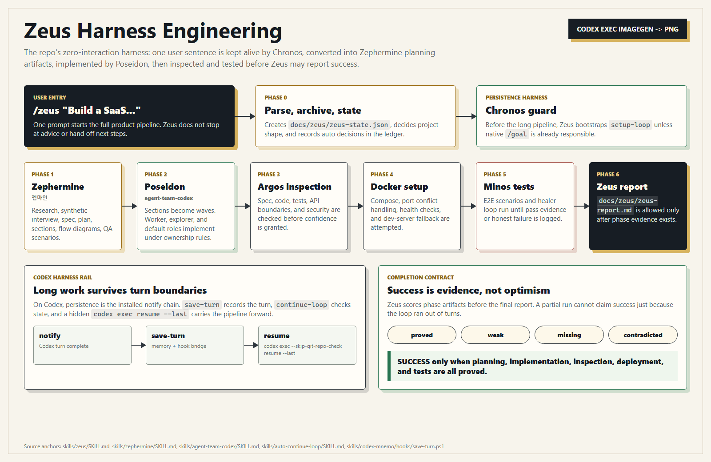
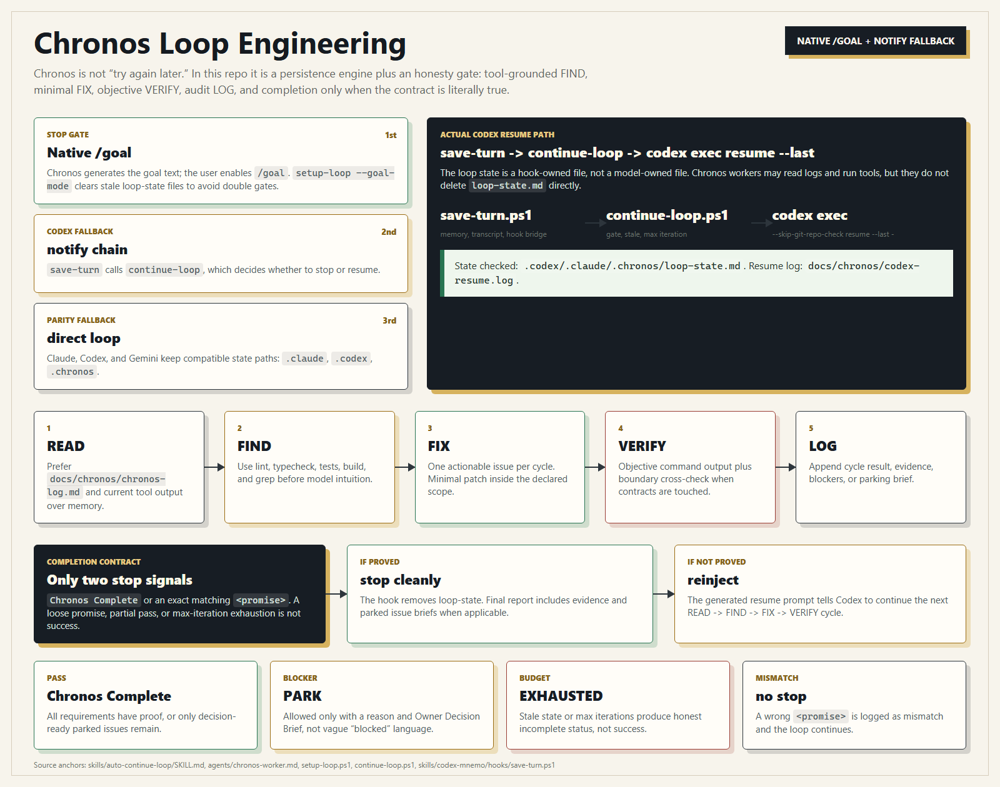

**Language:** English | [한국어](README-ko.md)

# Skill Olympus

### Twelve Greek gods. One command. A working SaaS.

> *Speak the name of cloud-gathering Zeus, and the entire pantheon descends —*
> *Zephermine drafts the spec, Poseidon raises the fleet, Argos counts every plank,*
> *Minos judges every test, and Clio carves the whole story into bronze.*

[](https://github.com/Dannykkh/skill-olympus/stargazers)
[](https://github.com/Dannykkh/skill-olympus/network/members)
[](LICENSE)


A production agent harness for **Claude Code**, **Codex CLI**, **Gemini CLI**, and **Grok Build** — a **harness-engineering** and **loop-engineering** stack,
named after the Twelve Olympians, forged across 3 months of daily real-product builds.

```bash
/zeus "Build a shopping mall. React + Spring Boot + PostgreSQL"
```

One line. Twelve gods. Design → Implement → Inspect → Test → Ship.
**No questions asked. No blueprints needed. No human in the loop.**

> **Built for the loop-engineering era.** Agents don't run on a single prompt — they run on loops:
> act → observe → verify, repeated until an **objectively verifiable completion criterion** is met.
> Olympus was built that way from the start — Chronos (verification gate that runs real tests),
> Minos (fix-until-pass), Argos (AC cross-check), Clio (GO/NO-GO). Since v4.7.0 these loops run
> on top of CLI-native features (`/goal` stop gate, review engines, built-in subagents) —
> the harness is the foundation, the loop is the operating model.
> And since v4.8.0 the loops know how to **stay** running: a loop survives on structure,
> not willpower — heartbeat in the machine, state in the audit log, blocked issues parked
> with decision-ready briefs, and false completion claims rejected at the hook level.

---

### What you actually get

| | |
|---|---|
| 🏛️ **The Pantheon** | 12 Greek gods (skills), each forged for one craft. Call one, or call Zeus to summon all twelve at once |
| ⚡ **One-command pipeline** | `/zeus "..."` ships an entire SaaS with zero human interaction (design → build → inspect → test) |
| 🧠 **Cross-CLI memory** | Persistent 3-layer memory (`mnemo`) that survives across sessions and across Claude/Codex/Gemini/Grok |
| 🔁 **Tireless loop** | `/chronos` autonomously runs FIND → FIX → VERIFY until the bug dies or the dawn breaks |
| 👁️ **Hundred-eyed watchman** | `/argos` cross-references spec ↔ code ↔ tests. Nothing slips past 100 eyes |
| ⚖️ **Underworld judge** | `/minos` weighs every Playwright test on golden scales. Fix-until-pass loop, no escape |
| 📜 **The chronicler** | `/clio` — closer + muse. GO/NO-GO judgment first, then carves PRD, flow diagrams, docs, and doc site onto bronze |
| 🏠 **Keeper of the hearth (optional)** | The source-only `hestia` workflow scans dead code, unused exports, and orphan files; request it through the catalog or enable `/hestia` with the source-only opt-in |
| 📋 **Launch checklist (optional)** | The source-only `shipping-and-launch` workflow covers pre-launch gates, staged rollout, and rollback planning |
| 📐 **Decision records (optional)** | The source-only `documentation-and-adrs` workflow records alternatives, trade-offs, and superseded decisions |

**100 skill sources (default allowlist union: 17 = 11 entrypoint harnesses + 6 runtime adapters; 13 or 14 active per installed surface, 83 source-only internal/optional modules) · 42 agent source references (40 top-level + 2 skill-owned; 0 custom agents registered by default) · 9 hooks · 4 CLIs · 1 mythology**

---

## Harness and Loop Engineering

Zeus is the harness layer: one non-interactive request is kept alive, decomposed, implemented, inspected, deployed, tested, and reported without handing "next steps" back to the user. In this repo that means `skills/zeus/SKILL.md` bootstraps Chronos persistence, drives Zephermine planning, routes implementation through Poseidon (`agent-team-codex` on Codex), then requires Argos, Docker, Minos, and a final evidence report before SUCCESS is allowed.

<p align="center">
  
</p>

Chronos is the loop layer under that harness. It prefers native `/goal`, falls back to the Codex notify chain (`save-turn -> continue-loop -> codex exec --skip-git-repo-check resume --last -`), and only stops on `Chronos Complete` or an exact matching `<promise>`. Exhaustion is reported as incomplete, blockers are parked with Owner Decision Briefs, and each cycle returns to READ -> FIND -> FIX -> VERIFY -> LOG.

<p align="center">
  
</p>

---

## Quick Start

### First install

```bash
# Clone
git clone https://github.com/Dannykkh/skill-olympus.git
cd skill-olympus

# Windows
.\install.bat

# macOS/Linux
chmod +x install.sh && ./install.sh
```

Running without arguments is the default full installation for Claude, Codex, Gemini, and Grok.
`--all` is an optional explicit spelling of the same selection. The installer prepares each selected
CLI's files even when that CLI executable is not on `PATH`; only CLI-dependent commands such as MCP
registration are skipped. Install the missing CLI and rerun the same installer to finish those commands.

### Updating an existing installation

A normal update does not require an uninstall first. Running the installer again reconciles only
Olympus-managed names with the current policy and leaves unrelated third-party skill names in place.

```powershell
git pull
.\install.bat
```

Use `./install.sh` on macOS/Linux. Uninstall and reinstall only when the installation is broken
or when you deliberately want to rebuild Olympus hooks and MCP registrations from scratch.

```powershell
.\install.bat --uninstall
.\install.bat
```

### What does source-only mean?

Source-only does not mean that an old skill version is being retained. It means that the **current
Olympus `SKILL.md` and supporting files remain available without being registered in the CLI's automatic
discovery directory**.

- Current sources are copied under each CLI's `.olympus/source-skills/` and recorded in `SKILLS-CATALOG.md`.
- An active Olympus harness or the LLM can read that catalog source when a task needs it.
- Use `--include-source-only-skills` to put every compatible source-only skill back into slash menus and automatic matching.
- That option activates current Olympus sources; it does not restore an older modified copy from `_olympus-preserved`.

```powershell
.\install.bat --include-source-only-skills
```

That's it. The 100 sources split into a 17-skill default allowlist union (11 user-facing harnesses + 6 runtime adapters) and 83 source-only internal or optional modules. Runtime compatibility then removes adapters meant for other CLIs: Codex and Gemini each expose 96 compatible entries (13 active + 83 source-only), while Claude exposes 97 (14 + 83). Grok's standalone policy is also 96 (13 + 83), but the installed Grok surface reads the shared Claude directory and therefore sees the same 14 active entries as Claude. Active harnesses resolve required source-only modules through the catalog and read them directly; those modules do not need independent registration. **No Olympus custom agent is registered by default**; all 42 agent references remain source-only, and each CLI keeps its native subagents. New skill and agent sources are default-denied until deliberately allowlisted.

> A missing CLI does not suppress asset preparation. Its skill catalog, source library, hooks, and
> configuration files are prepared; only commands that require the executable are reported as skipped.

> When upgrading an existing installation, unrelated third-party skill names are preserved. Modified
> same-name collisions are moved to `_olympus-preserved` instead of being discarded. See the
> [skill registry migration guide](docs/skill-registry-migration.md) for the lightweight default,
> full opt-in, collision recovery, and uninstall/reinstall procedure.
> Recovery is manual: copy the preserved skill back only after giving both its directory and frontmatter
> `name` a unique name. Otherwise the next sync will preserve it again. `--uninstall` never restores backups.

---

## The Pantheon of Olympus

> *Beyond the wine-dark sea, where clouds part above the world, Mount Olympus rises.
> On its windswept summit dwell the Twelve, each crowned with their own dominion,
> each known by an ancient and many-named song. Speak the name of one, and that one alone
> shall descend the holy mountain. Speak the name of cloud-gathering Zeus,
> and the whole pantheon shall come down with him in golden procession.*

This is no mere tool-chest. It is a small **mythology of work**, a council of immortals
each shaped to a single craft. They work as the old singers tell us they have always worked —
gentle Zephermine, breath of the west wind, whispers a blueprint into the ear of earth-shaking
Poseidon; Poseidon stirs the deep and his fleet sails forth in waves; hundred-eyed Argos
walks the shore at dusk to count every nail and every beam; stern Minos sits upon his marble
throne to weigh each soul at the gate; and last of all, fair-tressed Clio takes up her stylus
to carve the whole tale upon a tablet of bronze, that mortals yet unborn may read of it.

Below stand the immortals. Call upon one — or call upon all.

### The Twelve Who Sit Upon the Mountain

| Skill | Name | Epithet | Domain |
|-------|------|---------|--------|
| `/zephermine` | **Zephermine** (젭마인) | *Breath of the West Wind, Bringer of Spring* | The Architect — 26-step deep interview, spec generation, 6-expert team review |
| `/zeus` | **Zeus** (제우스) | *Cloud-Gatherer, Hurler of Thunderbolts, Father of Gods and Men* | The Sovereign — Zero-interaction full pipeline; at his nod the council convenes |
| `/agent-team` / `/poseidon` | **Poseidon** (포세이돈) | *Earth-Shaker, Lord of the Wine-Dark Sea, Trident-Bearer* | The Sea Lord — Reads dependency graphs as a sailor reads tides; sends the fleet in waves |
| `/workpm` | **Daedalus** (다이달로스) | *The Master Builder, Maker of the Labyrinth, Father of Wings* | The Hands-On Builder — Where there is no plan, he becomes the plan |
| `/argos` | **Argos** (아르고스) | *Argos Panoptes, the All-Seeing, of the Hundred Eyes* | The Watchman — Of his hundred eyes, none ever sleep at the same hour |
| `/minos` | **Minos** (미노스) | *Judge of the Dead, Keeper of the Golden Scales* | The Judge — At his marble throne, every soul and every test is weighed |
| `/clio` | **Clio** (클리오) | *Kleio, Proclaimer, Muse of History, Daughter of Memory* | The Chronicler — Her stylus sets down what mortals have done, that none may forget |
| `/chronos` | **Chronos** (크로노스) | *Father of Time, the Unwearying, He Who Devours the Hours* | The Tireless — Time itself is his servant; he turns the wheel until the deed is done |
| `/hermes` | **Hermes** (헤르메스) | *Wing-Footed Messenger, Guide of Souls, Patron of Merchants* | The Wayfinder — Reads the trade-winds and the marketplaces of distant lands |
| `/athena` | **Athena** (아테나) | *Gray-Eyed Daughter of Zeus, Defender of Cities, Born from the Skull* | The Strategist — Wisdom that cuts as cleanly as her father's bronze spear |
| `/aphrodite` | **Aphrodite** (아프로디테) | *Foam-Born, Golden, Cytherean, Lover of Laughter* | The Beauty — From her hand come forms that mortals cannot help but love |
| `mnemo` | **Mnemo** (므네모) | *Mnemosyne, Titaness of Memory, Mother of all the Muses* | The Keeper — She forgets nothing; her daughters are born of her remembering |

---

### Songs from the Mountain

> Hear now the voices of the Twelve, as the old singers heard them.

🜲 **Zeus, Cloud-Gatherer**
Upon the topmost peak he sits, and his nod is the law of mountains.
When his voice rolls out across Olympus, the council rises as one and descends —
designer, builder, watchman, judge, and chronicler — all at his single word.
*"Speak my name once, mortal, and the whole council shall walk beside you to the end."*

🜂 **Zephermine, Bringer of the West Wind**
She is the soft breath that wakes the seed beneath the soil.
Six and twenty are her questions, and the breath of each one is gentle —
yet none may pass her by, for the spec is sacred and half-told tales bear no fruit.
*"I ask, and ask, and ask again — until what was unspoken becomes a thing of stone."*

🜄 **Poseidon, Earth-Shaker**
He stands knee-deep in the wine-dark sea, his trident raised, and the waters listen.
The fleet of teammates lies in the harbor, and at his bidding the wave gathers them all
and bears them out together, each prow pointed where the dependency graph commands.
*"The sea does not yield to the swimmer. The swimmer who knows the tide — she yields to him."*

🜔 **Daedalus, Master Builder**
Before him there was no labyrinth in all of Crete.
He took stone from the mountain and shaped it with his own hands, and the work was good.
Where the blueprint is missing, where the architect has not spoken, send for him —
he will research, he will draft, and if no other hand will rise, his alone shall raise the walls.
*"Give me the stone. The plan I shall make as I go."*

👁 **Argos Panoptes, the Hundred-Eyed**
He paces the half-built city by night, and at no hour are all his eyes closed at once.
The plank a mortal builder forgot to nail — he has already seen it.
The line of code that fails to match the spec — he has already named it.
*"While fifty of my eyes rest, fifty more keep watch. Nothing passes Argos in the dark."*

⚖ **Minos, Judge of the Dead**
He sits upon a throne of cold marble at the gate where the souls of the dead must come.
He raises his golden scales, and the work is weighed against itself.
His verdict is two-fold and no other: it shall pass, or it shall return to the fire.
*"Stand before the scales, child of mortals. We shall see if your tests are honest."*

📜 **Clio, Muse of the Long Memory**
She comes last of all the gods, after the labor is laid down.
Her stylus is bronze and her tablet is the years to come.
What the heroes have done, she sets down — diagram, decree, manual, and song —
that the children of the children of those mortals may know the deeds were real.
*"The work has ended. Now begins the telling, and the telling endures."*

⏳ **Chronos, the Unwearying**
He is older than memory, older than the gods themselves.
He turns the great wheel of the hours and does not tire when mortals sleep.
The bug shall die or the dawn shall come — and Chronos shall outlast them both.
*"Mortals close their eyes. I do not. The work shall be finished, by sunrise or by the next."*

🪶 **Hermes, Wing-Footed**
He moves between the worlds — the high palace and the low marketplace, both are his road.
He reads the trade-winds of distant lands and the price of grain in city-gates yet unseen.
Before a single coin is risked, before a single line of code is written, he speaks first.
*"Every market is a road, traveler. Every road has its toll. Bring silver, or bring nothing."*

🦉 **Athena, Gray-Eyed**
She was born full-grown from the skull of her father, helmeted, spear in hand.
Her wisdom does not flatter; her counsel is the cold edge of the bronze.
She will ask the question the mortal fears most — *should this thing be made at all?*
*"Wisdom, child, is to know which work must never be begun. I shall ask. You shall answer."*

🌹 **Aphrodite, Foam-Born**
She rose from the white foam of the sea, and the world has not been plain since.
Nine palettes lie at her hand, seven and forty font pairings, four and eighty styles.
What leaves her workshop is not merely useful — it is loved, and that is the difference.
*"Beauty is not the ornament of the work. Beauty is what makes the work survive its maker."*

📚 **Mnemo, Mother of the Muses**
Long before the nine sisters sang, Mnemosyne kept the long memory of the world.
The conversation a mortal had three moons ago is the answer she carries to him today.
Three layers she keeps — the index of names, the meaning of things, the tale itself —
and her remembering crosses every session, every CLI, every dawn.
*"Forget nothing, child. The word you spoke long ago is the gift you needed now."*

---

## What's New

### v5.0.0 — Entrypoint-Only Registry · Native Agents · Provider-Safe Runtime Routing (August 2026)

Olympus now keeps only user-facing harnesses and the current CLI's runtime adapters in automatic discovery. The 100 current skill sources split into an allowlist union of 17 (11 common entrypoints plus 6 runtime adapters) and 83 source-only modules: Claude and the Grok-shared Claude surface expose 14 active skills, while Codex and Gemini expose 13; all three homes retain the same 83-module source library through exact catalog paths. Source-only means current code is available for direct, on-demand reading without consuming slash-menu or startup-description budget; `--include-source-only-skills` remains the explicit full-registry opt-in. Olympus custom agents now default to zero: orchestration uses each CLI's semantic read-only and write-capable native roles, with Main owning shared state and sequential fallback when delegation is unavailable. Runtime-specific adapters are selected by provider so Claude/Grok, Codex, and Gemini do not load one another's incompatible mnemo or agent-team entrypoints. The installer now treats no arguments as all four CLIs, prepares assets even when a CLI executable is absent, skips only executable-dependent registration, preserves unrelated third-party names, and moves modified same-name collisions to `_olympus-preserved` for manual recovery.

### v4.21.0 — Aphrodite Experience-Led Redesign · Stitch as Execution Adapter · Zeus Scope Gate (August 2026)

Aphrodite no longer starts from color tokens. The pipeline now runs source-mode routing → site-benchmark dissection (evidence-backed Adopt/Adapt/Avoid verdicts on header, message, section order, CTA, trust, and mobile transformations) → three actually-rendered directions → an **Experience Contract** capturing user tasks, messaging, CTAs, trust, and responsive behavior → implementation → rendered UX/accessibility/performance gates → a learning handoff, with a validation script enforcing the contract shape. Stitch is repositioned as an execution adapter: it compiles Aphrodite's decisions (`DESIGN.md`, design-refs) into Stitch MCP operations — work-contract, state-management, and file-transfer patterns selectively adopted from google-labs-code/stitch-skills — and never invents a visual direction of its own. Zeus gained a **scope gate**: a zero-interaction run has no user to approve scope creep, so any task, feature, or dependency not in the fixed plan must answer three questions (does it serve the one-line goal? what observed evidence demands it now? would something smaller do?) and record a pass/reduce/hold verdict in the Decision Ledger — held items surface as Deferred for post-hoc promotion (principle absorbed from hosioobo/track).

### v4.20.2 — Themis: Official-Guideline Pinning · Runtime Freshness Check (August 2026)

(spans v4.20.1–v4.20.2) The Korean policy path is now anchored to the PIPC's official **Privacy Policy Writing Guideline (Apr 2025)**: the guideline edition is pinned in the skill, and at generation time Themis fetches the official notice board to detect newer revisions — adopting them and telling the user when one exists (environments without web tools fall back to the pinned edition with an explicit "check latest" note). The ko template gained the 2025.4 specifics: a grievance-handling contact separate from the privacy officer, behavioral-advertising collection/refusal clauses, and a children's-data clause (Art. 22-2). Statute citations are verified against law.go.kr by direct fetch; the briefly-added optional law-MCP integration was removed as an unnecessary dependency — the "guidelines keep changing" problem is solved by runtime checks, not by owning scraper infrastructure.

### v4.20.0 — Themis: Privacy-Policy Generator · mnemo Opt-Out (August 2026)

Themis, Titaness of law and order, joins as skill #100. She audits a codebase for every point where personal data is received, stored, sent out, or deleted (5 audit questions + grep hints + a trap checklist covering soft deletes, append-only logs, uninstall scope, masking coverage, silent outbound requests, and `git ls-files`-verified ignore rules), interviews the operator for the 14 things code cannot tell you (privacy officer, retention, children, server region, marketing use…), then generates per-country policy drafts (Korean PIPA Art. 30 / US CCPA-CPRA / EU GDPR Art. 13) from audit facts only — unverified items stay explicit fill-in blanks, legal judgments are flagged for counsel, and every draft carries a not-legal-advice notice. Dogfooded on this very repo: the three resulting drafts ship as `docs/privacy-policy-draft-*`. That audit also exposed our own gap — recording hooks with no off switch — so mnemo gained `MNEMO_DISABLE` (all 15 hook entry points across 4 CLIs exit immediately; existing data untouched) and the session-start version check gained `OLYMPUS_UPDATE_CHECK_DISABLE`, both verified by on/off comparison runs.

### v4.19.0 — Native-First Realignment: 4-CLI Native Multi-Agent · impeccable Detection Hook (August 2026)

The Aphrodite interference experiment (real defects: native-alone 1 ≪ custom 20 ≈ mixed 25) proved the native-first principle — **"engines upstream, extensions local"** — and this release applies it across the skill roster. Design axis: the frontend-design fork now yields auto-invocation to the official plugin (with the v2.9.1 core grafted in), and prohibition rules moved from prompts to a linter — impeccable's 59 deterministic rules wired as a PostToolUse hook. Shipping that surfaced a real defect: PostToolUse exit-0 plain stdout never reaches the model, so the hook was rewritten to emit `hookSpecificOutput.additionalContext` JSON (without this fix it would have run silently forever). Multi-agent axis: with all four CLIs now shipping native multi-agent, Poseidon and Daedalus delegate execution to each CLI's native primitives (Claude Agent Teams / Codex spawn_agent / Gemini subagents / Grok spawn_subagent), repositioning the orchestrator MCP as a policy layer for hard file locks and external task boards plus a legacy fallback. Zeus gained an ultracode-session-only Workflow verification fan-out branch, Chronos got its Gemini AfterAgent wiring corrected (plus removal of stale deprecated `/loop` help text), and Argos now delegates its generic code-quality layer to the native review engines while keeping spec-vs-implementation audit as its own domain. Humanizer re-absorbed both upstreams (blader v2.9.1 + im-not-ai v2.3). The Gemini paths are designed from official docs but not yet field-tested — the verification checklist is on record.

### v4.15.0 — Grok Build Support: grok-mnemo Adapter (July 2026)

Grok Build (xAI's CLI) joins the roster with near-zero integration cost: `grok inspect --json` confirmed that Grok reads `~/.claude/` directly via its `[compat.claude]` defaults — 99 skills, 41 agents, MCP servers, and the global CLAUDE.md rules all load without any sync script. The only real parity gap was mnemo auto-save: Grok's hook envelope is camelCase (no `transcript_path`), so Claude's Stop hooks silently no-op'd and Grok conversations were never recorded. **grok-mnemo** closes that gap — one script dispatching on two events (UserPromptSubmit strips Grok's `<user_query>` wrapper; Stop saves `lastAssistantMessage` directly, no transcript parsing, filtering out the session-end observe re-fire by `reason == "end_turn"`), writing to `conversations/YYYY-MM-DD-grok.md`. Since Grok also loads `~/.claude/settings.json` hooks, the five Claude mnemo hook pairs gained a `GROK_HOOK_EVENT` guard to prevent double/mislabeled saves (Grok prompts were landing in `-claude.md`). Shipping this surfaced two environment gotchas now on record: Korean-commented `.ps1` files must be UTF-8 **with BOM** (PowerShell 5.1 reads BOM-less files as CP949, and a misdecoded comment can swallow the newline and absorb the next code line — the `<user_query>` strip silently never ran), and the installer test had been failing on `NoDefaultCurrentDirectoryInExePath=1` machines because it invoked `install.bat` by relative name. Verified end to end with a real `grok -p` headless session.

### v4.14.0 — Layout Block Anatomy · Atmosphere Recipe · Prompt Consumption Gate (July 2026)

A full round-trip: build a real page with Aphrodite, notice it's still generic, fix the pipeline, rebuild, repeat — validated end-to-end on this project's own landing page (`dannykkh.github.io/skill-olympus`). **Layout block anatomy:** bag-ui's (MIT) block wireframe catalog translated into a structure grammar — 30 block anatomy contracts (Marketing/App/Ecommerce) with shared rules (three-level ink hierarchy, exactly-one emphasis per block, CTA syntax, sustained-asymmetry ratio reuse across sections) wired in as design-plan Phase 2.5, so structure is locked before style. **Prompt consumption gate:** DESIGN.md's prose contracts and `docs/design-refs/` superprompts were being produced but never mandatorily read at implementation time — Phase 3 now requires reading them first, and direction cards must be saved to file instead of living only in chat. **Atmosphere/texture recipe:** SKILL.md told implementers to add grain/mesh/noise "atmosphere" with no verified CSS values to reach for, so it evaporated in practice — a new `technique-recipes.md` §11 supplies a real grain overlay, a restrained mesh gradient, an emphasis-break rule for repeated blocks, and a "boring test." The rebuild also surfaced two ground-truth bugs only visible by actually shipping: a font-loading false negative (`document.fonts` reports "unloaded" for subsetted Korean webfonts even after the network fetch succeeds — verified by inspecting the actual `woff2` requests) and a mobile CSS-selector bug (`.pipeline-grid > div` deleted the whole timeline, not just the empty gutter) caught by screenshot, not static review.

### v4.13.0 — Data Visualization Skill (July 2026)

Vendored Anthropic's official `data-visualization` skill (from `anthropics/knowledge-work-plugins`, Apache-2.0, body unmodified) — chart-selection guidance by data relationship (trend/comparison/ranking/distribution/correlation/flow), chart anti-patterns (pie charts over 6 slices, 3D, dual axes), Python code patterns (matplotlib/seaborn/plotly), design principles, and an accessibility checklist.

### v4.12.0 — Style Recipes · Reference Capture · Chronos Heartbeat (July 2026)

Aphrodite absorbed the best of MengTo/Skills (MIT) after a full read-through. **12 style recipes:** each aesthetic capsuled as "identity boundary + hex tokens + Korean/Latin font stacks + tuning knobs + avoid list" — the original's value-less prose was fixed by binding to our CSV DBs, and every color pair was verified by WCAG computation (3 sub-4.5:1 pairs fixed before shipping). **9 technique recipes:** copy-paste-ready values for shadows, progressive blur, border gradients, text reveals, and the GSAP+Lenis motion system. **Reference capture (Phase 2 rework):** screenshots/URLs/videos/HTML become section-anatomy superprompts (`docs/design-refs/`) — prompts as versioned assets. **Chronos heartbeat:** skipping `/goal` setup used to leave the loop engineless and stall mid-run; the new 1.5-tier engine re-enters via native `/loop` intervals (`--heartbeat`), and score-based completion (e.g., "90+ points") is now formalized as a 3-part `--completion-promise` (threshold, measurement, printed evidence). The pipeline was validated end-to-end with an editorial-tech sample page (Korean fallback rendering, motion, responsive, contrast), surfacing and fixing gotcha 045 (`document.fonts.check()` false-negatives on unicode-range subset fonts).

### v4.11.0 — Unknowns-First Planning · Lean Zephermine Flow · Implementation Learning Loop (July 2026)

Zephermine now plans around what is unknown instead of stopping for broad preference interviews. **Unknowns-first discovery:** Step 4 auto-selects codebase/web/GitHub/academic/competitor research from the spec and risk profile, writes `research-decision.md`, then Step 5A writes `unknowns.md` with known knowns, known unknowns, unknown knowns, unknown unknowns, and architecture-changing questions. **Lean interview:** Step 6 asks only critical blockers that could change architecture, data model, security boundary, UX flow, rollout, or compliance; otherwise it writes inferred assumptions and continues. **No-stop domain flow:** `domain-dictionary` now auto-seeds clear global terms, auto-merges low-risk ADD/REFINE/MERGE updates, and asks only on blocking dictionary conflicts. **Implementation learning:** workpm and agent-team prompts now keep `implementation-notes.md` deviations; Clio can generate a `CHANGE-QUIZ.md`; frontend-design can use divergent static prototypes to surface "you know it when you see it" preferences before implementation.

### v4.10.0 — DESIGN.md as Canonical Source · Korean Font Real-Load Guardrails · Hook Timeout & Schema Fixes (July 2026)

Driven by running `/aphrodite` end-to-end on a real Korean-language UI. **DESIGN.md canonical source:** Google's `@google/design.md` format (YAML tokens + two-layer prose) is adopted as Aphrodite's design source of truth, with the agent wiring, single-source, and verification Google omits — a new `design-md-guide.md` (schema + lint/export + legacy migration), CSV palettes pinned into DESIGN.md to stop re-invocation drift, and a "read DESIGN.md first" rule injected into the 3-CLI always-on guardrails. **Korean font real-load guardrail:** picking a Latin-only pairing let Korean silently fall back to a system font (Space Grotesk/DM Sans have no Hangul glyphs) — fonts must now be actually loaded (`@import`/`<link>` + `document.fonts.check`), and Korean UIs prefer a Korean-only pairing (Hahmlet/Noto Serif KR + Pretendard/Noto Sans KR) that covers both scripts, structurally avoiding the fallback trap (gotcha 041); the Latin+Pretendard stack remains the fallback path. **Dark/light theme rule:** the three commonly-missed spots (container `div` backgrounds, text-color inversion, `<select>` option `color-scheme`) are now checked by the mnemo guardrail and ui-ux-auditor. **Fixes:** hook 30s-timeout prevention (60s timeout + `powershell -NoProfile` across all four hook-command generators, closing "hook timed out after 30s — output discarded"), and AskUserQuestion schema violations (≤4 options, ≤12-char headers) in the Aphrodite presets and zephermine templates.

### v4.9.0 — Always-on Design Guardrail · Consult-Before-Implement · Handoff Feature Map (June 2026)

Three always-on capabilities, plus a compatibility audit. **Design guardrail injection:** frontend-design's anti-slop guidance only fired when the skill was explicitly invoked (the `auto_apply` field is read by no hook — a no-op), so casual design requests defaulted to "internet-average" output. The condensed guardrail is now injected into the 3-CLI always-on context (CLAUDE.md/AGENTS.md), updated to the 2026 web platform — native scroll-driven `animation-timeline` first (GSAP·Lenis only for pin/snap/WebGL), View Transitions API, container queries, `:has()`, OKLCH — plus a Korean/Latin font-pairing principle (Pretendard + noonnu, matched by weight/contrast DNA). Condensed ~24% and browser-verified on three distinct directions (dopamine SaaS / editorial / brutalist). **Consult-before-implement guard:** "implement X" requests now check existing work first (codemap → README/handoffs → grep), classify new/improve/duplicate, and compare against adjacent pipelines (zeus·zephermine·agent-team) — closing the "re-implementing what already exists" loop. **Handoff feature map:** every handoff records a Feature/Flow/Decision Snapshot + a Menu/Screen Map (screen-level features with done/partial/planned status), with diagrams required only for feature-bearing sessions. **agent-team·chronos** gain a static boundary-coherence cross-check ("build passes ≠ correct" — TS generics hide API↔hook contract mismatches) and chronos grounds its FIND in tool signals before model intuition. **Compatibility audit:** Pydantic v2, Next.js 15 async params, MySQL 8.4, docker compose v2, MUI v7, OpenAPI 3.1, Tailwind v4, and stale tool/model labels across the utility skills.

### v4.8.7 — Loop Honesty: Completion Contract, Independent Verify, Exhaustion Surfacing (June 2026)

Loop Library 028/034 patterns propagated across the loop stack. A **completion contract** (each requirement mapped to reproducible evidence, scored `proved/weak/missing/contradicted`, and **exhaustion never reported as success**) now governs termination in Chronos, Zeus, minos, autoresearch, argos, agent-team, and workpm. **Independent cross-model verification** is added where a single actor would otherwise grade its own work — autoresearch re-scores the final champion with a different model family, and Zeus's argos gate runs cross-model only on risk triggers (deterministic build/test/static gate first, the other model in the background) so the implementation path stays fast. At the **hook layer**, loop-stop and continue-loop now surface `EXHAUSTED` on max-iterations/stale termination and inject a final-allowed-turn honest-report warning (dry-run verified, ps1 5/5; sh syntax-checked). Hermes gains a grounding guard: TAM/SAM/SOM figures require a cited source or an explicit `[확인 필요]`.

### v4.8.1 — mnemo Root-Resolution Fix (June 2026)

Auto-save hooks used to key off the *latest* cwd, so a `cd` into a subfolder (e.g. `reference/1week`) in a **non-git** project scattered `conversations/`·`memory/` into that subfolder. Root resolution is now a 2-pass candidate evaluation — Pass 1 takes the first candidate with a git root (a git repo normalizes from any subfolder), Pass 2 falls back to the **session-launch cwd** for non-git projects, so a persisted `cd` can't move the anchor. Also guards an environment where HOME itself is a git repo (HOME excluded from candidates; a git root equal to HOME is treated as a dotfiles repo and skipped). Applied across all 8 hooks (save-response/save-conversation/save-tool-use/reconcile-conversations × ps1·sh) with installed copies synced; PS 7/7 · SH 7/7 scenario tests pass.

### v4.8.0 — Loop Programming: Park, Brief, Re-entry (June 2026)

> A loop is sustained by structure, not by the model's will to continue.
> Five failure modes, five structural cures: heartbeat in the machine, state outside the
> context window, blockers parked instead of blocking, idle work defined, and the human
> taken off the critical path with decision-ready briefs.

<p align="center">
  
</p>

The loop state lives in the audit log, not the context window; each cycle re-enters through READ, verifies with objective checks, parks valid blockers with decision-ready briefs, and lets hooks reject false completion claims.

- **Chronos PARK rule** — one blocked issue can no longer stall the whole loop. Four valid park reasons (verification 3-fail / permission boundary / missing external access / product decision); declaring "blocked" without naming a reason counts as evasion; the worker must go as far as it can (reproduce, root-cause, in-permission fixes) before parking
- **Escalation ladder before PARK** — a verification failure is not parked to the owner until the model raises its own capability once (higher reasoning effort, a stronger model, or a focused review pass when neither is available). Same-approach retries alone cannot trigger a park; escalation runs at most once per issue and its outcome is recorded in the Owner Decision Brief evidence
- **Owner Decision Brief** — parked issues are reported decision-ready, never as raw questions: what / why now / evidence / trade-offs / **recommendation (mandatory — never offload analysis to the owner)** / exact choices. The owner's job becomes a 4-way choice: approve as recommended, reject, grant exactly one access, or pick a documented alternative
- **Re-entry protocol (READ step)** — every cycle re-reads `docs/chronos/chronos-log.md` before FIND; when the model's memory and the log disagree, **the log wins**. A new session resumes the loop from the audit log alone — loop state lives in files, not in the context window
- **Deadlock guard** — goal statements now include the park clause: when only parked issues remain, the loop ends with a Brief-carrying `Chronos Complete` report. Outputting an untrue `<promise>` is forbidden — and the hooks stop rewarding it: the "any `<promise>` tag = done" branch is removed from loop-stop/continue-loop (a mismatched promise re-injects instead of terminating), multiline promises now match, and re-injection nudges teach the park rule. loop-stop.ps1 functionally tested (4/4 cases: mismatch-rejected / exact-match / parked-only complete / no-marker re-inject); .sh mirrored + syntax-verified
- **Zeus Decision Ledger** — `[ZEUS-AUTO:taste]` decisions now record rationale + rejected alternatives + **how to reverse**; zero-interaction stays intact — approval moves post-hoc instead of pre-hoc, with reversible defaults preferred
- **codex-mnemo installer fix** — notify-wrapper check order corrected: a wrapper that chains save-turn is preserved (refreshed) before the IDE-notification removal heuristic runs. External tools sharing Codex's single notify slot are no longer silently disconnected by reinstall

### v4.7.1 — Design Visual Verification + Clio Gate Hardening (June 2026)

- **ui-ux-auditor visual verification** — after the Grep static scan (first-pass signal), it now starts the dev server, captures screenshots (desktop 1440×900 / mobile 390×844 × light/dark), and **scores by directly observing the rendered screen**. When observation and code inference conflict, observation wins. Falls back to static-only with a `*` grade marker when no server can start. Proven end-to-end with a 4-planted-defect smoke test (dark-mode contrast collapse, purple gradient, symmetric 3-col grid, fixed-width overflow) — 4/4 caught by observation
- **clio v2.1.1 — GO/NO-GO verdict hardening** — minos results now enter the verdict (PASS/CONDITIONAL/FAIL), vacuous GO blocked (zero tests caps at CONDITIONAL GO), gate bypass via `--force`/`--docs-only` must be flagged on every artifact
- **Aphrodite scope boundary** — Phase 3 implementation limited to "appearance": tokens, markup, styles, visual interactions are hers; state, API wiring, business logic belong to Poseidon/Daedalus (no logic changes in pipeline mode)

### v4.7.0 — Native Harness Integration (June 2026)

> Groundwork for loop engineering — aligning the loop's parts (stop gate, review engine, team tools) with CLI-native features.

- **code-reviewer v4.1 — engine delegation + policy layer** — generic review is delegated to an available runtime engine (Claude built-in review, Codex `codex review --base`, Grok bundled review); runtimes without one use the full path. The skill adds Scope Drift, domain checks, read-only-by-default action triage, and a safe explicit repository-security audit. Remote/billed ultra review is never invoked or suggested
- **Chronos legacy `/loop` alias retired** — name collision with native `/loop` (interval re-runner) hijacked the alias on Claude. Removed across all CLIs + goal (stop gate) / loop (re-runner) / chronos (loop discipline) comparison table
- **Audit follow-ups (5 parallel Explore agents)** — zeus × /goal relationship (hook auto-resume stays default for zero-interaction; bootstrap skipped when a goal is pre-set to avoid double stop gates), agent-team experimental env var demoted to legacy, project-root memory vs native auto-memory boundary in 4 files, orchestrator native-vs-MCP selection criteria, chronos `--flow-verify` receiver definition, zephermine vs native plan-mode distinction
- **clio v2.1.0 — humanizer Korean copyediting hookup** — translationese/AI-style constraints injected at generation + post-generation S1 pass (USER-MANUAL > PRD > TECHNICAL priority)
- **Codex native `/review` documented** — TUI `/review`, `codex review --base/--uncommitted`, `codex exec review` in `docs/resources/codex-cli.md`

### v4.6.0 — Humanizer Korean Writing Module (June 2026)

- **Korean translationese module (67 patterns, 10 categories)** — comma-after-connective (4.84x vs human writing, strongest single signal), ~성/~적/~화 nominalization, progressive overuse, literal pronoun translation. Quantitative first-pass scan + genre guardrails (essay/paper/blog/script/formal)
- **Severity tiers + over-editing guard** — S1 (always remove) / S2 (clusters only) / S3 (overlaps only) across 24 English + 67 Korean patterns; 30% change-rate warning / 50% hard stop against meaning damage
- **Copyediting procedure** — do-not masking (proper nouns, numbers, quotes), risk-ordered rewriting, live change-rate tracking + rollback (based on im-not-ai v2.0 taxonomy)

### v4.5.0 — Chronos × Native /goal Integration (June 2026)

- **Reframed as a /goal wrapper** — Native `/goal` ("Set a goal Claude checks before stopping") landed in Claude Code and Codex. Chronos now layers its discipline on top of `/goal` (the persistence engine) instead of owning the loop: verification gate, priority cycle, audit log
- **Goal-statement model (no auto-invocation)** — Chronos cannot call `/goal` programmatically (no slash-command tool), so it generates a goal statement with its rules baked in and the user sets `/goal` once. The earlier "auto-delegation" framing was an impossible fiction and was removed
- **3-tier persistence fallback** — `/goal` (tier 1) → Stop hook / notify (tier 2) → direct loop (tier 3). Hooks are preserved so Chronos keeps working on Gemini / older builds (parity)
- **Hard guard against hook collision** — `setup-loop --goal-mode` removes any existing `loop-state.md` across `.claude/.codex/.chronos`, so the Stop hook has nothing to re-inject. Collision is impossible at the code level, not by convention. Verified with isolated `.ps1`/`.sh` tests
- **Codex vs Claude /goal differences documented** — same entry syntax, different completion judging (Codex runs commands directly; Claude's evaluator only sees chat output). Goal statements now require "print the verification result to chat" + a turn cap for cross-CLI compatibility

### v4.4.2 — Chronos Hardening + Cross-CLI Parity (May 2026)

- **Done-pattern false positive fixed** — Stop hook killed loops mid-cycle when the agent narrated progress ("모든 작업 완료, 다음 진행"). Loose narrative regexes (`모든.*작업.*완료`, `더 이상.*고칠.*없`, etc.) removed; only the explicit `Chronos Complete` marker and `<promise>` tag terminate the loop, matching the documented contract
- **tail-500 guard removed** — The 500-char window prevented stop signals when the marker sat above long explanations. Detection now scans the full assistant output; the guard's original anti-false-positive purpose disappeared once loose patterns were dropped
- **Gemini state-path bug fixed** — `loop-stop.ps1/.sh` hard-coded `.claude/loop-state.md` and silently passed through Gemini's `.chronos/loop-state.md`, breaking Chronos on Gemini entirely. Hooks now probe `.claude/`, `.codex/`, `.chronos/` in order
- **Notification fanout removed** — Desktop/IDE notification chaining stripped from Mnemo installers and save-turn hooks. save-turn, Chronos, and hook-bridge flows preserved
- **Codex compatibility audit refreshed** — Verified `notify → ide-response-notify-wrapper → save-turn → continue-loop → codex exec resume --last` chain end-to-end
- **Memory distill** — gotchas/learned entries refined via memory-distill regular runs
- **Stress-tested** — 5-iteration counter loop confirmed re-injection mechanism end-to-end on Claude (Stop hook block + reason re-inject)

### v4.4.1 — mnemo Audit Patches (May 2026)

- **mnemo-status notify hook (no LLM cost)** — Stop/save-turn hooks now check raw jsonl total and last-handoff age. When `notify_threshold_total` (500) or `notify_threshold_handoff_days` (14) is exceeded, writes `memory/.mnemo-status.md` + stderr one-liner. Pure text, zero LLM calls
- **Design ↔ docs alignment** — v4.4.0 mentioned a "threshold 50 auto-analyzer" that had no implementation (the auto-analyzer is intentionally absent to avoid silent LLM cost). config.json / SKILL.md now reflect the actual design: distillation runs only via `/memory-distill` or handoff
- **list_handoffs.py fix** — `YYYY-MM-DD-{slug}.md` filenames (no HHMMSS) were showing "Date Unknown"; now parsed correctly
- **check_staleness.py --all** — bulk mode for `docs/handoffs/`; previously required one file per invocation
- **Codex sync EXCLUDE** — `gemini-mnemo` was leaking into `~/.codex/skills/`; now correctly excluded

### v4.4.0 — /memory-distill + Dreaming-Equivalent Self-Improvement (May 2026)

- **`/memory-distill` skill (new)** — User-triggered distillation of raw `observations.jsonl` into refined `.md`. Modes: `--scan`, `--apply`, `--rebuild`. The `--rebuild` mode merges duplicates, resolves contradictions (SUPERSEDED pattern), and archives originals to `.archive/` — same logic Anthropic Dreaming runs in the cloud
- **gotcha-analyzer model upgrade** — `cleanup-low` (Haiku/mini/flash-lite) → main session model inheritance. Claude Opus 4.7 / GPT-5.5 / Gemini 3.1 Pro analysis quality, equivalent to Dreaming's `model: claude-opus-4-7`
- **Threshold downgrade 20 → 50** — Auto analyzer becomes safety net; primary distillation moves to handoff and `/memory-distill`
- **Multi-tier triggers** — Stop hook (collect) → threshold 50 (safety net) → `/memory-distill` (user-driven) → handoff (session boundary)

### v4.3.0 — Mnemo Memory Integrity Pass (May 2026)

- **Handoff path migration** — `.claude/handoffs/` → **`docs/handoffs/`** for cross-CLI sharing (gitignore was hiding handoffs from teammates)
- **Auto gotcha/learned extraction** — handoff procedure now auto-extracts new jsonl observations into refined `.md` files (no review prompt, secret scrubbing)
- **Memory item hardening** — 3 mnemo templates gain explicit guards: `source:` single-word only, `tags:` ≥3 keywords, no generic titles, ≤3 lines body
- **Memory hygiene** — 48 missing `source:` fields back-filled across 4 `memory/*.md` files; MEMORY.md cleanup (118→54 lines)

### v4.2.0 — Markdown → Publication-Quality PDF (May 2026)

- **pdf skill** — Markdown → PDF generator (playwright + Chromium), Korean defaults (A4 + 25mm + Pretendard)
- **Clio integration** — Phase 3-4 auto-emits PRD/TECHNICAL/USER-MANUAL.md as PDF alongside Markdown
- **Cover/TOC/watermark** — `--cover --toc --title --author --org --watermark "초안" --confidential`

### v4.1.0 — Domain Dictionary Pipeline (Apr 2026)

- **domain-dictionary** (new skill) — DDD Ubiquitous Language for Korean SI environments. 3-tier storage: master (`docs/domain-dictionary.md`) + delta (`<planning_dir>/`) + global (`~/.claude/memory/domain-dictionaries/`)
- **Full pipeline integration** — 12 skills now share a single dictionary: zephermine, code-reviewer, argos, poseidon, daedalus, minos, clio, hermes, athena, hestia + 2 codex variants
- **zephermine 6-Phase grouping** — 26 steps reorganized into Discovery/Spec/Domain/Plan/Design/Validation. Dictionary v1→v2→v3 evolves as Step 8/10/11 byproducts (no extra steps)
- **explain --zoom-out** — new mode showing callers/siblings/upper map (absorbed from mattpocock/skills)
- **code-reviewer module-depth** — new category for "shallow vs deep module" refactoring opportunities (absorbed improve-codebase-architecture)
- **argos Phase 8** — domain dictionary audit (4 checks: identifier compliance / forbidden terms / Korean UI labels / unregistered new identifiers)

### v1.9.0 — Athena CEO Coaching (Mar 2026)

- **ceo (Athena)** — CEO coaching skill: Go/No-Go gate, strategic challenge, scope decisions (Expand/Reduce/Pivot/Kill)
- **Pipeline expansion** — New phase: `/hermes` → `/athena` → `/zephermine` (Analyze → Challenge → Design)
- **Hermes synergy** — Athena auto-reads Hermes output for data-driven strategic challenge
- **README overhaul** — Star-optimized structure, Meet the Team with Greek myth naming

### v1.8.0 — Project Gotchas + Learned Patterns (Mar 2026)

- **project-gotchas** — Auto mistake tracking + success pattern learning (analyzer inherits main session model — Opus/Sonnet quality, Dreaming-equivalent)
- **2-layer storage** — Global (`memory/gotchas/`) + project-specific (`memory/learned/`)
- **Cross-CLI observation** — Claude save-tool-use + Codex/Gemini save-turn hooks integrated
- **CHANGELOG.md** — Version history v1.0.0 ~ v1.8.0

### v1.7.0 — Orchestrator SQLite WAL + Minos Step 5 (Mar 2026)

- **orchestrator** — state.json → SQLite WAL migration for crash recovery
- **minos** — Playwright MCP real-browser QA testing
- **codemap** — CodeMap index for codebase navigation

### v1.6.0 — Design + Business + Skill Best Practices (Mar 2026)

- **design-plan (Aphrodite)** — Design orchestrator with 9 palettes, 47 font pairings, 84 styles
- **estimate** — Development cost estimation with Excel output
- **biz-strategy (Hermes)** — Business model canvas, TAM/SAM/SOM, GTM strategy
- **Anthropic best practices** — Applied across all skills

See the full changelog in [CHANGELOG.md](CHANGELOG.md) and [Releases](https://github.com/Dannykkh/skill-olympus/releases).

---

## Core Pipeline

One command does everything:

```
/zeus "Build a shopping mall. React + Spring Boot"
    → Design (26-step interview) → Implement (parallel workers) → Inspect → Test
    → Zero interaction — never asks questions, all decisions automated
```

| Phase | Skill | What it does |
|-------|-------|-------------|
| **Analyze** | `/hermes` (헤르메스) | Business model, TAM/SAM/SOM, GTM, metrics, cohort |
| **Challenge** | `/athena` (아테나) | CEO coaching — Go/No-Go gate, scope decisions, kill test |
| **Design** | `/zephermine` (젭마인) | 26-step interview → SPEC.md → role-based native review |
| **Implement** | `/agent-team` | Wave-grouped execution with the current CLI's native workers |
| **Inspect** | `/argos` (아르고스) | Construction inspection: verify code matches design |
| **Test** | `/minos` (미노스) | Playwright E2E tests + fix-until-pass loop |
| **Deliver** | `/clio` (클리오) | Flow diagrams + PRD + technical docs + user manual |
| **Full Auto** | `/zeus` (제우스) | Seven phases: parse → Zephermine → agent-team/workpm → Argos → Docker → Minos → evidence report |

Each skill works standalone or as part of the pipeline. Hermes, Athena, and Clio are optional standalone
stages; Zeus does not invoke them in its Phase 0–6 contract.

---

## How the Gods Work — Practical Guide

> The myth above is the flavor. Here is the plain version: what each god is *for* (which work it handles), how you *call* it, and what *files* you get back. Every god works standalone; chained in order, they form the pipeline.

### Strategy & validation — before a line of code

**`/hermes` — Business case (Wayfinder)**
- **When:** validating whether an idea is worth building — demand, market, money.
- **Use:** `/hermes` (aliases: 헤르메스, 사업성)
- **Process:** demand validation → BMC → TAM/SAM/SOM → revenue & pricing → GTM → North Star → cohort. Generates 2-3 scored business-model candidates before committing to one.
- **Output:** `docs/hermes/{project}.md` (analysis + Mermaid) + a domain-term seed Zephermine reuses.
- **Next:** `/athena` to pressure-test, or `/zephermine` to design.

**`/athena` — CEO challenge (Strategist)**
- **When:** deciding *should this be built at all?* before committing resources.
- **Use:** `/athena` (aliases: 아테나, ceo) — auto-reads `docs/hermes/*.md` if present.
- **Process:** demand confidence → moat → scope mode → ROI → verdict.
- **Output:** `docs/athena/{project}.md` — GO / CONDITIONAL GO / NO-GO + scope recommendation (Reduce / Expand / Pivot / Kill).
- **Next:** `/zephermine` if GO.

### Design — turn intent into a buildable spec

**`/zephermine` — Deep design (Architect)**
- **When:** a feature/product needs a thorough spec before implementation.
- **Use:** `/zephermine [spec-path]` (aliases: 젭마인, 제퍼마인)
- **Process:** research → 26-step interview → spec synthesis → 6-expert team review → strategy-candidate scoring (ToT) → plan → DB schema / API spec / flow diagrams → section split → operation & QA scenarios.
- **Output:** `docs/plan/<feature>/` → `spec.md`, `plan.md`, `db-schema.md`, `api-spec.md`, `flow-diagrams/`, `sections/`, `operation-scenarios.md`, `qa-scenarios.md`.
- **Next:** `/agent-team` (build) or `/argos` (inspect).

**`/aphrodite` — Design system (Beauty)**
- **When:** a UI project needs an intentional experience, benchmark interpretation, and consistent implementation before the frontend build.
- **Use:** `/aphrodite` (aliases: 아프로디테)
- **Process:** source-mode routing → site benchmark evidence (header/message/section order/CTA/trust/mobile transformations) → Adopt/Adapt/Avoid → 3 rendered directions → Experience Contract → implementation → rendered UX/accessibility/performance gates → learning handoff.
- **Output:** `DESIGN.md` (visual tokens), Experience Contract (hierarchy, behavior, responsive and quality decisions), layout blueprint, benchmark evidence, and the frontend build.
- **Boundary:** Aphrodite owns experience structure, visual behavior, responsive transformations, states, and quality gates. API wiring, persistent state, and business logic remain with `/agent-team` or `/workpm`.
- **Next:** Aphrodite directly loads its source-only `frontend-design` and audit modules; use `--stitch` only when the Stitch adapter is requested, then `/agent-team` / `/workpm` for application logic.

### Build — write the code

**`/agent-team` (`/poseidon`) — Parallel build (Sea Lord)**
- **When:** a spec with `sections/` exists and you want parallel implementation.
- **Use:** `/agent-team <planning_dir>` (aliases: 포세이돈)
- **Process:** dependency graph → wave grouping → teammates build in waves → mandatory post-merge integration gate (build + full test suite + one E2E).
- **Output:** implemented code + verification report; the integration gate is the sole completion authority (code-existence checks are pre-checks only).
- **Next:** `/argos`, `/minos`.

**`/workpm` (`/daedalus`) — Build without a spec (Master Builder)**
- **When:** no design exists and you want a PM that goes straight to implementation.
- **Use:** `/workpm` (aliases: 다이달로스)
- **Process:** research → 3 proposals scored on fit/risk/effort → flow diagram → implement → verify (tests/lint, bounded retries); activity log externalized for resume.
- **Output:** working code + decision/activity log.
- **Next:** `/argos`, `/minos`.

### Verify — prove it works

**`/argos` — Construction inspection (Watchman)**
- **When:** after build — confirm the code matches the design artifacts.
- **Use:** `/argos [planning_dir]` (aliases: 아르고스, 감리)
- **Process:** static analysis → runtime checks → API-spec match → QA-scenario checklist → flow-diagram-vs-code → security (Phase 0–7).
- **Output:** `<planning_dir>/verify-report.md`.
- **Next:** fix findings, then `/minos`.

**`/minos` — E2E test loop (Judge)**
- **When:** you need real browser/E2E tests that actually pass, not "looks done".
- **Use:** `/minos` (aliases: 미노스)
- **Process:** scenarios (from `qa-scenarios.md` or auto-generated) → Playwright code → run → fix-until-pass → browser-exploration QA.
- **Output:** `tests/e2e/{feature}.spec.ts` + `tests/api/{feature}-api.spec.ts` + pass results.
- **Next:** `/clio`.

### Deliver — write it down

**`/clio` — Closer + docs (Chronicler)**
- **When:** the work is done and you need a GO/NO-GO call plus deliverable docs.
- **Use:** `/clio` (aliases: 클리오; legacy `/closer`)
- **Process:** pipeline GO/NO-GO (reads argos/minos + runs build/test) → source-based flow extraction → PRD / technical / manual generation → doc fact-check gate.
- **Output:** `docs/clio/latest/` → `CHECKLIST.md`, `flow-diagrams/`, `PRD.md`, `TECHNICAL.md`, `USER-MANUAL.md`, `FINAL-REPORT.md`.
- **Next:** ship.

### Always running — orchestration, loop, memory

**`/zeus` — One command, the whole council (Sovereign)**
- **When:** you want a whole SaaS from one sentence, zero questions.
- **Use:** `/zeus "Build X. React + Spring Boot"` (aliases: 제우스)
- **Process:** seven phases: description parsing → zephermine → agent-team/workpm → argos → source-only docker-deploy → minos → final evidence report. Hermes, Athena, and Clio are not implicit Zeus phases. Decisions are automated and logged to a reversible Decision Ledger.
- **Output:** a running app + `docs/zeus/zeus-report.md` (SUCCESS requires proved evidence for planning, implementation, inspection, runtime setup, and tests).
- **Next:** review the Decision Ledger.

**`/chronos` — Tireless fix loop (Time)**
- **When:** "fix everything in X until tests pass" — autonomous and resumable.
- **Use:** `/chronos [scope] --completion-promise '...'` (aliases: 크로노스)
- **Process:** FIND → FIX → VERIFY (a real test run, not self-judgment) per cycle, priority-ordered, one issue per cycle; blocked issues are parked with an Owner Decision Brief, with a capability-escalation step before parking.
- **Output:** fixes + `docs/chronos/chronos-log.md` audit log (the loop resumes from the log, not memory).
- **Next:** —

**`mnemo` — Cross-CLI memory (Keeper)**
- **When:** always — and whenever you ask "what did we do before?"
- **Use:** `mnemo` (aliases: 므네모); auto-saves every turn via hooks. Opt-out: `MNEMO_DISABLE=1` (version check: `OLYMPUS_UPDATE_CHECK_DISABLE=1`).
- **Process:** 3-layer memory that survives across sessions and across Claude/Codex/Gemini/Grok; past-conversation search; auto handoff near the context limit.
- **Output:** `MEMORY.md` (index) + `memory/*.md` (semantic) + `conversations/*.md` (episodic).
- **Next:** —

---

## Cross-CLI Support

One source library and the same user-facing workflows, with runtime-native defaults for each CLI.

| Feature | Claude Code | Codex CLI | Gemini CLI | Grok Build |
|---------|------------|-----------|------------|------------|
| Skills | 14 active in `~/.claude/skills/` | 13 active in `~/.codex/skills/` | 13 active in `~/.gemini/skills/` | same 14 from Claude compatibility layer |
| Custom agents | none by default (`~/.claude/agents/` only on opt-in) | none by default; Codex requires `.toml` | none by default (`~/.gemini/agents/` only on opt-in) | none from Olympus by default |
| Memory (Mnemo) | save-response hook | save-turn hook | save-turn hook | grok-mnemo hook |
| Gotchas/Learned | save-tool-use hook | save-turn hook | save-turn hook | grok-mnemo hook |
| Orchestration | native workers; optional MCP | native workers; optional MCP | native workers; optional MCP | native workers; MCP PM host only |
| Install | no-argument installer prepares assets; CLI commands run when `claude` exists | same installer prepares assets; MCP commands run when `codex` exists | same installer prepares assets; MCP commands run when `gemini` exists | shared Claude assets; grok-mnemo runs when Grok home exists |

Cross-CLI sync is handled by `sync-claude-skills.js`, `sync-codex-assets.js`, and `sync-gemini-assets.js`.
Codex skills install globally only by default, avoiding duplicate discovery from this repo's
`.agents/skills`; use `node scripts/sync-codex-assets.js --include-project-skills` only for an
isolated project-mirror test. All runtimes use a fail-closed skill allowlist. Its cross-runtime union
contains 17 skills: 11 user-facing harnesses and 6 `agent-team`/`mnemo` adapters. Each runtime excludes
3 or 4 incompatible adapters, leaving Claude with 14 active skills and Codex/Gemini/standalone Grok
with 13; the installed Grok surface reads Claude's shared 14. The same 83 non-allowlisted sources are
copied to the non-scanned `.olympus/source-skills` library and listed as source-only with an exact path in
`SKILLS-CATALOG.md`. The source-only `orchestrator` also has a non-discoverable executable mirror under
`.olympus/runtime-modules/orchestrator`; MCP registration points there and dependency caches survive source refreshes. Activate every compatible source-only skill with `--include-source-only-skills`,
or only the legacy eight coding guides with `--include-broad-coding-skills`. Source-only skills can be
requested in natural language through the catalog; use the full opt-in when a native `/skill-name`
menu entry is required, because some CLIs reject unknown slash names before model routing.
Directories whose names match this repository's skill sources are installer-managed and may be
replaced or removed on sync; unrelated local skill names are preserved. Customize the repository
source or use a distinct local name instead of editing an installed Olympus copy in place.
All four runtime surfaces keep all 42 custom-agent source references source-only by default. `--include-source-only-agents` copies those legacy prompts for deliberate compatibility testing; it does not make Markdown an active Codex agent definition. (`--include-passive-agents` and `--include-broad-coding-agents` remain legacy aliases.) Codex also keeps `.agents/agents` absent unless both a project mirror and source-only opt-in are requested.

Agent-using skills keep their orchestration logic and map semantic roles to each CLI's built-ins:

| Semantic role | Claude | Codex | Gemini | Grok |
|---------------|--------|-------|--------|------|
| Read-only exploration | `Explore` | `explorer` | `codebase_investigator` | `explore` |
| File changes and commands | `general-purpose` / named teammate | `worker` | `generalist` | `general-purpose` |

The main context owns shared state and completion decisions. Workers get a unique file or return-only task; when delegation is unavailable or brings no parallel benefit, the same workflow runs sequentially in the main context.

---

## Memory System (Mnemo)

3-layer persistent memory that survives across sessions and CLIs.

```
Session A: work → #tags saved → automatic or explicit handoff → MEMORY.md updated
Session B: MEMORY.md auto-loaded → past search → context restored
```

| Layer | Storage | Loaded |
|-------|---------|--------|
| **Index** | `MEMORY.md` | Always (< 100 lines) |
| **Semantic** | `memory/*.md` | On demand |
| **Episodic** | `conversations/*.md` | On search |

Includes deterministic gotcha/learned capture:
- **Errors** → hooks append scrubbed events to `memory/gotchas/observations.jsonl`
- **Successes** → hooks append scrubbed events to `memory/learned/observations.jsonl`
- **Distillation** → the active mnemo adapter reads the source-only `memory-distill` module from the catalog, or a session handoff applies the same contract; there is no always-on analyzer agent
- **Backlog diagnosis** → observation logs are append-only and never truncated; backlog is judged by delta against the `.mnemo-distill-offset` marker (hooks handle this via `.mnemo-status.md`), never by cumulative line count

---

## What's Inside

### Skill sources (100; default union 17, 13 or 14 active per installed surface)

The table is the source inventory, not the startup registry. Low-frequency format tools, provider integrations, framework cookbooks, and generators remain source-only until explicitly invoked through the catalog or installed with the opt-in flag.

| Category | Skills | Highlights |
|----------|--------|------------|
| **AI Tools** | codex, gemini, orchestrator, workpm, agent-team + 5 more | Multi-AI orchestration, PM-Worker pattern |
| **Pipeline** | zephermine, zeus, argos, minos, closer, shipping-and-launch | Zero-interaction full dev pipeline, launch checklist |
| **Frontend** | react-dev, frontend-design, theme-factory, stitch, seo-audit, ui-ux-auditor, data-visualization + 5 more | 9 palettes, 47 font pairings, 84 styles, 14 themes (4 Hangul), SEO+AEO+GEO audit, chart selection guide |
| **Development** | docker-deploy, database-schema-designer, deprecation-and-migration, documentation-and-adrs, social-login, code-reviewer + 7 more | Docker, DB design, ADR, migration, social login, code quality |
| **Business** | biz-strategy, ceo, estimate, okr, daily-meeting-update | CEO coaching, cost estimation, OKR, standup |
| **Testing** | minos, auto-continue-loop, flow-verifier, themis + 3 more | Chronos loop, Playwright QA, privacy-policy generator (Themis) |
| **Memory** | mnemo, memory-compact, project-gotchas, memory-distill | 3-layer memory, auto learning, raw distillation (rebuild) |
| **Docs** | mermaid-diagrams, marp-slide, docx, pdf, draw-io, domain-dictionary + 3 more | Diagrams, presentations, documents, domain dictionary (DDD UL) |
| **Meta** | autoresearch, skill-judge, manage-skills, plugin-forge, release-notes + 4 more | Skill auto-optimization (Hill Climbing), management, release |
| **Git** | commit-work, release-notes, deploymonitor | Conventional commits, CHANGELOG |
| **Media** | video-maker | Remotion-based React video |
| **Research** | reddit-researcher | Market research + lead scoring |
| **Translation** | ko-en-translator | Korean↔English bidirectional translation |
| **Utilities** | humanizer, jira, datadog-cli, excel2md + 3 more | AI pattern removal, integrations |

### Agent source references (42 files: 40 top-level + 2 skill-owned; 0 registered by default)

These are retained compatibility/reference prompts, not always-on runtime personas. Normal delegation uses each CLI's native subagents; procedural behavior lives in skills.

All 42 remain source-only under a default-deny policy and can be copied for explicit compatibility testing with `--include-source-only-agents`.

| Area | Agents |
|------|--------|
| **Skill-owned compatibility prompts** | chronos-worker, gotcha-analyzer |
| **Optional source-only agents** | architect, documentation, mermaid-diagram-specialist, typescript-spec, python-spec, ui-ux-designer, frontend-react, backend-spring, database-mysql, database-postgresql, react-best-practices, python-fastapi-guidelines, fullstack-coding-standards, dotnet-coding-standards, wpf-coding-standards, naming-conventions, writing-guidelines, bilingual-dev, web-preview-guide, codebase-pattern-finder, explore-agent, debugger, feature-tracker, tdd-coach, migration-helper, spec-interviewer, api-comparator, api-tester, ascii-ui-mockup-generator, backend-dotnet, database-schema-designer, desktop-wpf, performance-engineer, stitch-developer, writing-specialist, ai-ml, qa-engineer, qa-writer, code-reviewer, security-reviewer |

### Hooks (9)

| Hook | Event | Purpose |
|------|-------|---------|
| reconcile-conversations | SessionStart | Backfill missed Claude/Codex turns from JSONL transcripts |
| save-response | Stop | Auto-save assistant responses with #tags |
| save-tool-use | PostToolUse | Tool logging + gotchas/learned observation |
| save-conversation | UserPromptSubmit | Persist user input |
| check-new-file | PreToolUse | Reducing entropy check |
| protect-files | PreToolUse | Sensitive file protection |
| validate-api | PostToolUse | API file validation |
| loop-stop | Stop | Chronos auto-iteration |
| orchestrator-detector | UserPromptSubmit | PM/Worker mode detection |

---

## Native and Multi-AI Orchestration

By default, `workpm` distributes work to the current CLI's native workers. The MCP policy layer is only for hard file locks, an external task board, or a deliberate Claude + Codex + Gemini mix.

```
Default:             /workpm → analyze → native workers → verify

Optional MCP mode:
Terminal 1 (PM):     /daedalus --mcp → create provider-aware tasks
Terminal 2 (Claude): /pmworker → claim Claude/agnostic task → complete
Terminal 3 (Codex):  /pmworker → claim Codex/agnostic task → complete
Terminal 4 (Gemini): /pmworker → claim Gemini/agnostic task → complete
```

| Component | Description |
|-----------|-------------|
| **workpm** | Default PM entrypoint using the current CLI's native workers |
| **Orchestrator MCP** | Optional SQLite WAL task queue, provider routing, file locks, dependency resolution |
| **pmworker** | Worker entrypoint for the explicit MCP mode (Claude/Codex/Gemini) |

---

## External Resources

### Recommended Skills

| Resource | Description | Install |
|----------|-------------|---------|
| [everything-claude-code](https://github.com/affaan-m/everything-claude-code) | Anthropic hackathon winner (28 agents, 116 skills) | `/plugin marketplace add` |
| [Vercel Agent Skills](https://github.com/vercel-labs/agent-skills) | React/Next.js best practices (45+ rules) | `npx add-skill vercel-labs/agent-skills` |
| [claude-code-dotnet](https://github.com/Aaronontheweb/claude-code-dotnet) | C#/WPF/MAUI/.NET skills | `npx add-skill Aaronontheweb/claude-code-dotnet` |

### Recommended MCP Servers

| MCP | Description | Install |
|-----|-------------|---------|
| [Context7](https://github.com/upstash/context7) | Latest library docs (Next.js 15, React 19) | `claude mcp add context7 -- npx -y @upstash/context7-mcp` |
| [Playwright](https://github.com/microsoft/playwright-mcp) | Browser automation for QA | `claude mcp add playwright -- npx -y @playwright/mcp@latest` |
| [Stitch](https://github.com/anthropics/stitch-mcp) | Google Stitch UI design | `npx -p stitch-mcp-auto stitch-mcp-auto-setup` |

### Skills Directory

| Resource | Description |
|----------|-------------|
| [skills.sh](https://skills.sh/) | 25K+ skills directory by Vercel |
| [awesome-agent-skills](https://github.com/VoltAgent/awesome-agent-skills) | 200+ curated skills |
| [awesome-claude-code](https://github.com/hesreallyhim/awesome-claude-code) | Claude Code resource curation |

---

## Version History

| Version | Date | Highlights |
|---------|------|------------|
| **[v5.0.0](https://github.com/Dannykkh/skill-olympus/releases/tag/v5.0.0)** | **2026-08-13** | **Entrypoint-only registry + native-agent default + provider-safe routing** — 100 current skill sources become 17 allowlisted entrypoints/adapters plus 83 directly readable source-only modules; active surfaces are Claude/shared Grok 14 and Codex/Gemini 13; Olympus custom-agent registration defaults to 0 while semantic native roles and Main-owned state provide delegation with sequential fallback; incompatible runtime adapters are excluded per provider; no-argument install targets all four CLIs, prepares assets without installed executables, skips only CLI-specific commands, and preserves same-name modifications for manual collision recovery |
| **[v4.21.0](https://github.com/Dannykkh/skill-olympus/releases/tag/v4.21.0)** | **2026-08-10** | **Aphrodite experience-led redesign + Stitch execution adapter + Zeus scope gate** — design-plan pipeline: source routing → benchmark dissection (Adopt/Adapt/Avoid) → three rendered directions → Experience Contract (tasks, message, CTA, trust, mobile transformations; validator-enforced) → implementation → rendered UX/a11y/perf gates → learning handoff; Stitch compiles Aphrodite's decisions into Stitch MCP operations (contract/state/transfer patterns from google-labs-code/stitch-skills) instead of inventing direction; Zeus records pass/reduce/hold verdicts in the Decision Ledger before any off-plan task/feature/dependency, holds surfacing as Deferred (absorbed from hosioobo/track) |
| **[v4.20.2](https://github.com/Dannykkh/skill-olympus/releases/tag/v4.20.2)** | **2026-08-08** | **Themis guideline pinning + runtime freshness check** (spans v4.20.1–v4.20.2) — Korean drafts anchored to the PIPC Writing Guideline (2025.4) with a generation-time notice-board check that detects and adopts newer revisions (user notified; pinned-edition fallback without web tools); ko template aligned to 2025.4 (grievance contact, behavioral-ads clause, children Art. 22-2); statute citations verified via law.go.kr direct fetch — law-MCP dependency removed as unnecessary |
| **[v4.20.0](https://github.com/Dannykkh/skill-olympus/releases/tag/v4.20.0)** | **2026-08-08** | **Themis privacy-policy generator + mnemo opt-out** — skill #100 Themis audits a codebase for personal-data collection/storage/outbound/deletion (trap checklist: soft delete, append-only logs, masking coverage, silent outbound, `git ls-files`-verified ignores), interviews the operator for the 14 things code can't tell (officer, retention, children, server region…), then drafts per-country policies (PIPA Art. 30 / CCPA-CPRA / GDPR Art. 13) from file:line evidence only — blanks are never invented; dogfooded on this repo (3 drafts shipped). The audit exposed our own no-off-switch recording hooks → `MNEMO_DISABLE` (15 hook entry points, 4 CLIs) + `OLYMPUS_UPDATE_CHECK_DISABLE`, verified by on/off comparison runs |
| **[v4.19.0](https://github.com/Dannykkh/skill-olympus/releases/tag/v4.19.0)** | **2026-08-05** | **Native-first realignment** — the Aphrodite interference experiment (real defects: native-alone 1 ≪ custom 20 ≈ mixed 25) proved "engines upstream, extensions local," now applied roster-wide: frontend-design fork yields auto-invocation to the official plugin + impeccable's 59 deterministic rules as a PostToolUse hook (fixing a real defect: PostToolUse exit-0 stdout never reaches the model — rewritten as `additionalContext` JSON); Poseidon/Daedalus delegate to each CLI's native multi-agent (Claude Agent Teams / Codex spawn_agent / Gemini subagents / Grok spawn_subagent) with orchestrator MCP repositioned as hard-lock policy layer + legacy fallback; Zeus gains an ultracode-only Workflow fan-out branch; Chronos Gemini AfterAgent wiring corrected + deprecated `/loop` help remnants removed; Argos delegates its generic quality layer to native review engines (spec audit stays its own); humanizer re-synced to both upstreams (blader v2.9.1 + im-not-ai v2.3); Gemini paths designed from official docs, field test pending |
| **[v4.15.0](https://github.com/Dannykkh/skill-olympus/releases/tag/v4.15.0)** | **2026-07-25** | **Grok Build support: grok-mnemo adapter** — measured with `grok inspect --json` that Grok reads `~/.claude/` skills/agents/MCP/rules directly via `[compat.claude]` defaults (no sync script needed); the one parity gap, mnemo auto-save, closed by a UserPromptSubmit+Stop adapter (`<user_query>` wrapper strip, `end_turn`-only saves, `lastAssistantMessage` direct save, `conversations/*-grok.md`); `GROK_HOOK_EVENT` guard on 5 Claude mnemo hook pairs stops double/mislabeled saves; installer-test fix for `NoDefaultCurrentDirectoryInExePath=1` machines (absolute path + `windowsVerbatimArguments`); new gotcha: Korean-commented `.ps1` needs UTF-8 BOM or PS 5.1's CP949 misdecode silently merges code lines into comments; verified with a real `grok -p` headless session |
| **[v4.14.0](https://github.com/Dannykkh/skill-olympus/releases/tag/v4.14.0)** | **2026-07-22** | **Layout block anatomy · atmosphere recipe · prompt consumption gate** — bag-ui's (MIT) block wireframe catalog translated into 30 structure contracts wired as design-plan Phase 2.5; Phase 3 now requires reading DESIGN.md prose contracts and `docs/design-refs/` superprompts before implementing (previously produced but never mandatorily consumed); `technique-recipes.md` §11 supplies verified grain/mesh/emphasis-break/sustained-variance values where SKILL.md previously only instructed "add atmosphere" with nothing to implement against; all three gaps found and fixed by shipping this project's own landing page end to end (including a Korean-webfont `document.fonts` false-negative and a mobile CSS-selector bug caught by screenshot) |
| **[v4.13.0](https://github.com/Dannykkh/skill-olympus/releases/tag/v4.13.0)** | **2026-07-10** | **Data-visualization skill (vendored from Anthropic)** — chart selection by data relationship (trend/comparison/ranking/distribution/correlation/flow), chart anti-patterns (pie >6 categories, 3D never, dual-axis caution), Python (matplotlib/seaborn/plotly) code patterns, design principles, accessibility checklist; Apache-2.0 attribution kept, invocable as `/data-visualization`, role split vs design-plan/mermaid-diagrams documented; 96 -> 97 skills across 3 CLIs |
| [v4.12.2](https://github.com/Dannykkh/skill-olympus/releases/tag/v4.12.2) | 2026-07-10 | **Non-git project-root guard** — when git yields no root, hooks walk ancestors for an existing mnemo marker (`MEMORY.md`/`conversations/`, HOME excluded) then cut before build-output segments (bin/obj/dist/...); stops `conversations/`·`memory/` scattering into `bin\Debug` or app-data folders; 12 files (4 Claude hooks + codex/gemini save-turn, ps1+sh) |
| [v4.12.1](https://github.com/Dannykkh/skill-olympus/releases/tag/v4.12.1) | 2026-07-10 | **Hook stdin watchdog fail-open** — fixes "UserPromptSubmit hook timed out after 60s" (stdin starvation on mid-turn prompt submission): 15s bounded stdin read + quiet exit, PS 5.1 `[Console]::In` sync-blocking workaround (StreamReader over OpenStandardInput), exit-on-timeout rule (orphaned read + native spawn = deadlock, reproduced), chronos continue-loop payload order argv-first, HOME git-root guard on codex/gemini save-turn |
| **[v4.12.0](https://github.com/Dannykkh/skill-olympus/releases/tag/v4.12.0)** | **2026-07-09** | **Style Recipes · Reference Capture · Chronos Heartbeat** — 12 style recipes (hex + Korean/Latin font stacks, WCAG-computed) + 9 technique recipes (shadows/blur/border-gradient/reveals/GSAP+Lenis) + Phase 2 reference capture (section-anatomy superprompts); Chronos 1.5-tier heartbeat engine (`--heartbeat`, native /loop interval re-entry) + score-based completion contract; validated end-to-end with an editorial-tech sample + gotcha 045 (fonts.check subset false-negative) |
| **[v4.11.0](https://github.com/Dannykkh/skill-olympus/releases/tag/v4.11.0)** | **2026-07-05** | **Unknowns-first planning · lean Zephermine flow · implementation learning loop** — Zephermine auto-selects research and records `research-decision.md`, adds `unknowns.md` before interviews, asks only architecture-changing blockers, and writes inferred assumptions otherwise; domain-dictionary now auto-seeds/auto-merges low-risk terms and asks only on blocking conflicts; workpm/agent-team keep `implementation-notes.md` deviations, Clio can generate `CHANGE-QUIZ.md`, and frontend-design can prototype divergent directions to expose unknown knowns before implementation |
| **[v4.10.0](https://github.com/Dannykkh/skill-olympus/releases/tag/v4.10.0)** | **2026-07-01** | **DESIGN.md canonical source · Korean font real-load guardrails · hook timeout & schema fixes** — Google `@google/design.md` format adopted as Aphrodite's design source of truth (new `design-md-guide.md`, palettes pinned to stop drift, "read DESIGN.md first" in 3-CLI always-on); Korean font real-load (`@import` + `document.fonts.check`, Korean-only pairing preferred to avoid silent system fallback, gotcha 041); dark/light rule (container `div` bg · text inversion · `<select>` `color-scheme`); hook 30s-timeout prevention (60s + `-NoProfile` across 4 generators); AskUserQuestion schema fixes (≤4 options, ≤12-char headers) |
| **[v4.9.0](https://github.com/Dannykkh/skill-olympus/releases/tag/v4.9.0)** | **2026-06-25** | **Always-on design guardrail · consult-before-implement · handoff feature map** — anti-slop design guidance injected into the 3-CLI always-on context (frontend-design `auto_apply` was a no-op), updated to the 2026 web platform (native scroll-driven `animation-timeline` first, View Transitions, container queries, `:has()`, OKLCH) + Korean/Latin font pairing, condensed ~24%, browser-verified on 3 directions; consult-before-implement guard (codemap-first → handoffs → grep → classify, compare adjacent pipelines); handoff Feature/Flow/Decision Snapshot + Menu/Screen Map; **harness-engineering** boundary-coherence cross-check on agent-team·chronos (build-pass≠correct) + **loop-engineering** tool-grounded FIND on chronos; compat audit (Pydantic v2, Next.js 15, MySQL 8.4, docker compose v2, MUI v7, OpenAPI 3.1, Tailwind v4) |
| **[v4.8.7](https://github.com/Dannykkh/skill-olympus/releases/tag/v4.8.7)** | **2026-06-23** | **Loop honesty (028/034)** — completion contract (requirement→evidence, 4-state scoring, exhaustion≠success) across Chronos·Zeus·minos·autoresearch·argos·agent-team·workpm; independent cross-model verify (autoresearch champion re-score; Zeus argos risk-gated cross-model — deterministic gate first, other model in background); hook-layer `EXHAUSTED` surfacing + final-turn honest-report warning (loop-stop·continue-loop ps1/sh, dry-run ps1 5/5); Hermes TAM/SAM/SOM source-citation grounding guard |
| **[v4.8.1](https://github.com/Dannykkh/skill-olympus/releases/tag/v4.8.1)** | **2026-06-14** | **mnemo root-resolution fix** — auto-save hooks no longer misplace `conversations/`·`memory/` into a subfolder when you `cd` deeper in a non-git project; 2-pass project-root (git root if any candidate resolves, else session-launch cwd) + HOME-as-git-repo guard; applied across 8 hooks (ps1·sh) + installed copies, PS 7/7 · SH 7/7 |
| **[v4.8.0](https://github.com/Dannykkh/skill-olympus/releases/tag/v4.8.0)** | **2026-06-13** | **Loop programming: park, brief, re-entry** — Chronos PARK rule (4 reasons; reasonless "blocked" = evasion) + Owner Decision Brief (decision-ready escalation, mandatory recommendation, 4-way owner choice) + re-entry protocol (log beats memory; new-session resume from audit log); deadlock guard for parked-only queues (no untrue `<promise>`; hooks stop rewarding mismatched tags — ps1 tested 4/4, multiline match added, park rule in re-injection nudges); Zeus Decision Ledger (rationale + alternatives + how-to-reverse, post-hoc approval); codex-mnemo notify order fix (save-turn-chaining wrappers preserved across reinstalls) |
| **[v4.7.1](https://github.com/Dannykkh/skill-olympus/releases/tag/v4.7.1)** | **2026-06-11** | **Design visual verification + Clio gate hardening** — ui-ux-auditor scores by observing rendered screenshots (observation beats grep; 4/4 planted-defect smoke test), clio v2.1.1 verdict hardening (minos in verdict, vacuous GO blocked, bypass flagged), Aphrodite scope limited to appearance |
| **[v4.7.0](https://github.com/Dannykkh/skill-olympus/releases/tag/v4.7.0)** | **2026-06-11** | **Native harness integration** — code-reviewer v4 (engine delegation: Claude /code-review · Codex `codex review --base`, policy layer P1~P5 with Scope Drift/Fix-First/domain checklists, Gemini full-path fallback); Chronos legacy `/loop` alias retired (native /loop name collision) + goal/loop/chronos comparison table; audit follow-ups (zeus /goal relationship + double stop-gate guard, agent-team env var demoted to legacy, project-root memory vs native auto-memory boundary in 4 files, orchestrator native-vs-MCP selection criteria, chronos `--flow-verify` receiver definition); clio v2.1.0 humanizer Korean copyediting hookup; zephermine vs native plan-mode distinction |
| **[v4.6.0](https://github.com/Dannykkh/skill-olympus/releases/tag/v4.6.0)** | **2026-06-10** | **Humanizer Korean writing module** — 67 translationese patterns in 10 categories (A~J), quantitative first-pass scan (comma-after-connective 4.84x signal), genre guardrails, S1/S2/S3 severity tiers, procedural over-editing guard (do-not masking, change-rate rollback); absorbed im-not-ai v2.0 taxonomy; deployed to 3 CLIs |
| **[v4.5.0](https://github.com/Dannykkh/skill-olympus/releases/tag/v4.5.0)** | **2026-06-05** | **Chronos × native /goal integration** — reframed as a /goal wrapper (goal=persistence, Chronos=verification gate/priority/log); goal-statement model (no auto-invocation — generates the statement, user sets /goal once); 3-tier fallback (goal → hook/notify → direct) for Gemini parity; hard guard `setup-loop --goal-mode` clears loop-state to make hook collision impossible at the code level (tested .ps1/.sh); Codex vs Claude judging differences documented |
| **[v4.4.2](https://github.com/Dannykkh/skill-olympus/releases/tag/v4.4.2)** | **2026-05-30** | **Chronos hardening + cross-CLI parity** — done-pattern false positive removed (`Chronos Complete` + `<promise>` only); tail-500 guard dropped (full-output marker scan); Gemini state-path bug fixed (3-path probe `.claude/.codex/.chronos`); notification fanout stripped from Mnemo installers/save-turn; stress-tested 5-iteration re-injection on Claude |
| [v4.4.1](https://github.com/Dannykkh/skill-olympus/releases/tag/v4.4.1) | 2026-05-11 | **mnemo audit patches** — Stop/save-turn `notify_mnemo_status` hook (zero-LLM-cost user awareness via `memory/.mnemo-status.md` + stderr); SKILL.md/config.json aligned with actual design (no auto-analyzer); `list_handoffs.py` parses `YYYY-MM-DD-{slug}` filenames; `check_staleness.py --all` bulk mode; Codex EXCLUDE adds `gemini-mnemo` |
| [v4.4.0](https://github.com/Dannykkh/skill-olympus/releases/tag/v4.4.0) | 2026-05-08 | **/memory-distill + Dreaming-equivalent self-improvement** — new user-triggered skill with `--scan`/`--apply`/`--rebuild` modes (duplicate merge, SUPERSEDED conflict resolution, archive backup); gotcha-analyzer upgraded from cleanup-low to main session model inheritance (Opus/GPT-5.5/3.1-Pro analysis quality); threshold 20→50 (safety-net role); multi-tier distillation triggers |
| [v4.3.0](https://github.com/Dannykkh/skill-olympus/releases/tag/v4.3.0) | 2026-05-05 | **Mnemo Memory Integrity Pass** — handoffs to `docs/handoffs/` (cross-CLI shareable); auto gotcha/learned extraction in handoff (no review, secret scrubbing); item format hardening (source/tags/title/length); 48 source backfills; 3-CLI parity verified |
| [v4.2.0](https://github.com/Dannykkh/skill-olympus/releases/tag/v4.2.0) | 2026-05-04 | Markdown → publication-quality PDF — pdf skill adds generator (playwright + Pretendard), Korean defaults (A4 + 25mm), automatic Clio Phase 3-4 integration |
| **[v4.1.0](https://github.com/Dannykkh/skill-olympus/releases/tag/v4.1.0)** | **2026-04-28** | **Domain Dictionary Pipeline** — new domain-dictionary skill (DDD Ubiquitous Language) integrated across 12 skills with 3-tier storage (master/delta/global); zephermine 6-Phase grouping; explain --zoom-out; code-reviewer module-depth |
| [v4.0.2](https://github.com/Dannykkh/skill-olympus/releases/tag/v4.0.2) | 2026-04-27 | Skill description diet — shorter routing metadata for safer Codex/Claude prompt budgets; docs and installed copies synced |
| [v4.0.1](https://github.com/Dannykkh/skill-olympus/releases/tag/v4.0.1) | 2026-04-20 | Hook install cleanup, stale references removed, structure principles replace old line-count guidance |
| [v4.0.0](https://github.com/Dannykkh/skill-olympus/releases/tag/v4.0.0) | 2026-04-20 | The Great Cleanup: skill/agent consolidation, obsolete hooks archived, Skill Olympus quality pass |
| **[v3.0.0](https://github.com/Dannykkh/skill-olympus/releases/tag/v3.0.0)** | **2026-04-08** | **🏛️ Skill Olympus — The Pantheon Awakens** (repo rename, 그리스 신화 통일, mnemo 데이터 유실 방지 종합 개편, 3-CLI parity, README 호메로스 톤) |
| [v2.1.0](https://github.com/Dannykkh/skill-olympus/releases/tag/v2.1.0) | 2026-04-06 | Pipeline Integrity Audit + gstack-Inspired Improvements (Zeus 7-Phase, hermes/athena 강화, AI Slop 탐지) |
| [v2.0.0](https://github.com/Dannykkh/skill-olympus/releases/tag/v2.0.0) | 2026-03-25 | Athena CEO Coaching + Pipeline Expansion |
| [v1.9.0](https://github.com/Dannykkh/skill-olympus/releases/tag/v1.9.0) | 2026-03-24 | Athena CEO Coaching + Pipeline Expansion |
| [v1.8.0](https://github.com/Dannykkh/skill-olympus/releases/tag/v1.8.0) | 2026-03-23 | Project Gotchas + Learned Patterns |
| [v1.7.0](https://github.com/Dannykkh/skill-olympus/releases/tag/v1.7.0) | 2026-03-21 | Orchestrator SQLite WAL + Minos |
| [v1.6.0](https://github.com/Dannykkh/skill-olympus/releases/tag/v1.6.0) | 2026-03-18 | Design + Business + Skill Best Practices |
| [v1.5.0](https://github.com/Dannykkh/skill-olympus/releases/tag/v1.5.0) | 2026-03-09 | Closer + SEO Audit + Pipeline Overhaul |
| [v1.4.0](https://github.com/Dannykkh/skill-olympus/releases/tag/v1.4.0) | 2026-03-02 | Chronos + Argos + Memory Compact |
| [v1.3.0](https://github.com/Dannykkh/skill-olympus/releases/tag/v1.3.0) | 2026-02-19 | Cross-CLI: Codex + Gemini |
| [v1.2.0](https://github.com/Dannykkh/skill-olympus/releases/tag/v1.2.0) | 2026-02-09 | Agent-Team + Zeus + QA Pipeline |
| [v1.1.0](https://github.com/Dannykkh/skill-olympus/releases/tag/v1.1.0) | 2026-02-01 | Zephermine + Mnemo + Install |
| [v1.0.0](https://github.com/Dannykkh/skill-olympus/releases/tag/v1.0.0) | 2026-01-29 | Initial Release |

---

## License

MIT License

---

**Last Updated:** 2026-08-13
