**Language:** English | [한국어](README-ko.md)

# Skill Olympus

### Twelve Greek gods. One command. A working SaaS.

> *Speak the name of cloud-gathering Zeus, and the entire pantheon descends —*
> *Zephermine drafts the spec, Poseidon raises the fleet, Argos counts every plank,*
> *Minos judges every test, and Clio carves the whole story into bronze.*

[](https://github.com/Dannykkh/skill-olympus/stargazers)
[](https://github.com/Dannykkh/skill-olympus/network/members)
[](LICENSE)


A production agent harness and **loop-engineering stack** for **Claude Code**, **Codex CLI**, and **Gemini CLI** —
named after the Twelve Olympians, forged across 3 months of daily real-product builds.

```bash
/zeus "Build a shopping mall. React + Spring Boot + PostgreSQL"
```

One line. Twelve gods. Design → Implement → Inspect → Test → Ship.
**No questions asked. No blueprints needed. No human in the loop.**

> **Built for the loop-engineering era.** Agents don't run on a single prompt — they run on loops:
> act → observe → verify, repeated until an **objectively verifiable completion criterion** is met.
> Olympus was built that way from the start — Chronos (verification gate that runs real tests),
> Minos (fix-until-pass), Argos (AC cross-check), Clio (GO/NO-GO). Since v4.7.0 these loops run
> on top of CLI-native features (`/goal` stop gate, `/code-review`, Agent Teams) —
> the harness is the foundation, the loop is the operating model.
> And since v4.8.0 the loops know how to **stay** running: a loop survives on structure,
> not willpower — heartbeat in the machine, state in the audit log, blocked issues parked
> with decision-ready briefs, and false completion claims rejected at the hook level.

---

### What you actually get

| | |
|---|---|
| 🏛️ **The Pantheon** | 12 Greek gods (skills), each forged for one craft. Call one, or call Zeus to summon all twelve at once |
| ⚡ **One-command pipeline** | `/zeus "..."` ships an entire SaaS with zero human interaction (design → build → inspect → test) |
| 🧠 **Cross-CLI memory** | Persistent 3-layer memory (`mnemo`) that survives across sessions AND across Claude/Codex/Gemini |
| 🔁 **Tireless loop** | `/chronos` autonomously runs FIND → FIX → VERIFY until the bug dies or the dawn breaks |
| 👁️ **Hundred-eyed watchman** | `/argos` cross-references spec ↔ code ↔ tests. Nothing slips past 100 eyes |
| ⚖️ **Underworld judge** | `/minos` weighs every Playwright test on golden scales. Fix-until-pass loop, no escape |
| 📜 **The chronicler** | `/clio` — closer + muse. GO/NO-GO judgment first, then carves PRD, flow diagrams, docs, and doc site onto bronze |
| 🏠 **Keeper of the hearth** | `/hestia` scans dead code, unused exports, orphan files — and sweeps them clean |
| 📋 **Launch checklist** | `/launch` — pre-launch quality gates, staged rollout plan, rollback playbook |
| 📐 **Decision records** | `/adr` — architecture decisions with alternatives, trade-offs, and superseded tracking |

**96 skills · 42 agents · 9 hooks · 3 CLIs · 1 mythology**

---

## Quick Start

```bash
# Clone
git clone https://github.com/Dannykkh/skill-olympus.git
cd skill-olympus

# Windows
.\install.bat

# macOS/Linux
chmod +x install.sh && ./install.sh
```

That's it. **96 skills, 42 agents, 9 hooks** installed across Claude Code + Codex CLI + Gemini CLI.

> Codex/Gemini steps auto-skip if the respective CLI is not installed.

---

## The Pantheon of Olympus

> *Beyond the wine-dark sea, where clouds part above the world, Mount Olympus rises.
> On its windswept summit dwell the Twelve, each crowned with their own dominion,
> each known by an ancient and many-named song. Speak the name of one, and that one alone
> shall descend the holy mountain. Speak the name of cloud-gathering Zeus,
> and the whole pantheon shall come down with him in golden procession.*

This is no mere tool-chest. It is a small **mythology of work**, a council of immortals
each shaped to a single craft. They work as the old singers tell us they have always worked —
gentle Zephermine, breath of the west wind, whispers a blueprint into the ear of earth-shaking
Poseidon; Poseidon stirs the deep and his fleet sails forth in waves; hundred-eyed Argos
walks the shore at dusk to count every nail and every beam; stern Minos sits upon his marble
throne to weigh each soul at the gate; and last of all, fair-tressed Clio takes up her stylus
to carve the whole tale upon a tablet of bronze, that mortals yet unborn may read of it.

Below stand the immortals. Call upon one — or call upon all.

### The Twelve Who Sit Upon the Mountain

| Skill | Name | Epithet | Domain |
|-------|------|---------|--------|
| `/zephermine` | **Zephermine** (젭마인) | *Breath of the West Wind, Bringer of Spring* | The Architect — 26-step deep interview, spec generation, 5-expert team review |
| `/zeus` | **Zeus** (제우스) | *Cloud-Gatherer, Hurler of Thunderbolts, Father of Gods and Men* | The Sovereign — Zero-interaction full pipeline; at his nod the council convenes |
| `/agent-team` / `/poseidon` | **Poseidon** (포세이돈) | *Earth-Shaker, Lord of the Wine-Dark Sea, Trident-Bearer* | The Sea Lord — Reads dependency graphs as a sailor reads tides; sends the fleet in waves |
| `/workpm` | **Daedalus** (다이달로스) | *The Master Builder, Maker of the Labyrinth, Father of Wings* | The Hands-On Builder — Where there is no plan, he becomes the plan |
| `/argos` | **Argos** (아르고스) | *Argos Panoptes, the All-Seeing, of the Hundred Eyes* | The Watchman — Of his hundred eyes, none ever sleep at the same hour |
| `/minos` | **Minos** (미노스) | *Judge of the Dead, Keeper of the Golden Scales* | The Judge — At his marble throne, every soul and every test is weighed |
| `/clio` | **Clio** (클리오) | *Kleio, Proclaimer, Muse of History, Daughter of Memory* | The Chronicler — Her stylus sets down what mortals have done, that none may forget |
| `/chronos` | **Chronos** (크로노스) | *Father of Time, the Unwearying, He Who Devours the Hours* | The Tireless — Time itself is his servant; he turns the wheel until the deed is done |
| `/hermes` | **Hermes** (헤르메스) | *Wing-Footed Messenger, Guide of Souls, Patron of Merchants* | The Wayfinder — Reads the trade-winds and the marketplaces of distant lands |
| `/athena` | **Athena** (아테나) | *Gray-Eyed Daughter of Zeus, Defender of Cities, Born from the Skull* | The Strategist — Wisdom that cuts as cleanly as her father's bronze spear |
| `/aphrodite` | **Aphrodite** (아프로디테) | *Foam-Born, Golden, Cytherean, Lover of Laughter* | The Beauty — From her hand come forms that mortals cannot help but love |
| `mnemo` | **Mnemo** (므네모) | *Mnemosyne, Titaness of Memory, Mother of all the Muses* | The Keeper — She forgets nothing; her daughters are born of her remembering |

---

### Songs from the Mountain

> Hear now the voices of the Twelve, as the old singers heard them.

🜲 **Zeus, Cloud-Gatherer**
Upon the topmost peak he sits, and his nod is the law of mountains.
When his voice rolls out across Olympus, the council rises as one and descends —
designer, builder, watchman, judge, and chronicler — all at his single word.
*"Speak my name once, mortal, and the whole council shall walk beside you to the end."*

🜂 **Zephermine, Bringer of the West Wind**
She is the soft breath that wakes the seed beneath the soil.
Six and twenty are her questions, and the breath of each one is gentle —
yet none may pass her by, for the spec is sacred and half-told tales bear no fruit.
*"I ask, and ask, and ask again — until what was unspoken becomes a thing of stone."*

🜄 **Poseidon, Earth-Shaker**
He stands knee-deep in the wine-dark sea, his trident raised, and the waters listen.
The fleet of teammates lies in the harbor, and at his bidding the wave gathers them all
and bears them out together, each prow pointed where the dependency graph commands.
*"The sea does not yield to the swimmer. The swimmer who knows the tide — she yields to him."*

🜔 **Daedalus, Master Builder**
Before him there was no labyrinth in all of Crete.
He took stone from the mountain and shaped it with his own hands, and the work was good.
Where the blueprint is missing, where the architect has not spoken, send for him —
he will research, he will draft, and if no other hand will rise, his alone shall raise the walls.
*"Give me the stone. The plan I shall make as I go."*

👁 **Argos Panoptes, the Hundred-Eyed**
He paces the half-built city by night, and at no hour are all his eyes closed at once.
The plank a mortal builder forgot to nail — he has already seen it.
The line of code that fails to match the spec — he has already named it.
*"While fifty of my eyes rest, fifty more keep watch. Nothing passes Argos in the dark."*

⚖ **Minos, Judge of the Dead**
He sits upon a throne of cold marble at the gate where the souls of the dead must come.
He raises his golden scales, and the work is weighed against itself.
His verdict is two-fold and no other: it shall pass, or it shall return to the fire.
*"Stand before the scales, child of mortals. We shall see if your tests are honest."*

📜 **Clio, Muse of the Long Memory**
She comes last of all the gods, after the labor is laid down.
Her stylus is bronze and her tablet is the years to come.
What the heroes have done, she sets down — diagram, decree, manual, and song —
that the children of the children of those mortals may know the deeds were real.
*"The work has ended. Now begins the telling, and the telling endures."*

⏳ **Chronos, the Unwearying**
He is older than memory, older than the gods themselves.
He turns the great wheel of the hours and does not tire when mortals sleep.
The bug shall die or the dawn shall come — and Chronos shall outlast them both.
*"Mortals close their eyes. I do not. The work shall be finished, by sunrise or by the next."*

🪶 **Hermes, Wing-Footed**
He moves between the worlds — the high palace and the low marketplace, both are his road.
He reads the trade-winds of distant lands and the price of grain in city-gates yet unseen.
Before a single coin is risked, before a single line of code is written, he speaks first.
*"Every market is a road, traveler. Every road has its toll. Bring silver, or bring nothing."*

🦉 **Athena, Gray-Eyed**
She was born full-grown from the skull of her father, helmeted, spear in hand.
Her wisdom does not flatter; her counsel is the cold edge of the bronze.
She will ask the question the mortal fears most — *should this thing be made at all?*
*"Wisdom, child, is to know which work must never be begun. I shall ask. You shall answer."*

🌹 **Aphrodite, Foam-Born**
She rose from the white foam of the sea, and the world has not been plain since.
A hundred and sixty-one palettes lie at her hand, three and seventy fonts, four and eighty styles.
What leaves her workshop is not merely useful — it is loved, and that is the difference.
*"Beauty is not the ornament of the work. Beauty is what makes the work survive its maker."*

📚 **Mnemo, Mother of the Muses**
Long before the nine sisters sang, Mnemosyne kept the long memory of the world.
The conversation a mortal had three moons ago is the answer she carries to him today.
Three layers she keeps — the index of names, the meaning of things, the tale itself —
and her remembering crosses every session, every CLI, every dawn.
*"Forget nothing, child. The word you spoke long ago is the gift you needed now."*

---

## What's New

### v4.8.1 — mnemo Root-Resolution Fix (June 2026)

Auto-save hooks used to key off the *latest* cwd, so a `cd` into a subfolder (e.g. `reference/1week`) in a **non-git** project scattered `conversations/`·`memory/` into that subfolder. Root resolution is now a 2-pass candidate evaluation — Pass 1 takes the first candidate with a git root (a git repo normalizes from any subfolder), Pass 2 falls back to the **session-launch cwd** for non-git projects, so a persisted `cd` can't move the anchor. Also guards an environment where HOME itself is a git repo (HOME excluded from candidates; a git root equal to HOME is treated as a dotfiles repo and skipped). Applied across all 8 hooks (save-response/save-conversation/save-tool-use/reconcile-conversations × ps1·sh) with installed copies synced; PS 7/7 · SH 7/7 scenario tests pass.

### v4.8.0 — Loop Programming: Park, Brief, Re-entry (June 2026)

> A loop is sustained by structure, not by the model's will to continue.
> Five failure modes, five structural cures: heartbeat in the machine, state outside the
> context window, blockers parked instead of blocking, idle work defined, and the human
> taken off the critical path with decision-ready briefs.

<p align="center">
  
</p>

The loop state lives in the audit log, not the context window; each cycle re-enters through READ, verifies with objective checks, parks valid blockers with decision-ready briefs, and lets hooks reject false completion claims.

- **Chronos PARK rule** — one blocked issue can no longer stall the whole loop. Four valid park reasons (verification 3-fail / permission boundary / missing external access / product decision); declaring "blocked" without naming a reason counts as evasion; the worker must go as far as it can (reproduce, root-cause, in-permission fixes) before parking
- **Escalation ladder before PARK** — a verification failure is not parked to the owner until the model raises its own capability once (higher reasoning effort, a stronger model, or a focused review pass when neither is available). Same-approach retries alone cannot trigger a park; escalation runs at most once per issue and its outcome is recorded in the Owner Decision Brief evidence
- **Owner Decision Brief** — parked issues are reported decision-ready, never as raw questions: what / why now / evidence / trade-offs / **recommendation (mandatory — never offload analysis to the owner)** / exact choices. The owner's job becomes a 4-way choice: approve as recommended, reject, grant exactly one access, or pick a documented alternative
- **Re-entry protocol (READ step)** — every cycle re-reads `docs/chronos/chronos-log.md` before FIND; when the model's memory and the log disagree, **the log wins**. A new session resumes the loop from the audit log alone — loop state lives in files, not in the context window
- **Deadlock guard** — goal statements now include the park clause: when only parked issues remain, the loop ends with a Brief-carrying `Chronos Complete` report. Outputting an untrue `<promise>` is forbidden — and the hooks stop rewarding it: the "any `<promise>` tag = done" branch is removed from loop-stop/continue-loop (a mismatched promise re-injects instead of terminating), multiline promises now match, and re-injection nudges teach the park rule. loop-stop.ps1 functionally tested (4/4 cases: mismatch-rejected / exact-match / parked-only complete / no-marker re-inject); .sh mirrored + syntax-verified
- **Zeus Decision Ledger** — `[ZEUS-AUTO:taste]` decisions now record rationale + rejected alternatives + **how to reverse**; zero-interaction stays intact — approval moves post-hoc instead of pre-hoc, with reversible defaults preferred
- **codex-mnemo installer fix** — notify-wrapper check order corrected: a wrapper that chains save-turn is preserved (refreshed) before the IDE-notification removal heuristic runs. External tools sharing Codex's single notify slot are no longer silently disconnected by reinstall

### v4.7.1 — Design Visual Verification + Clio Gate Hardening (June 2026)

- **ui-ux-auditor visual verification** — after the Grep static scan (first-pass signal), it now starts the dev server, captures screenshots (desktop 1440×900 / mobile 390×844 × light/dark), and **scores by directly observing the rendered screen**. When observation and code inference conflict, observation wins. Falls back to static-only with a `*` grade marker when no server can start. Proven end-to-end with a 4-planted-defect smoke test (dark-mode contrast collapse, purple gradient, symmetric 3-col grid, fixed-width overflow) — 4/4 caught by observation
- **clio v2.1.1 — GO/NO-GO verdict hardening** — minos results now enter the verdict (PASS/CONDITIONAL/FAIL), vacuous GO blocked (zero tests caps at CONDITIONAL GO), gate bypass via `--force`/`--docs-only` must be flagged on every artifact
- **Aphrodite scope boundary** — Phase 3 implementation limited to "appearance": tokens, markup, styles, visual interactions are hers; state, API wiring, business logic belong to Poseidon/Daedalus (no logic changes in pipeline mode)

### v4.7.0 — Native Harness Integration (June 2026)

> Groundwork for loop engineering — aligning the loop's parts (stop gate, review engine, team tools) with CLI-native features.

- **code-reviewer v4 — engine delegation + policy layer** — generic review is delegated to native engines (Claude `/code-review`, Codex `codex review --base`); the skill keeps only what natives can't do: Scope Drift detection, domain checklists (LLM output trust boundary, enum completeness), Fix-First triage, unified report. Gemini falls back to the full path (2-Pass + specialists). `/code-review ultra` (billed) is never invoked nor suggested
- **Chronos legacy `/loop` alias retired** — name collision with native `/loop` (interval re-runner) hijacked the alias on Claude. Removed across all CLIs + goal (stop gate) / loop (re-runner) / chronos (loop discipline) comparison table
- **Audit follow-ups (5 parallel Explore agents)** — zeus × /goal relationship (hook auto-resume stays default for zero-interaction; bootstrap skipped when a goal is pre-set to avoid double stop gates), agent-team experimental env var demoted to legacy, project-root memory vs native auto-memory boundary in 4 files, orchestrator native-vs-MCP selection criteria, chronos `--flow-verify` receiver definition, zephermine vs native plan-mode distinction
- **clio v2.1.0 — humanizer Korean copyediting hookup** — translationese/AI-style constraints injected at generation + post-generation S1 pass (USER-MANUAL > PRD > TECHNICAL priority)
- **Codex native `/review` documented** — TUI `/review`, `codex review --base/--uncommitted`, `codex exec review` in `docs/resources/codex-cli.md`

### v4.6.0 — Humanizer Korean Writing Module (June 2026)

- **Korean translationese module (67 patterns, 10 categories)** — comma-after-connective (4.84x vs human writing, strongest single signal), ~성/~적/~화 nominalization, progressive overuse, literal pronoun translation. Quantitative first-pass scan + genre guardrails (essay/paper/blog/script/formal)
- **Severity tiers + over-editing guard** — S1 (always remove) / S2 (clusters only) / S3 (overlaps only) across 24 English + 67 Korean patterns; 30% change-rate warning / 50% hard stop against meaning damage
- **Copyediting procedure** — do-not masking (proper nouns, numbers, quotes), risk-ordered rewriting, live change-rate tracking + rollback (based on im-not-ai v2.0 taxonomy)

### v4.5.0 — Chronos × Native /goal Integration (June 2026)

- **Reframed as a /goal wrapper** — Native `/goal` ("Set a goal Claude checks before stopping") landed in Claude Code and Codex. Chronos now layers its discipline on top of `/goal` (the persistence engine) instead of owning the loop: verification gate, priority cycle, audit log
- **Goal-statement model (no auto-invocation)** — Chronos cannot call `/goal` programmatically (no slash-command tool), so it generates a goal statement with its rules baked in and the user sets `/goal` once. The earlier "auto-delegation" framing was an impossible fiction and was removed
- **3-tier persistence fallback** — `/goal` (tier 1) → Stop hook / notify (tier 2) → direct loop (tier 3). Hooks are preserved so Chronos keeps working on Gemini / older builds (parity)
- **Hard guard against hook collision** — `setup-loop --goal-mode` removes any existing `loop-state.md` across `.claude/.codex/.chronos`, so the Stop hook has nothing to re-inject. Collision is impossible at the code level, not by convention. Verified with isolated `.ps1`/`.sh` tests
- **Codex vs Claude /goal differences documented** — same entry syntax, different completion judging (Codex runs commands directly; Claude's evaluator only sees chat output). Goal statements now require "print the verification result to chat" + a turn cap for cross-CLI compatibility

### v4.4.2 — Chronos Hardening + Cross-CLI Parity (May 2026)

- **Done-pattern false positive fixed** — Stop hook killed loops mid-cycle when the agent narrated progress ("모든 작업 완료, 다음 진행"). Loose narrative regexes (`모든.*작업.*완료`, `더 이상.*고칠.*없`, etc.) removed; only the explicit `Chronos Complete` marker and `<promise>` tag terminate the loop, matching the documented contract
- **tail-500 guard removed** — The 500-char window prevented stop signals when the marker sat above long explanations. Detection now scans the full assistant output; the guard's original anti-false-positive purpose disappeared once loose patterns were dropped
- **Gemini state-path bug fixed** — `loop-stop.ps1/.sh` hard-coded `.claude/loop-state.md` and silently passed through Gemini's `.chronos/loop-state.md`, breaking Chronos on Gemini entirely. Hooks now probe `.claude/`, `.codex/`, `.chronos/` in order
- **Notification fanout removed** — Desktop/IDE notification chaining stripped from Mnemo installers and save-turn hooks. save-turn, Chronos, and hook-bridge flows preserved
- **Codex compatibility audit refreshed** — Verified `notify → ide-response-notify-wrapper → save-turn → continue-loop → codex exec resume --last` chain end-to-end
- **Memory distill** — gotchas/learned entries refined via memory-distill regular runs
- **Stress-tested** — 5-iteration counter loop confirmed re-injection mechanism end-to-end on Claude (Stop hook block + reason re-inject)

### v4.4.1 — mnemo Audit Patches (May 2026)

- **mnemo-status notify hook (no LLM cost)** — Stop/save-turn hooks now check raw jsonl total and last-handoff age. When `notify_threshold_total` (500) or `notify_threshold_handoff_days` (14) is exceeded, writes `memory/.mnemo-status.md` + stderr one-liner. Pure text, zero LLM calls
- **Design ↔ docs alignment** — v4.4.0 mentioned a "threshold 50 auto-analyzer" that had no implementation (the auto-analyzer is intentionally absent to avoid silent LLM cost). config.json / SKILL.md now reflect the actual design: distillation runs only via `/memory-distill` or handoff
- **list_handoffs.py fix** — `YYYY-MM-DD-{slug}.md` filenames (no HHMMSS) were showing "Date Unknown"; now parsed correctly
- **check_staleness.py --all** — bulk mode for `docs/handoffs/`; previously required one file per invocation
- **Codex sync EXCLUDE** — `gemini-mnemo` was leaking into `~/.codex/skills/`; now correctly excluded

### v4.4.0 — /memory-distill + Dreaming-Equivalent Self-Improvement (May 2026)

- **`/memory-distill` skill (new)** — User-triggered distillation of raw `observations.jsonl` into refined `.md`. Modes: `--scan`, `--apply`, `--rebuild`. The `--rebuild` mode merges duplicates, resolves contradictions (SUPERSEDED pattern), and archives originals to `.archive/` — same logic Anthropic Dreaming runs in the cloud
- **gotcha-analyzer model upgrade** — `cleanup-low` (Haiku/mini/flash-lite) → main session model inheritance. Claude Opus 4.7 / GPT-5.5 / Gemini 3.1 Pro analysis quality, equivalent to Dreaming's `model: claude-opus-4-7`
- **Threshold downgrade 20 → 50** — Auto analyzer becomes safety net; primary distillation moves to handoff and `/memory-distill`
- **Multi-tier triggers** — Stop hook (collect) → threshold 50 (safety net) → `/memory-distill` (user-driven) → handoff (session boundary)

### v4.3.0 — Mnemo Memory Integrity Pass (May 2026)

- **Handoff path migration** — `.claude/handoffs/` → **`docs/handoffs/`** for cross-CLI sharing (gitignore was hiding handoffs from teammates)
- **Auto gotcha/learned extraction** — handoff procedure now auto-extracts new jsonl observations into refined `.md` files (no review prompt, secret scrubbing)
- **Memory item hardening** — 3 mnemo templates gain explicit guards: `source:` single-word only, `tags:` ≥3 keywords, no generic titles, ≤3 lines body
- **Memory hygiene** — 48 missing `source:` fields back-filled across 4 `memory/*.md` files; MEMORY.md cleanup (118→54 lines)

### v4.2.0 — Markdown → Publication-Quality PDF (May 2026)

- **pdf skill** — Markdown → PDF generator (playwright + Chromium), Korean defaults (A4 + 25mm + Pretendard)
- **Clio integration** — Phase 3-4 auto-emits PRD/TECHNICAL/USER-MANUAL.md as PDF alongside Markdown
- **Cover/TOC/watermark** — `--cover --toc --title --author --org --watermark "초안" --confidential`

### v4.1.0 — Domain Dictionary Pipeline (Apr 2026)

- **domain-dictionary** (new skill) — DDD Ubiquitous Language for Korean SI environments. 3-tier storage: master (`docs/domain-dictionary.md`) + delta (`<planning_dir>/`) + global (`~/.claude/memory/domain-dictionaries/`)
- **Full pipeline integration** — 12 skills now share a single dictionary: zephermine, code-reviewer, argos, poseidon, daedalus, minos, clio, hermes, athena, hestia + 2 codex variants
- **zephermine 6-Phase grouping** — 26 steps reorganized into Discovery/Spec/Domain/Plan/Design/Validation. Dictionary v1→v2→v3 evolves as Step 8/10/11 byproducts (no extra steps)
- **explain --zoom-out** — new mode showing callers/siblings/upper map (absorbed from mattpocock/skills)
- **code-reviewer module-depth** — new category for "shallow vs deep module" refactoring opportunities (absorbed improve-codebase-architecture)
- **argos Phase 8** — domain dictionary audit (4 checks: identifier compliance / forbidden terms / Korean UI labels / unregistered new identifiers)

### v1.9.0 — Athena CEO Coaching (Mar 2026)

- **ceo (Athena)** — CEO coaching skill: Go/No-Go gate, strategic challenge, scope decisions (Expand/Reduce/Pivot/Kill)
- **Pipeline expansion** — New phase: `/hermes` → `/athena` → `/zephermine` (Analyze → Challenge → Design)
- **Hermes synergy** — Athena auto-reads Hermes output for data-driven strategic challenge
- **README overhaul** — Star-optimized structure, Meet the Team with Greek myth naming

### v1.8.0 — Project Gotchas + Learned Patterns (Mar 2026)

- **project-gotchas** — Auto mistake tracking + success pattern learning (analyzer inherits main session model — Opus/Sonnet quality, Dreaming-equivalent)
- **2-layer storage** — Global (`memory/gotchas/`) + project-specific (`memory/learned/`)
- **Cross-CLI observation** — Claude save-tool-use + Codex/Gemini save-turn hooks integrated
- **CHANGELOG.md** — Version history v1.0.0 ~ v1.8.0

### v1.7.0 — Orchestrator SQLite WAL + Minos Step 5 (Mar 2026)

- **orchestrator** — state.json → SQLite WAL migration for crash recovery
- **minos** — Playwright MCP real-browser QA testing
- **codemap** — CodeMap index for codebase navigation

### v1.6.0 — Design + Business + Skill Best Practices (Mar 2026)

- **design-plan (Aphrodite)** — Design orchestrator with 161 palettes, 73 fonts, 84 styles
- **estimate** — Development cost estimation with Excel output
- **biz-strategy (Hermes)** — Business model canvas, TAM/SAM/SOM, GTM strategy
- **Anthropic best practices** — Applied across all skills

See the full changelog in [CHANGELOG.md](CHANGELOG.md) and [Releases](https://github.com/Dannykkh/skill-olympus/releases).

---

## Core Pipeline

One command does everything:

```
/zeus "Build a shopping mall. React + Spring Boot"
    → Design (26-step interview) → Implement (parallel workers) → Inspect → Test
    → Zero interaction — never asks questions, all decisions automated
```

| Phase | Skill | What it does |
|-------|-------|-------------|
| **Analyze** | `/hermes` (헤르메스) | Business model, TAM/SAM/SOM, GTM, metrics, cohort |
| **Challenge** | `/athena` (아테나) | CEO coaching — Go/No-Go gate, scope decisions, kill test |
| **Design** | `/zephermine` (젭마인) | 26-step interview → SPEC.md → 5-agent team review |
| **Implement** | `/agent-team` | Wave-grouped parallel execution with Agent Teams |
| **Inspect** | `/argos` (아르고스) | Construction inspection: verify code matches design |
| **Test** | `/minos` (미노스) | Playwright E2E tests + fix-until-pass loop |
| **Deliver** | `/clio` (클리오) | Flow diagrams + PRD + technical docs + user manual |
| **Full Auto** | `/zeus` (제우스) | All phases chained, zero interaction |

Each skill works standalone or as part of the pipeline.

---

## Cross-CLI Support

Same skills, same memory, same experience across 3 CLIs.

| Feature | Claude Code | Codex CLI | Gemini CLI |
|---------|------------|-----------|------------|
| Skills | `~/.claude/skills/` | `~/.codex/skills/` | `~/.gemini/skills/` |
| Agents | `~/.claude/agents/` | `~/.codex/agents/` | `~/.gemini/agents/` |
| Memory (Mnemo) | save-response hook | save-turn hook | save-turn hook |
| Gotchas/Learned | save-tool-use hook | save-turn hook | save-turn hook |
| Orchestrator | MCP server | MCP server | MCP server |
| Install | `install.bat/sh` | Auto (steps 8-11) | Auto (step 12) |

Cross-CLI sync is handled by `sync-codex-assets.js` and `sync-gemini-assets.js`.

---

## Memory System (Mnemo)

3-layer persistent memory that survives across sessions and CLIs.

```
Session A: work → #tags saved → /wrap-up → MEMORY.md updated
Session B: MEMORY.md auto-loaded → past search → context restored
```

| Layer | Storage | Loaded |
|-------|---------|--------|
| **Index** | `MEMORY.md` | Always (< 100 lines) |
| **Semantic** | `memory/*.md` | On demand |
| **Episodic** | `conversations/*.md` | On search |

Includes auto gotcha/learned tracking:
- **Errors** → `memory/gotchas/observations.jsonl` → Haiku analyzes patterns
- **Successes** → `memory/learned/observations.jsonl` → Haiku detects workflows

---

## What's Inside

### Skills (96)

| Category | Skills | Highlights |
|----------|--------|------------|
| **AI Tools** | codex, gemini, orchestrator, workpm, agent-team + 5 more | Multi-AI orchestration, PM-Worker pattern |
| **Pipeline** | zephermine, zeus, argos, minos, closer, shipping-and-launch | Zero-interaction full dev pipeline, launch checklist |
| **Frontend** | react-dev, frontend-design, stitch, seo-audit, ui-ux-auditor + 5 more | 161 palettes, 73 fonts, SEO+AEO+GEO audit |
| **Development** | docker-deploy, database-schema-designer, deprecation-and-migration, documentation-and-adrs, social-login, code-reviewer + 7 more | Docker, DB design, ADR, migration, social login, code quality |
| **Business** | biz-strategy, ceo, estimate, okr, daily-meeting-update | CEO coaching, cost estimation, OKR, standup |
| **Testing** | minos, auto-continue-loop, flow-verifier + 3 more | Chronos loop, Playwright QA |
| **Memory** | mnemo, memory-compact, project-gotchas, memory-distill | 3-layer memory, auto learning, raw distillation (rebuild) |
| **Docs** | mermaid-diagrams, marp-slide, docx, pdf, draw-io, domain-dictionary + 3 more | Diagrams, presentations, documents, domain dictionary (DDD UL) |
| **Meta** | autoresearch, skill-judge, manage-skills, plugin-forge, release-notes + 4 more | Skill auto-optimization (Hill Climbing), management, release |
| **Git** | commit-work, release-notes, deploymonitor | Conventional commits, CHANGELOG |
| **Media** | video-maker | Remotion-based React video |
| **Research** | reddit-researcher | Market research + lead scoring |
| **Translation** | ko-en-translator | Korean↔English bidirectional translation |
| **Utilities** | humanizer, jira, datadog-cli, excel2md + 3 more | AI pattern removal, integrations |

### Agents (42)

Specialized subagents for every development task:

| Area | Agents |
|------|--------|
| **Architecture** | architect, spec-interviewer, fullstack-coding-standards |
| **Frontend** | frontend-react, react-best-practices, stitch-developer, ui-ux-designer |
| **Backend** | backend-spring, backend-dotnet, desktop-wpf, python-fastapi |
| **Database** | database-postgresql, database-mysql, database-schema-designer |
| **Quality** | code-reviewer, security-reviewer, qa-engineer, tdd-coach |
| **Performance** | performance-engineer, debugger |
| **AI/ML** | ai-ml (RAG, LLM APIs, latest SDKs) |
| **Writing** | writing-specialist, humanizer, writing-guidelines |
| **Language** | typescript-spec, python-spec |

### Hooks (9)

| Hook | Event | Purpose |
|------|-------|---------|
| reconcile-conversations | SessionStart | Backfill missed Claude/Codex turns from JSONL transcripts |
| save-response | Stop | Auto-save assistant responses with #tags |
| save-tool-use | PostToolUse | Tool logging + gotchas/learned observation |
| save-conversation | UserPromptSubmit | Persist user input |
| check-new-file | PreToolUse | Reducing entropy check |
| protect-files | PreToolUse | Sensitive file protection |
| validate-api | PostToolUse | API file validation |
| loop-stop | Stop | Chronos auto-iteration |
| orchestrator-detector | UserPromptSubmit | PM/Worker mode detection |

---

## Multi-AI Orchestration

PM distributes tasks, Workers execute in parallel across Claude + Codex + Gemini.

```
Terminal 1 (PM):     /workpm → analyze → create 3 tasks
Terminal 2 (Claude): /pmworker → claim task-1 → execute → complete
Terminal 3 (Codex):  /pmworker → claim task-2 → execute → complete
Terminal 4 (Gemini): /pmworker → claim task-3 → execute → complete
```

| Component | Description |
|-----------|-------------|
| **Orchestrator MCP** | SQLite WAL task queue, file locks, dependency resolution |
| **workpm** | Unified PM entrypoint (Agent Teams or MCP mode) |
| **pmworker** | Unified Worker entrypoint (all CLIs) |

---

## External Resources

### Recommended Skills

| Resource | Description | Install |
|----------|-------------|---------|
| [everything-claude-code](https://github.com/affaan-m/everything-claude-code) | Anthropic hackathon winner (28 agents, 116 skills) | `/plugin marketplace add` |
| [Vercel Agent Skills](https://github.com/vercel-labs/agent-skills) | React/Next.js best practices (45+ rules) | `npx add-skill vercel-labs/agent-skills` |
| [claude-code-dotnet](https://github.com/Aaronontheweb/claude-code-dotnet) | C#/WPF/MAUI/.NET skills | `npx add-skill Aaronontheweb/claude-code-dotnet` |

### Recommended MCP Servers

| MCP | Description | Install |
|-----|-------------|---------|
| [Context7](https://github.com/upstash/context7) | Latest library docs (Next.js 15, React 19) | `claude mcp add context7 -- npx -y @upstash/context7-mcp` |
| [Playwright](https://github.com/microsoft/playwright-mcp) | Browser automation for QA | `claude mcp add playwright -- npx -y @playwright/mcp@latest` |
| [Stitch](https://github.com/anthropics/stitch-mcp) | Google Stitch UI design | `npx -p stitch-mcp-auto stitch-mcp-auto-setup` |

### Skills Directory

| Resource | Description |
|----------|-------------|
| [skills.sh](https://skills.sh/) | 25K+ skills directory by Vercel |
| [awesome-agent-skills](https://github.com/VoltAgent/awesome-agent-skills) | 200+ curated skills |
| [awesome-claude-code](https://github.com/hesreallyhim/awesome-claude-code) | Claude Code resource curation |

---

## Version History

| Version | Date | Highlights |
|---------|------|------------|
| **[v4.8.1](https://github.com/Dannykkh/skill-olympus/releases/tag/v4.8.1)** | **2026-06-14** | **mnemo root-resolution fix** — auto-save hooks no longer misplace `conversations/`·`memory/` into a subfolder when you `cd` deeper in a non-git project; 2-pass project-root (git root if any candidate resolves, else session-launch cwd) + HOME-as-git-repo guard; applied across 8 hooks (ps1·sh) + installed copies, PS 7/7 · SH 7/7 |
| **[v4.8.0](https://github.com/Dannykkh/skill-olympus/releases/tag/v4.8.0)** | **2026-06-13** | **Loop programming: park, brief, re-entry** — Chronos PARK rule (4 reasons; reasonless "blocked" = evasion) + Owner Decision Brief (decision-ready escalation, mandatory recommendation, 4-way owner choice) + re-entry protocol (log beats memory; new-session resume from audit log); deadlock guard for parked-only queues (no untrue `<promise>`; hooks stop rewarding mismatched tags — ps1 tested 4/4, multiline match added, park rule in re-injection nudges); Zeus Decision Ledger (rationale + alternatives + how-to-reverse, post-hoc approval); codex-mnemo notify order fix (save-turn-chaining wrappers preserved across reinstalls) |
| **[v4.7.1](https://github.com/Dannykkh/skill-olympus/releases/tag/v4.7.1)** | **2026-06-11** | **Design visual verification + Clio gate hardening** — ui-ux-auditor scores by observing rendered screenshots (observation beats grep; 4/4 planted-defect smoke test), clio v2.1.1 verdict hardening (minos in verdict, vacuous GO blocked, bypass flagged), Aphrodite scope limited to appearance |
| **[v4.7.0](https://github.com/Dannykkh/skill-olympus/releases/tag/v4.7.0)** | **2026-06-11** | **Native harness integration** — code-reviewer v4 (engine delegation: Claude /code-review · Codex `codex review --base`, policy layer P1~P5 with Scope Drift/Fix-First/domain checklists, Gemini full-path fallback); Chronos legacy `/loop` alias retired (native /loop name collision) + goal/loop/chronos comparison table; audit follow-ups (zeus /goal relationship + double stop-gate guard, agent-team env var demoted to legacy, project-root memory vs native auto-memory boundary in 4 files, orchestrator native-vs-MCP selection criteria, chronos `--flow-verify` receiver definition); clio v2.1.0 humanizer Korean copyediting hookup; zephermine vs native plan-mode distinction |
| **[v4.6.0](https://github.com/Dannykkh/skill-olympus/releases/tag/v4.6.0)** | **2026-06-10** | **Humanizer Korean writing module** — 67 translationese patterns in 10 categories (A~J), quantitative first-pass scan (comma-after-connective 4.84x signal), genre guardrails, S1/S2/S3 severity tiers, procedural over-editing guard (do-not masking, change-rate rollback); absorbed im-not-ai v2.0 taxonomy; deployed to 3 CLIs |
| **[v4.5.0](https://github.com/Dannykkh/skill-olympus/releases/tag/v4.5.0)** | **2026-06-05** | **Chronos × native /goal integration** — reframed as a /goal wrapper (goal=persistence, Chronos=verification gate/priority/log); goal-statement model (no auto-invocation — generates the statement, user sets /goal once); 3-tier fallback (goal → hook/notify → direct) for Gemini parity; hard guard `setup-loop --goal-mode` clears loop-state to make hook collision impossible at the code level (tested .ps1/.sh); Codex vs Claude judging differences documented |
| **[v4.4.2](https://github.com/Dannykkh/skill-olympus/releases/tag/v4.4.2)** | **2026-05-30** | **Chronos hardening + cross-CLI parity** — done-pattern false positive removed (`Chronos Complete` + `<promise>` only); tail-500 guard dropped (full-output marker scan); Gemini state-path bug fixed (3-path probe `.claude/.codex/.chronos`); notification fanout stripped from Mnemo installers/save-turn; stress-tested 5-iteration re-injection on Claude |
| [v4.4.1](https://github.com/Dannykkh/skill-olympus/releases/tag/v4.4.1) | 2026-05-11 | **mnemo audit patches** — Stop/save-turn `notify_mnemo_status` hook (zero-LLM-cost user awareness via `memory/.mnemo-status.md` + stderr); SKILL.md/config.json aligned with actual design (no auto-analyzer); `list_handoffs.py` parses `YYYY-MM-DD-{slug}` filenames; `check_staleness.py --all` bulk mode; Codex EXCLUDE adds `gemini-mnemo` |
| [v4.4.0](https://github.com/Dannykkh/skill-olympus/releases/tag/v4.4.0) | 2026-05-08 | **/memory-distill + Dreaming-equivalent self-improvement** — new user-triggered skill with `--scan`/`--apply`/`--rebuild` modes (duplicate merge, SUPERSEDED conflict resolution, archive backup); gotcha-analyzer upgraded from cleanup-low to main session model inheritance (Opus/GPT-5.5/3.1-Pro analysis quality); threshold 20→50 (safety-net role); multi-tier distillation triggers |
| [v4.3.0](https://github.com/Dannykkh/skill-olympus/releases/tag/v4.3.0) | 2026-05-05 | **Mnemo Memory Integrity Pass** — handoffs to `docs/handoffs/` (cross-CLI shareable); auto gotcha/learned extraction in handoff (no review, secret scrubbing); item format hardening (source/tags/title/length); 48 source backfills; 3-CLI parity verified |
| [v4.2.0](https://github.com/Dannykkh/skill-olympus/releases/tag/v4.2.0) | 2026-05-04 | Markdown → publication-quality PDF — pdf skill adds generator (playwright + Pretendard), Korean defaults (A4 + 25mm), automatic Clio Phase 3-4 integration |
| **[v4.1.0](https://github.com/Dannykkh/skill-olympus/releases/tag/v4.1.0)** | **2026-04-28** | **Domain Dictionary Pipeline** — new domain-dictionary skill (DDD Ubiquitous Language) integrated across 12 skills with 3-tier storage (master/delta/global); zephermine 6-Phase grouping; explain --zoom-out; code-reviewer module-depth |
| [v4.0.2](https://github.com/Dannykkh/skill-olympus/releases/tag/v4.0.2) | 2026-04-27 | Skill description diet — shorter routing metadata for safer Codex/Claude prompt budgets; docs and installed copies synced |
| [v4.0.1](https://github.com/Dannykkh/skill-olympus/releases/tag/v4.0.1) | 2026-04-20 | Hook install cleanup, stale references removed, structure principles replace old line-count guidance |
| [v4.0.0](https://github.com/Dannykkh/skill-olympus/releases/tag/v4.0.0) | 2026-04-20 | The Great Cleanup: skill/agent consolidation, obsolete hooks archived, Skill Olympus quality pass |
| **[v3.0.0](https://github.com/Dannykkh/skill-olympus/releases/tag/v3.0.0)** | **2026-04-08** | **🏛️ Skill Olympus — The Pantheon Awakens** (repo rename, 그리스 신화 통일, mnemo 데이터 유실 방지 종합 개편, 3-CLI parity, README 호메로스 톤) |
| [v2.1.0](https://github.com/Dannykkh/skill-olympus/releases/tag/v2.1.0) | 2026-04-06 | Pipeline Integrity Audit + gstack-Inspired Improvements (Zeus 7-Phase, hermes/athena 강화, AI Slop 탐지) |
| [v2.0.0](https://github.com/Dannykkh/skill-olympus/releases/tag/v2.0.0) | 2026-03-25 | Athena CEO Coaching + Pipeline Expansion |
| [v1.9.0](https://github.com/Dannykkh/skill-olympus/releases/tag/v1.9.0) | 2026-03-24 | Athena CEO Coaching + Pipeline Expansion |
| [v1.8.0](https://github.com/Dannykkh/skill-olympus/releases/tag/v1.8.0) | 2026-03-23 | Project Gotchas + Learned Patterns |
| [v1.7.0](https://github.com/Dannykkh/skill-olympus/releases/tag/v1.7.0) | 2026-03-21 | Orchestrator SQLite WAL + Minos |
| [v1.6.0](https://github.com/Dannykkh/skill-olympus/releases/tag/v1.6.0) | 2026-03-18 | Design + Business + Skill Best Practices |
| [v1.5.0](https://github.com/Dannykkh/skill-olympus/releases/tag/v1.5.0) | 2026-03-09 | Closer + SEO Audit + Pipeline Overhaul |
| [v1.4.0](https://github.com/Dannykkh/skill-olympus/releases/tag/v1.4.0) | 2026-03-02 | Chronos + Argos + Memory Compact |
| [v1.3.0](https://github.com/Dannykkh/skill-olympus/releases/tag/v1.3.0) | 2026-02-19 | Cross-CLI: Codex + Gemini |
| [v1.2.0](https://github.com/Dannykkh/skill-olympus/releases/tag/v1.2.0) | 2026-02-09 | Agent-Team + Zeus + QA Pipeline |
| [v1.1.0](https://github.com/Dannykkh/skill-olympus/releases/tag/v1.1.0) | 2026-02-01 | Zephermine + Mnemo + Install |
| [v1.0.0](https://github.com/Dannykkh/skill-olympus/releases/tag/v1.0.0) | 2026-01-29 | Initial Release |

---

## License

MIT License

---

**Last Updated:** 2026-06-13
