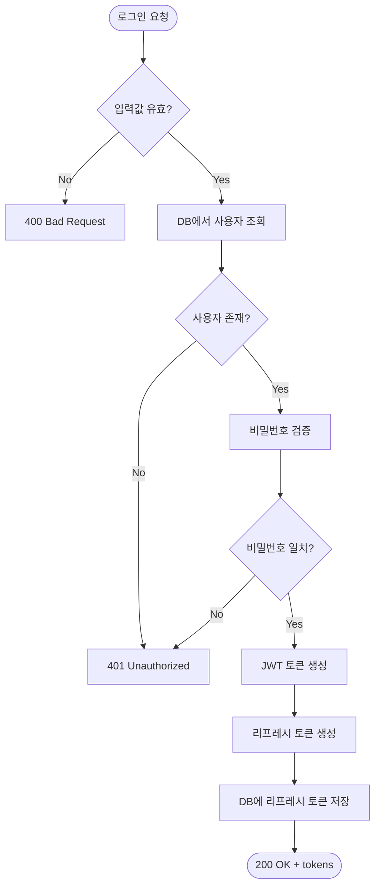

# Flow Verifier

> **구현 전 다이어그램 → 구현 후 검증** — 코드가 설계대로 흐르는지 확인합니다.

기존 `mermaid-diagrams` 스킬로 플로우차트를 그리고,
구현 완료 후 실제 코드 경로가 다이어그램의 노드/분기와 일치하는지 자동 검증합니다.

---

## 사용법

```bash
# 1단계: 구현 전 — 프로세스 다이어그램 생성
/flow-verifier plan "사용자 로그인 → JWT 발급 → 리프레시 토큰"

# 2단계: 구현 후 — 코드 흐름 검증
/flow-verifier verify "사용자 로그인"

# 한번에 (이미 다이어그램이 있을 때)
/flow-verifier verify docs/flow-diagrams/user-login.mmd
```

**공식 호출명:** `/flow-verifier` (별칭: `플로우 검증`, `다이어그램 검증`)

---

## 모드

### `plan` — 다이어그램 생성

구현할 기능의 프로세스를 Mermaid flowchart로 그립니다.

**절차:**

1. **기능 분석**: 사용자 설명 또는 SPEC 파일에서 핵심 흐름 추출
2. **노드 식별**: 각 처리 단계를 노드로 정의
   - `([시작/끝])` — 시작/종료점
   - `[처리]` — 일반 처리 단계
   - `{분기?}` — 조건 분기 (if/else, switch)
   - `[[서브루틴]]` — 외부 함수/서비스 호출
3. **경로 매핑**: 정상 경로(happy path) + 에러 경로 + 엣지 케이스
4. **파일 저장**: `docs/flow-diagrams/{feature-name}.mmd`

**출력 예시:**



**규칙:**
- `mermaid-diagrams` 스킬의 문법 가이드를 참조하여 정확한 Mermaid 문법 사용
- 노드 ID는 영문 camelCase (예: `FindUser`, `CheckPwd`)
- 노드 라벨은 한국어/영어 모두 가능
- 분기(decision)는 반드시 모든 경로(Yes/No, 에러 등) 포함
- 한 다이어그램에 노드 20개 이하 권장 (초과 시 서브 다이어그램으로 분리)

### `verify` — 코드 흐름 검증

구현된 코드가 다이어그램의 흐름과 일치하는지 검증합니다.

**절차:**

1. **다이어그램 파싱**: `.mmd` 파일에서 노드와 엣지(연결) 추출
2. **코드 추적**: 관련 소스 파일에서 실제 실행 경로 분석
3. **매칭 검증**: 다이어그램의 각 노드/분기가 코드에 존재하는지 확인
4. **리포트 생성**: 일치/불일치 보고서 출력

**검증 항목:**

| # | 검증 항목 | 확인 방법 |
|---|-----------|-----------|
| 1 | **노드 존재** | 다이어그램의 각 처리 단계에 대응하는 코드(함수/메서드/조건문)가 존재하는가 |
| 2 | **분기 완전성** | 다이어그램의 모든 분기(if/else, switch case)가 코드에 구현되었는가 |
| 3 | **경로 순서** | 코드의 실행 순서가 다이어그램의 화살표 방향과 일치하는가 |
| 4 | **에러 처리** | 다이어그램의 에러 경로(Error 노드)에 대응하는 예외 처리가 있는가 |
| 5 | **누락 경로** | 코드에 존재하지만 다이어그램에 없는 경로가 있는가 (다이어그램 업데이트 필요) |
| 6 | **서브루틴 연결** | 외부 함수/서비스 호출이 실제 구현과 일치하는가 |

**추적 전략:**

```
1. 엔트리포인트 찾기
   - API: 라우터/컨트롤러에서 해당 엔드포인트 함수 찾기
   - UI: 이벤트 핸들러 또는 페이지 컴포넌트에서 시작점 찾기
   - 서비스: 해당 서비스 클래스/함수에서 public 메서드 찾기

2. 호출 체인 따라가기
   - 함수 → 함수 호출 추적 (Grep으로 함수명 검색)
   - 조건문 → 다이어그램 분기와 매칭
   - try-catch → 다이어그램 에러 경로와 매칭
   - return/throw → 다이어그램 종료 노드와 매칭

3. 결과 대조
   - 다이어그램 노드 ↔ 코드 위치 1:1 매핑 테이블 생성
   - 매핑 안 되는 노드 = 불일치
```

**리포트 형식:**

```
══ Flow Verification Report ══════════════
Feature: 사용자 로그인
Diagram: docs/flow-diagrams/user-login.mmd
Source:  src/auth/login.controller.ts
         src/auth/auth.service.ts
═══════════════════════════════════════════

## 노드 매칭 결과

| 다이어그램 노드 | 코드 위치 | 상태 |
|----------------|-----------|------|
| Start(로그인 요청) | login.controller.ts:15 `@Post('/login')` | ✅ Match |
| Validate(입력값 유효?) | login.controller.ts:18 `if (!dto.email)` | ✅ Match |
| Error400 | login.controller.ts:19 `throw new BadRequestException()` | ✅ Match |
| FindUser | auth.service.ts:32 `findByEmail()` | ✅ Match |
| CheckPwd | auth.service.ts:38 `bcrypt.compare()` | ✅ Match |
| GenRefresh | — | ❌ Missing |
| SaveToken | — | ❌ Missing |

## 분기 검증

| 분기 | Yes 경로 | No 경로 | 상태 |
|------|----------|---------|------|
| 입력값 유효? | ✅ | ✅ | Complete |
| 사용자 존재? | ✅ | ✅ | Complete |
| 비밀번호 일치? | ✅ | ✅ | Complete |

## 누락 경로 (코드에만 존재)

| 코드 경로 | 위치 | 제안 |
|-----------|------|------|
| Rate limit 체크 | login.controller.ts:12 | 다이어그램에 노드 추가 권장 |

## 요약

- 전체 노드: 10개
- 매칭: 8개 (80%)
- 누락: 2개 (GenRefresh, SaveToken)
- 추가 경로: 1개 (Rate limit)
- 판정: ⚠️ PARTIAL MATCH — 리프레시 토큰 관련 구현 누락
═══════════════════════════════════════════
```

---

## Chronos 통합

Chronos(`/chronos`) 실행 시 `--flow-verify` 옵션으로 활성화:

```bash
/chronos 로그인 기능 구현해줘 --flow-verify
```

**Chronos 내 동작:**

```
Phase 0: 스코프 확인 (기존)
Phase 0.5: [NEW] 프로세스 다이어그램 생성
  → /flow-verifier plan "{기능 설명}"
  → docs/flow-diagrams/{feature}.mmd 저장
Phase 1: 루프 실행 — FIND → FIX → VERIFY (기존)
Phase 1.5: [NEW] 플로우 검증
  → /flow-verifier verify docs/flow-diagrams/{feature}.mmd
  → 불일치 발견 시 → 다음 사이클에서 수정 대상으로 승격
Phase 2: 최종 보고 (기존 + 플로우 검증 결과 포함)
```

**Chronos 없이 단독 사용도 가능:**

```bash
# 설계 단계에서 다이어그램만 그리기
/flow-verifier plan "결제 프로세스"

# 코드 리뷰 시 기존 다이어그램과 비교
/flow-verifier verify docs/flow-diagrams/payment.mmd
```

---

## 다이어그램 파일 관리

```
docs/
└── flow-diagrams/
    ├── user-login.mmd          # 사용자 로그인
    ├── payment-process.mmd     # 결제 프로세스
    └── order-lifecycle.mmd     # 주문 생명주기
```

**규칙:**
- 파일명: kebab-case + `.mmd` 확장자
- 위치: `docs/flow-diagrams/` (프로젝트 루트 기준)
- 다이어그램 수정 시 `verify` 모드로 재검증 권장
- Git에 함께 커밋하여 코드와 다이어그램 버전 동기화

---

## Related Files

| 파일 | 역할 |
|------|------|
| `skills/mermaid-diagrams/SKILL.md` | Mermaid 문법 가이드 (다이어그램 생성 시 참조) |
| `agents/mermaid-diagram-specialist.md` | 다이어그램 전문 에이전트 (복잡한 다이어그램 위임) |
| `skills/auto-continue-loop/SKILL.md` | Chronos 루프 (--flow-verify 연동) |
| `skills/code-reviewer/SKILL.md` | 코드 리뷰 (검증 결과 참조 가능) |
