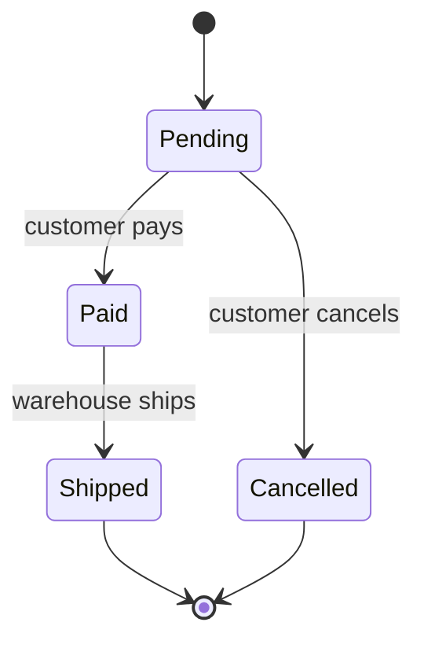
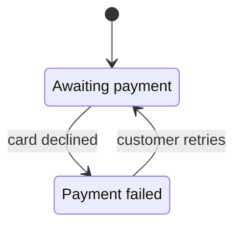
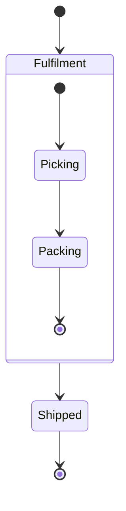
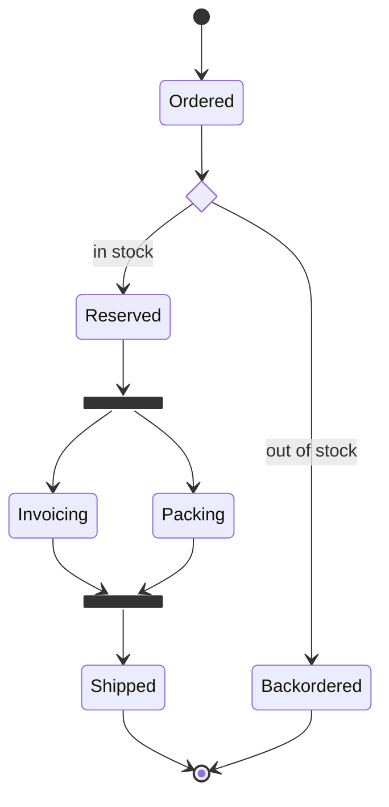
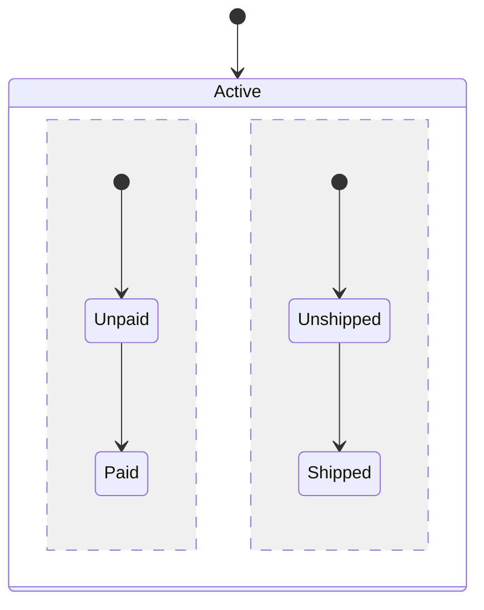
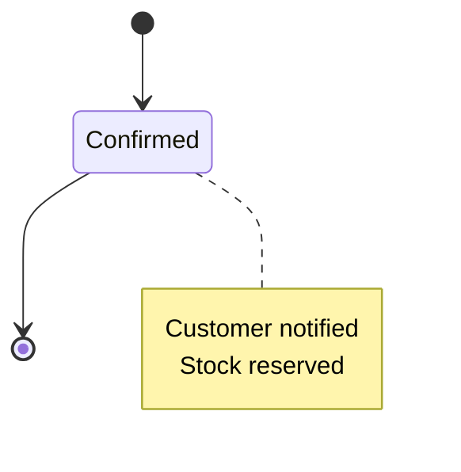
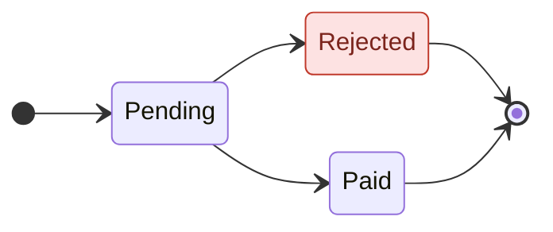
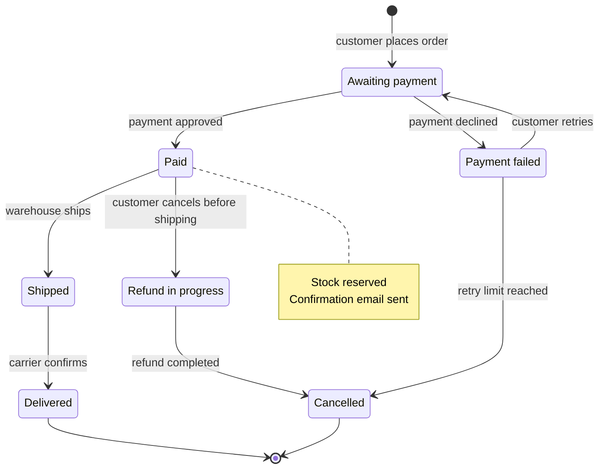

# State Diagrams

State diagrams show the lifecycle of one thing — an order, a booking, a payment, a ticket — as the states it can be in and the events that move it between them. Use one when an entity has a status field and at least three transitions; for a step-by-step process with no persistent status, use a flowchart instead.

## Basic Syntax

- `stateDiagram-v2` selects the current renderer. Prefer it over the older `stateDiagram`.
- `[*]` is the start state when it is on the left of an arrow and an end state when it is on the right.
- `A --> B : label` is a transition. Write the label as the trigger, and name who or what causes it when roles matter (`Pending --> Paid : customer pays`).

## Naming States

State IDs cannot contain spaces. Give a readable label with an alias:

A description can also be attached to an existing ID: `Pending : waiting for the payment gateway`.

## Composite States

Group the internal steps of one state inside braces. The inner `[*]` markers belong to the composite state only.

## Choice, Fork and Join

- `<<choice>>` branches on a condition; put the condition on each outgoing label.
- `<<fork>>` / `<<join>>` split work into parallel paths and wait for all of them.

## Concurrent Regions

Inside a composite state, `--` separates regions that run at the same time:

## Notes

A single-line note uses `note left of Confirmed : stock reserved`.

## Direction and Styling

- `direction LR` (or `TB`) sets the layout direction for the diagram or for one composite state.
- `classDef` plus `:::className` (or `class StateId className`) styles states. Classes cannot be applied to start/end markers or to (or inside) composite states.

## Complete Example: Order Lifecycle

## Best Practices

1. **One entity per diagram** — a diagram that mixes an order's and a payment's states hides who owns which transition.
2. **Label every transition** with its trigger, and with the role that may cause it when permissions differ.
3. **Make every path end** — each state should reach `[*]` or be an intentional resting state, so missing transitions are visible.
4. **Match the code** — state names should be the values stored in the status field, so the diagram can be checked against the implementation.
5. **Use aliases for readable labels** instead of putting spaces in IDs.
