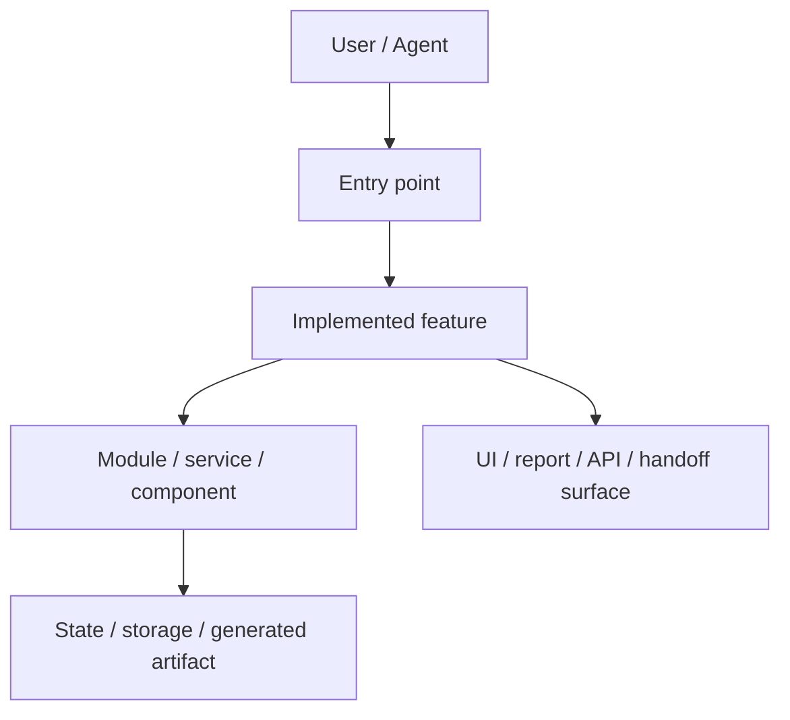
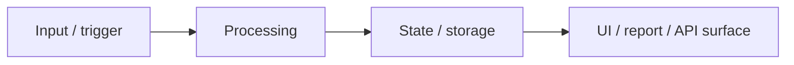

# Handoff Template

Use this template structure when creating handoff documents. The smart scaffold script will pre-fill metadata sections; complete the remaining sections based on session context.

## Table of Contents

- [Session Metadata](#session-metadata)
- [Origin](#origin)
- [Current State Summary](#current-state-summary)
- [Feature/Flow/Decision Snapshot](#featureflowdecision-snapshot)
  - [Implemented Features](#implemented-features)
  - [Feature Boundary](#feature-boundary)
  - [Menu / Screen Map](#menu--screen-map)
  - [Composition Diagram](#composition-diagram)
  - [Flow Diagram](#flow-diagram)
  - [Decision Records](#decision-records)
- [Codebase Understanding](#codebase-understanding)
  - [Architecture Overview](#architecture-overview)
  - [Critical Files](#critical-files)
  - [Key Patterns Discovered](#key-patterns-discovered)
- [Work Completed](#work-completed)
  - [Tasks Finished](#tasks-finished)
  - [Files Modified](#files-modified)
  - [Decisions Made](#decisions-made)
- [Pending Work](#pending-work)
  - [Immediate Next Steps](#immediate-next-steps)
  - [Blockers/Open Questions](#blockersopen-questions)
  - [Deferred Items](#deferred-items)
- [Context for Resuming Agent](#context-for-resuming-agent)
  - [Important Context](#important-context)
  - [Assumptions Made](#assumptions-made)
  - [Potential Gotchas](#potential-gotchas)
- [Environment State](#environment-state)
- [Related Resources](#related-resources)
- [Template Usage Notes](#template-usage-notes)

---

# Handoff: [TASK_TITLE]

## Session Metadata
- Created: [TIMESTAMP]
- Project: [PROJECT_PATH]
- Branch: [GIT_BRANCH]
- Session duration: [APPROX_DURATION]

## Origin

이 작업이 시작된 이유. 세션이 끝나면 "무엇을 했나"는 남지만 "왜 만들기로 했나"는
사라지기 때문에, **기능을 구현·변경한 세션에서만** 요구한다. 이어지는 세션은 최초
핸드오프를 링크하고 바뀐 부분만 적는다. 탐색·문서·설정만 한 세션은 각 칸을
`N/A — <이유>`로 채운다 (다이어그램과 같은 규칙).

| 항목 | 내용 |
|------|------|
| 요구 | [TODO: 요청받은 것 — 가능하면 원문에 가깝게] |
| 출처 | [TODO: 사용자 요청 / 이슈 / spec·설계 문서 경로 / 이전 핸드오프] |
| 해결할 문제 | [TODO: 이 요구가 없애려는 불편·위험. "왜 지금인가"] |

## Current State Summary

[One paragraph: What was being worked on, current status, and where things left off]

## Session Memory Review

- Architecture preflight: [기억 본문 확인으로 SKIPPED / 없어서 닥터 RAN / NOT RUN·ERROR와 이유]
- Memory/index updates: [실제 변경 경로 또는 변경 불필요·보완 불가 근거]
- Retrieval verification: [검색어 → 인덱스 → 상세 항목 재검색 결과]
- Observations: [세션 ID·시작 시각으로 한정한 정제 결과; 기존 백로그 제외]

작성 전에 [핸드오프 기억 점검](handoff-memory.md)을 적용한다.

## Feature/Flow/Decision Snapshot

This is the session's implemented-feature map. Always fill **Implemented Features** and **Feature Boundary**. **Composition/Flow diagrams are required only for feature-bearing sessions** — a session that implemented or changed a feature. For non-feature handoffs (docs/config/refactor/exploration only), set Implemented Features to a single `none — <reason>` row and replace each diagram body with `N/A — <reason>` (or omit the diagram subsections); forcing a diagram on a typo fix is ceremony, not signal. If TermSnap CodeMap/Wiki/Report exists, link it as supporting evidence; do not treat this section as a replacement for CodeMap.

### Implemented Features

| Feature/Change | Visible Behavior | Entry Point | Implementation Anchors | Verification |
|----------------|------------------|-------------|------------------------|--------------|
| [Feature or change name] | [What user/agent can now do or observe] | [UI/API/command/hook/file] | [files/classes/methods] | [test/log/manual check] |

### Feature Boundary

| Feature/Area | Does | Does Not Do | Source of Truth |
|--------------|------|-------------|-----------------|
| [Feature name] | [responsibility] | [non-goal/boundary] | [code/doc/spec path] |

### Menu / Screen Map

UI/메뉴가 있는 프로젝트만 작성 (CLI/library/backend-only는 `N/A` 또는 생략). **행 단위는 화면(screen/view), 메뉴는 그룹 컬럼** — 한 메뉴에 화면이 여럿일 수 있으므로 화면 단위로 상태를 잡는다. 단순 앱은 메뉴=화면 한 줄. `Status`로 다음 세션이 "이 화면 기능 이미 됐나"를 한눈에 본다.

| Menu | Screen / View | Features on this screen | Route/Path | Status |
|------|---------------|-------------------------|------------|--------|
| [menu group] | [screen/view name] | [feature A, B, C] | [/route] | [done / partial / planned] |

### Composition Diagram

### Flow Diagram

### Decision Records

| Decision | Options Considered | Rationale | Record/Follow-up |
|----------|--------------------|-----------|------------------|
| [Decision] | [A / B / C] | [why] | [ADR/doc path or TODO] |

## Codebase Understanding

### Architecture Overview

[Key architectural insights discovered during this session - how the system is structured, main components, data flow]

### Critical Files

| File | Purpose | Relevance |
|------|---------|-----------|
| path/to/file | What this file does | Why it matters for this task |

### Key Patterns Discovered

[Important patterns, conventions, or idioms found in this codebase that the next agent should follow]

## Work Completed

### Tasks Finished

- [x] Task 1 - brief description of what was done
- [x] Task 2 - brief description

### Files Modified

| File | Changes | Rationale |
|------|---------|-----------|
| path/to/file | Description of changes | Why this change was made |

### Decisions Made

| Decision | Options Considered | Rationale |
|----------|-------------------|-----------|
| Chose X over Y | X, Y, Z | Why X was chosen |

## Pending Work

### Immediate Next Steps

1. [Most critical next action - what to do first]
2. [Second priority]
3. [Third priority]

### Blockers/Open Questions

- [ ] Blocker: [description] - Needs: [what's required to unblock]
- [ ] Question: [unclear aspect] - Suggested: [potential resolution]

### Deferred Items

- Item 1 (deferred because: [reason, e.g., out of scope, needs user input])

## Context for Resuming Agent

### Important Context

[Critical information the next agent MUST know to continue effectively - this is the most important section for handoff]

### Assumptions Made

- Assumption 1: [what was assumed to be true]
- Assumption 2: [another assumption]

### Potential Gotchas

- [Things that might trip up a new agent - edge cases, quirks, non-obvious behavior]

## Environment State

### Tools/Services Used

- [Tool/Service]: [relevant configuration or state]

### Active Processes

- [Any background processes, dev servers, watchers that may be running]

### Environment Variables

- [Key env vars that matter for this work - DO NOT include secrets/values, just names]

## Related Resources

- [Link to relevant documentation]
- [Related file paths]
- [External resources consulted]

---

## Template Usage Notes

When filling this template:
1. Be specific and concrete - vague descriptions don't help the next agent
2. Include file paths with line numbers where relevant (e.g., `src/auth.ts:142`)
3. Prioritize the "Feature/Flow/Decision Snapshot", "Important Context", and "Immediate Next Steps" sections
4. Don't include sensitive data (API keys, passwords, tokens)
5. Focus on WHAT and WHY, not just WHAT - rationale is crucial for handoffs
